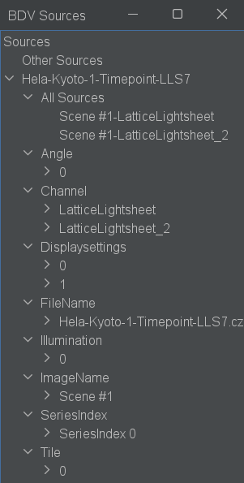
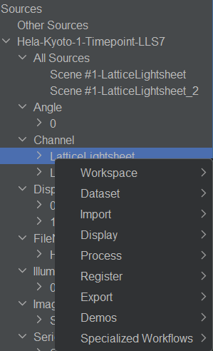
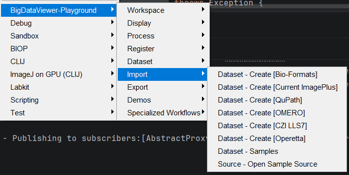

# Opening Images

This guide covers how to get your image data into BigDataViewer Playground.

## What Is a Dataset?

When you open images in BigDataViewer Playground, they become a **dataset**. Understanding what a dataset is will help you work with every other feature. A dataset is composed of many sources, each source representing a XYZT pixel dataset. Each source has additional metadata, to specify their other properties within the dataset (channel, tile, illumination, etc.). 

A dataset is a unified representation of your images that holds three things:

1. **A recipe to read the raw data** — the dataset doesn't copy your pixels. It stores a reference to the original source (a file on disk, an OMERO server, a QuPath project, etc.) and reads data on demand.
2. **Spatial metadata** — position, orientation, and calibration of each image, stored as a chain of 3D affine transforms. Each channel and timepoint can have its own chain of transforms.
3. **Source metadata** — channel name and index, tiles, angle, illumination, etc. These are also called `Entities` in BigDataViewer's jargon. This helps to regroup source by kind (all tiles of channel 2, for instance).

This design means you can open terabyte-scale images instantly — no data is loaded until you actually look at it or export it. And when you register, drift-correct, or transform your data, those operations simply add transforms to the chain rather than rewriting pixels.

:::{note}
The pixel data from a Dataset are 'immutable', this means that you can't modify the pixel data of the dataset. Think of this as a "read-only" file. However you'll be able to compute new data resulting from the processing of Datasets, which can then be saved and exported as new Datasets. 
:::

### Saving and Reloading Datasets

Datasets can be **saved to an XML file** and reloaded later. The XML file stores:

- Which backend to use (Bio-Formats, OMERO, etc.) and how to reach the raw data
- The full chain of affine transforms for each channel and timepoint
- Other sources metadata and display settings (color, min max display range)

This means you can set up a complex multi-image, multi-channel dataset, save it, and pick up exactly where you left off — or share it with a collaborator who has access to the same raw files.

{menuselection}`Plugins --> BigDataViewer-Playground --> Dataset --> Dataset - Save XML Dataset`

{menuselection}`Plugins --> BigDataViewer-Playground --> Dataset --> Dataset --> Open XML Dataset`

---

## The Sources Tree

All images you open appear in the **BigDataViewer Playground** panel, accessible via:

{menuselection}`Plugins --> BigDataViewer-Playground --> Show BDV Playground Window`



The panel displays a **tree of sources**. Think of it as a pipeline of filters: every source you have opened lives at the root, and child nodes progressively narrow down the selection — by dataset, by channel, by tile, by timepoint, and so on. The same source can appear under multiple leaf nodes simultaneously.

For example, after opening a two-channel 3-D acquisition you might see:

```
All Sources
└── Hela-Kyoto-1-Timepoint-LLS7         ← dataset filter                          
    ├── All Sources
    |       ├── Source Ch0 
    |       └── Source Ch1
    └── Channel                       
        ├── Channel 0                   ← channel 0 filter
        |       └── Source Ch0
        └── Channel 1                   ← channel 1 filter 
                └── Source Ch1
```

**Interactions:**
- **Right-click** any node → context menu with actions (show in a BDV window, change color, export…)
- **Double-click** any node → center the current viewer on those sources



---

## Creating a Dataset

All dataset creation commands are found under:

{menuselection}`Plugins --> BigDataViewer-Playground --> Import`



Each command creates a dataset from a different source. The most common starting point is **Bio-Formats**, which handles the widest range of file formats.

### Dataset - Create [Bio-Formats]

*Source: {image-loaders-src}`DatasetFromBioFormatsCreateCommand.java <ch/epfl/biop/bdv/img/bioformats/command/DatasetFromBioFormatsCreateCommand.java>`*

The general-purpose importer. Supports any file format that Bio-Formats can read (CZI, LIF, ND2, OME-TIFF, and [many more](https://bio-formats.readthedocs.io/en/latest/supported-formats.html)).

| Parameter | Description |
|-----------|-------------|
| Input Files | One or more image files to include in the dataset |
| Dataset Name | Name for the resulting dataset |
| Plane Origin Convention | Where the image origin is located |
| World coordinate units | Unit for the coordinate system (e.g. MICROMETER) |
| Split RGB Channels | Separate RGB into individual channels |
| Auto-Pyramidize | Generate multi-resolution levels for large images that lack them natively |
| Disable Memoization | Turn off Bio-Formats caching (not recommended for large files) |

:::{tip}
**Working with CZI files?** Enable the **Quick Start CZI Reader** update site for significantly faster loading. See the [Installation Guide](../installation/installation.md#fast-czi-file-reading).
:::

:::::{tab-set}

::::{tab-item} GUI
{menuselection}`Plugins --> BigDataViewer-Playground --> Import --> Dataset - Create [Bio-Formats]`
::::

::::{tab-item} IJ Macro
```ijm
run("Dataset - Create [Bio-Formats]");
```
::::

::::{tab-item} Groovy
```imagej-groovy
#@File[] files
#@CommandService cs

import ch.epfl.biop.bdv.img.bioformats.command.DatasetFromBioFormatsCreateCommand

cs.run(DatasetFromBioFormatsCreateCommand, true,
    "files", files,
    "datasetname", "My Dataset",
    "plane_origin_convention", "TOP LEFT",
    "unit", "MICROMETER",
    "split_rgb_channels", false,
    "auto_pyramidize", true,
    "disable_memo", false
).get()
```
::::

::::{tab-item} Python
```python
#@File[] files
#@CommandService cs

from ch.epfl.biop.bdv.img.bioformats.command import DatasetFromBioFormatsCreateCommand

cs.run(DatasetFromBioFormatsCreateCommand, True,
    ["files", files,
     "datasetname", "My Dataset",
     "plane_origin_convention", "TOP LEFT",
     "unit", "MICROMETER",
     "split_rgb_channels", False,
     "auto_pyramidize", True,
     "disable_memo", False]
).get()
```
::::

:::::

### Dataset - Create [Current ImagePlus]

*Source: {image-loaders-src}`DatasetFromImagePlusCreateCommand.java <ch/epfl/biop/bdv/img/imageplus/command/DatasetFromImagePlusCreateCommand.java>`*

Wraps an image that is already open in Fiji as a dataset, so you can use it with BigDataViewer Playground tools.

| Parameter | Description |
|-----------|-------------|
| Input Image | The ImagePlus window to convert |
| Dataset Name | Name for the dataset (leave empty to use the image title) |

:::::{tab-set}

::::{tab-item} GUI
{menuselection}`Plugins --> BigDataViewer-Playground --> Import --> Dataset - Create [Current ImagePlus]`
::::

::::{tab-item} IJ Macro
```ijm
run("Dataset - Create [Current ImagePlus]");
```
::::

::::{tab-item} Groovy
```imagej-groovy
#@ImagePlus image
#@CommandService cs

import ch.epfl.biop.bdv.img.imageplus.command.DatasetFromImagePlusCreateCommand

cs.run(DatasetFromImagePlusCreateCommand, true,
    "image", image,
    "datasetname", ""
).get()
```
::::

::::{tab-item} Python
```python
#@ImagePlus image
#@CommandService cs

from ch.epfl.biop.bdv.img.imageplus.command import DatasetFromImagePlusCreateCommand

cs.run(DatasetFromImagePlusCreateCommand, True,
    ["image", image,
     "datasetname", ""]
).get()
```
::::

:::::

### Dataset - Create [OMERO]

*Source: {image-loaders-src}`DatasetFromOMEROCreateCommand.java <ch/epfl/biop/bdv/img/omero/command/DatasetFromOMEROCreateCommand.java>`*

Creates a dataset from images stored on an OMERO server. You can connect to the server first using `Plugins > BIOP > OMERO > Omero - Connect`, or you will be prompted to connect if you're not yet connected to the server. 

| Parameter | Description |
|-----------|-------------|
| OMERO URLs | Comma-separated list of OMERO image URLs |
| Dataset Name | Name for the resulting dataset |
| Plane Origin Convention | Where the image origin is located |
| World coordinate units | Unit for the coordinate system |

:::::{tab-set}

::::{tab-item} GUI
{menuselection}`Plugins --> BigDataViewer-Playground --> Import --> Dataset - Create [OMERO]`
::::

::::{tab-item} IJ Macro
```ijm
run("Dataset - Create [OMERO]");
```
::::

::::{tab-item} Groovy
```imagej-groovy
#@CommandService cs

import ch.epfl.biop.bdv.img.omero.command.DatasetFromOMEROCreateCommand

cs.run(DatasetFromOMEROCreateCommand, true,
    "omero_urls", "https://omero.myorg.org/webclient/?show=image-1234,https://omero.myorg.org/webclient/?show=image-1235",
    "datasetname", "My OMERO Dataset",
    "plane_origin_convention", "TOP LEFT",
    "unit", "MICROMETER"
).get()
```
::::

::::{tab-item} Python
```python
#@CommandService cs

from ch.epfl.biop.bdv.img.omero.command import DatasetFromOMEROCreateCommand

cs.run(DatasetFromOMEROCreateCommand, True,
    ["omero_urls", "https://omero.myorg.org/webclient/?show=image-1234,https://omero.myorg.org/webclient/?show=image-1235",
     "datasetname", "My OMERO Dataset",
     "plane_origin_convention", "TOP LEFT",
     "unit", "MICROMETER"]
).get()
```
::::

:::::

### Dataset - Create [QuPath]

*Source: {image-loaders-src}`DatasetFromQuPathCreateCommand.java <ch/epfl/biop/bdv/img/qupath/command/DatasetFromQuPathCreateCommand.java>`*

Imports all images from a QuPath project as a single dataset. Note that only Bio-Formats image servers and OMERO (Ice) image servers are supported. 

| Parameter | Description |
|-----------|-------------|
| QuPath Project | The QuPath project file (`.qpproj`) |
| Dataset Name | Name for the dataset (leave empty to use the project folder name) |
| Plane Origin Convention | Where the image origin is located |
| World coordinate units | Unit for the coordinate system |
| Split RGB Channels | Separate RGB into individual channels |

:::::{tab-set}

::::{tab-item} GUI
{menuselection}`Plugins --> BigDataViewer-Playground --> Import --> Dataset - Create [QuPath]`
::::

::::{tab-item} IJ Macro
```ijm
run("Dataset - Create [QuPath]");
```
::::

::::{tab-item} Groovy
```imagej-groovy
#@File qupath_project
#@CommandService cs

import ch.epfl.biop.bdv.img.qupath.command.DatasetFromQuPathCreateCommand

cs.run(DatasetFromQuPathCreateCommand, true,
    "qupath_project", qupath_project,
    "datasetname", "",
    "plane_origin_convention", "TOP LEFT",
    "unit", "MICROMETER",
    "split_rgb_channels", false
).get()
```
::::

::::{tab-item} Python
```python
#@File qupath_project
#@CommandService cs

from ch.epfl.biop.bdv.img.qupath.command import DatasetFromQuPathCreateCommand

cs.run(DatasetFromQuPathCreateCommand, True,
    ["qupath_project", qupath_project,
     "datasetname", "",
     "plane_origin_convention", "TOP LEFT",
     "unit", "MICROMETER",
     "split_rgb_channels", False]
).get()
```
::::

:::::

### Dataset - Create [Operetta]

*Source: {biop-src}`DatasetFromOperettaCreateCommand.java <ch/epfl/biop/command/importer/DatasetFromOperettaCreateCommand.java>`*

Opens PerkinElmer Operetta high-content imaging datasets. Note that Perkin Elmer dataset can also be opened with the direct Bio-Formats command. But listing all potential 100 thousands files from the dataset can be an issue. It is thus easier to use this command where you can select the parent Operetta dataset folder.

| Parameter | Description |
|-----------|-------------|
| Operetta Images Folder | The `Images` or `flex` folder from your Operetta dataset |
| World coordinate units | Unit for the coordinate system |
| Min/Max Display Value | Initial display range |
| Show in Viewer | Immediately display in a BigDataViewer window |

:::::{tab-set}

::::{tab-item} GUI
{menuselection}`Plugins --> BigDataViewer-Playground --> Import --> Dataset - Create [Operetta]`
::::

::::{tab-item} IJ Macro
```ijm
run("Dataset - Create [Operetta]");
```
::::

::::{tab-item} Groovy
```imagej-groovy
#@File folder
#@CommandService cs

import ch.epfl.biop.command.importer.DatasetFromOperettaCreateCommand

cs.run(DatasetFromOperettaCreateCommand, true,
    "folder", folder,
    "unit", "MICROMETER",
    "min_display_value", 0,
    "max_display_value", 1000,
    "show", true
).get()
```
::::

::::{tab-item} Python
```python
#@File folder
#@CommandService cs

from ch.epfl.biop.command.importer import DatasetFromOperettaCreateCommand

cs.run(DatasetFromOperettaCreateCommand, True,
    ["folder", folder,
     "unit", "MICROMETER",
     "min_display_value", 0,
     "max_display_value", 1000,
     "show", True]
).get()
```
::::

:::::

### Dataset - Create [CZI LLS7]

*Source: {biop-src}`LLS7DatasetOpenCommand.java <ch/epfl/biop/command/workflow/lls7/LLS7DatasetOpenCommand.java>`*

Specialized importer for Zeiss Lattice Light Sheet 7 data. Automatically applies the correct skew transformation so the data displays with proper 3D geometry.

| Parameter | Description |
|-----------|-------------|
| CZI LLS7 File | The `.czi` file from an LLS7 acquisition |
| Use Legacy XY Mode | For compatibility with older datasets |

:::::{tab-set}

::::{tab-item} GUI
{menuselection}`Plugins --> BigDataViewer-Playground --> Import --> Dataset - Create [CZI LLS7]`
::::

::::{tab-item} IJ Macro
```ijm
run("Dataset - Create [CZI LLS7]");
```
::::

::::{tab-item} Groovy
```imagej-groovy
#@File czi_file
#@CommandService cs

import ch.epfl.biop.command.workflow.lls7.LLS7DatasetOpenCommand

cs.run(LLS7DatasetOpenCommand, true,
    "czi_file", czi_file,
    "legacy_xy_mode", false
).get()
```
::::

::::{tab-item} Python
```python
#@File czi_file
#@CommandService cs

from ch.epfl.biop.command.workflow.lls7 import LLS7DatasetOpenCommand

cs.run(LLS7DatasetOpenCommand, True,
    ["czi_file", czi_file,
     "legacy_xy_mode", False]
).get()
```
::::

:::::

See the [LLS7 Timelapse workflow](../workflows/lls7_timelapse.md) for a complete processing guide.

### Dataset - Samples

*Source: {image-loaders-src}`OpenSampleCommand.java <ch/epfl/biop/bdv/img/bioformats/command/OpenSampleCommand.java>`*

Opens a sample dataset for testing and exploration. Downloads and caches (in `/home/CachedSamples/`) on first use.

| Parameter | Description |
|-----------|-------------|
| Dataset Name | Name of the sample dataset to open |

:::::{tab-set}

::::{tab-item} GUI
{menuselection}`Plugins --> BigDataViewer-Playground --> Import --> Dataset - Samples`
::::

::::{tab-item} IJ Macro
```ijm
run("Dataset - Samples");
```
::::

::::{tab-item} Groovy
```imagej-groovy
#@CommandService cs

import ch.epfl.biop.bdv.img.bioformats.command.OpenSampleCommand

cs.run(OpenSampleCommand, true,
    "dataset_name", "HeLa Kyoto - LLS7"
).get()
```
::::

::::{tab-item} Python
```python
#@CommandService cs

from ch.epfl.biop.bdv.img.bioformats.command import OpenSampleCommand

cs.run(OpenSampleCommand, True,
    ["dataset_name", "HeLa Kyoto - LLS7"]
).get()
```
::::

:::::

---

## Dataset Operations

Once you have datasets, several commands help you manipulate them at the dataset level.

:::{seealso}
To inspect or edit the affine transform chain of your sources (view, add, remove, or overwrite transforms per timepoint), see [Spatial Transforms — Dataset Transform Stack](../processing_images/spatial_transforms.md#dataset-transform-stack).
:::

### Combine XML Datasets

*Source: {biop-src}`DatasetXMLCombineCommand.java <ch/epfl/biop/command/dataset/DatasetXMLCombineCommand.java>`*

Merges multiple saved XML datasets into one, either as additional timepoints or additional channels.

| Parameter | Description |
|-----------|-------------|
| Input XML Files | The XML files to combine (order matters) |
| Dataset Name | Name for the merged dataset |
| Combine Mode | Combine as separate timepoints or separate channels |
| Filter Setup IDs | Optional: include only specific setups (e.g. `0:5,10`) |

:::::{tab-set}

::::{tab-item} GUI
{menuselection}`Plugins --> BigDataViewer-Playground --> Dataset --> Dataset - Combine XML Datasets`
::::

::::{tab-item} IJ Macro
```ijm
run("Dataset - Combine XML Datasets");
```
::::

::::{tab-item} Groovy
```imagej-groovy
#@File[] input_files
#@CommandService cs

import ch.epfl.biop.command.dataset.DatasetXMLCombineCommand

cs.run(DatasetXMLCombineCommand, true,
    "input_files", input_files,
    "datasetname", "Combined Dataset",
    "combine_mode", "timepoints",
    "setup_filter", ""
).get()
```
::::

::::{tab-item} Python
```python
#@File[] input_files
#@CommandService cs

from ch.epfl.biop.command.dataset import DatasetXMLCombineCommand

cs.run(DatasetXMLCombineCommand, True,
    ["input_files", input_files,
     "datasetname", "Combined Dataset",
     "combine_mode", "timepoints",
     "setup_filter", ""]
).get()
```
::::

:::::

### Dataset - Remove Entities

*Source: {biop-src}`DatasetEntitiesRemoveCommand.java <ch/epfl/biop/command/dataset/DatasetEntitiesRemoveCommand.java>`*

Strips entity types from a dataset XML, useful for compatibility with tools that do not understand BigDataViewer Playground specific entities.

| Parameter | Description |
|-----------|-------------|
| Input XML | The source dataset XML file |
| Output XML | Where to write the stripped XML |
| Entities to Remove | Comma-separated list of entity class names to strip |

:::::{tab-set}

::::{tab-item} GUI
{menuselection}`Plugins --> BigDataViewer-Playground --> Dataset --> Dataset - Remove Entities`
::::

::::{tab-item} IJ Macro
```ijm
run("Dataset - Remove Entities");
```
::::

::::{tab-item} Groovy
```imagej-groovy
#@File xmlin
#@File xmlout
#@CommandService cs

import ch.epfl.biop.command.dataset.DatasetEntitiesRemoveCommand

cs.run(DatasetEntitiesRemoveCommand, true,
    "xmlin", xmlin,
    "xmlout", xmlout,
    "entitiestoremove", ""
).get()
```
::::

::::{tab-item} Python
```python
#@File xmlin
#@File xmlout
#@CommandService cs

from ch.epfl.biop.command.dataset import DatasetEntitiesRemoveCommand

cs.run(DatasetEntitiesRemoveCommand, True,
    ["xmlin", xmlin,
     "xmlout", xmlout,
     "entitiestoremove", ""]
).get()
```
::::

:::::

### Dataset - Make BigStitcher Compatible

*Source: {biop-src}`DatasetXMLToBigStitcherDatasetConvertCommand.java <ch/epfl/biop/command/dataset/DatasetXMLToBigStitcherDatasetConvertCommand.java>`*

Converts a BigDataViewer Playground XML dataset to BigStitcher format. Essentially, this command will add a transform that will make each pixel of size 1 in XY, which is a BigStitcher convention, and strips out BigDataViewer-Playground specific entities.

| Parameter | Description |
|-----------|-------------|
| Input XML | The source dataset XML file |
| Output XML | Where to write the converted XML |
| View Setup Reference | Index of the view setup to use as reference for the conversion |

:::::{tab-set}

::::{tab-item} GUI
{menuselection}`Plugins --> BigDataViewer-Playground --> Dataset --> Dataset - Make BigStitcher Compatible`
::::

::::{tab-item} IJ Macro
```ijm
run("Dataset - Make BigStitcher Compatible");
```
::::

::::{tab-item} Groovy
```imagej-groovy
#@File xmlin
#@File xmlout
#@CommandService cs

import ch.epfl.biop.command.dataset.DatasetXMLToBigStitcherDatasetConvertCommand

cs.run(DatasetXMLToBigStitcherDatasetConvertCommand, true,
    "xmlin", xmlin,
    "xmlout", xmlout,
    "viewsetupreference", 0
).get()
```
::::

::::{tab-item} Python
```python
#@File xmlin
#@File xmlout
#@CommandService cs

from ch.epfl.biop.command.dataset import DatasetXMLToBigStitcherDatasetConvertCommand

cs.run(DatasetXMLToBigStitcherDatasetConvertCommand, True,
    ["xmlin", xmlin,
     "xmlout", xmlout,
     "viewsetupreference", 0]
).get()
```
::::

:::::