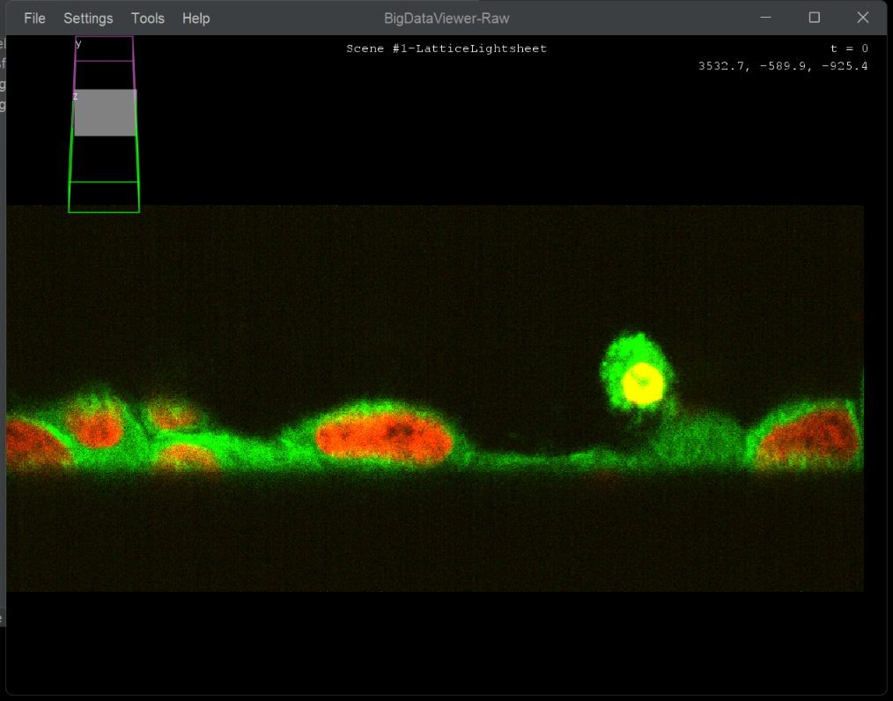
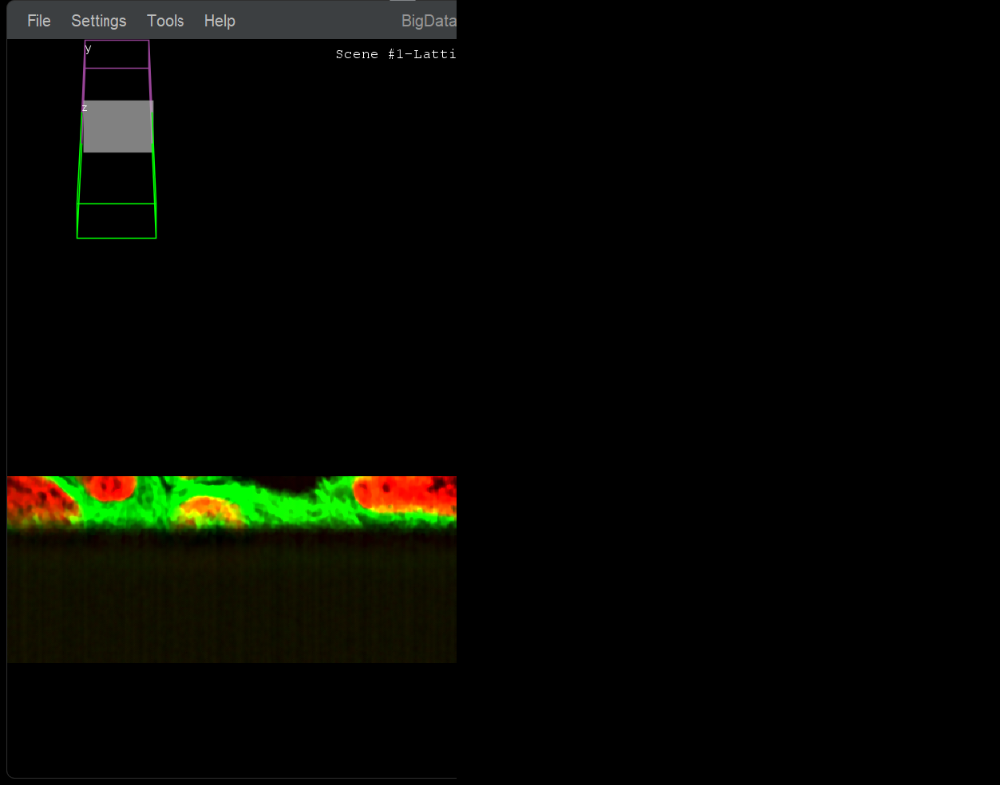

# Deconvolution

GPU-accelerated Richardson-Lucy deconvolution, computed lazily in tiles. The deconvolved result is a virtual source — tiles are deconvolved on-the-fly as you navigate or export.

:::{important}
GPU deconvolution requires CLIJ2 and an OpenCL-compatible graphics card. See the [Installation Guide](../installation/installation.md#gpu-deconvolution-clij) for setup instructions.
:::

---

## Typical workflow

1. **Open your image** using any of the import commands (e.g. **Dataset - Create [Bio-Formats]**).
2. **Load the PSF** — import your point spread function image the same way. It appears as a separate source in the tree.
3. **Run the deconvolution command** (see below). The result is registered immediately as a new virtual source.
4. **Inspect the result** in BigDataViewer. Tiles are computed by the GPU on demand as you navigate — expect a short delay per tile the first time you visit each region.

:::{note}
A single PSF is applied to all selected sources. If you have measured a separate PSF per channel — for example, one bead image per emission wavelength — run the command once per channel, selecting that channel's source and its matching PSF each time.
:::

---

## Source - Deconvolve (Richardson Lucy GPU - Tiled)

*Source: {biop-src}`SourcesDeconvolveCommand.java <ch/epfl/biop/command/process/deconvolve/SourcesDeconvolveCommand.java>`*

| Parameter | Description |
|-----------|-------------|
| Select Source(s) | The sources to deconvolve |
| PSF Source | Point spread function source (applied to all sources) |
| Iterations | Number of Richardson-Lucy iterations |
| Block Size X/Y/Z | Tile size in each dimension for GPU processing (pixels) |
| Overlap Size | Overlap between adjacent tiles to avoid edge artifacts (pixels) |
| Non-Circulant | Use non-circulant boundary conditions (reduces edge artifacts) |
| Regularization Factor | Regularization strength to prevent noise amplification (0 = none) |
| Output Pixel Type | Pixel type for the deconvolved output (`Float` or `Keep Pixel Type Of Original Image`) |
| Name Suffix | Suffix appended to source names for the deconvolved outputs |
| Number of Threads | Number of parallel threads for tile processing |

:::{tip}
The PSF must be loaded as a source in BigDataViewer Playground before running deconvolution. You can import a PSF image using any of the import commands (e.g. **Dataset - Create [Bio-Formats]** or **Dataset - Create [Current ImagePlus]**).
:::

:::::{tab-set}

::::{tab-item} GUI
{menuselection}`Plugins --> BigDataViewer-Playground --> Process --> Deconvolve --> Source - Deconvolve (Richardson Lucy GPU - Tiled)`
::::

::::{tab-item} IJ Macro
```ijm
// Sources and PSF are selected interactively from the dialog.
run("Source - Deconvolve (Richardson Lucy GPU - Tiled)");
```
::::

::::{tab-item} Groovy
```imagej-groovy
#@SourceAndConverter[] sources
#@SourceAndConverter psf
#@CommandService cs

import ch.epfl.biop.command.process.deconvolve.SourcesDeconvolveCommand

def result = cs.run(SourcesDeconvolveCommand, true,
    "sources", sources,
    "psf", psf,
    "num_iterations", 20,
    "block_size_x", 256,
    "block_size_y", 256,
    "block_size_z", 64,
    "overlap_size", 16,
    "non_circulant", true,
    "regularization_factor", 0.002f,
    "output_pixel_type", "Float",
    "suffix", "_deconvolved",
    "n_threads", 4
).get()

def deconvolved = result.getOutput("sources_out")
```
::::

::::{tab-item} Python
```python
#@SourceAndConverter[] sources
#@SourceAndConverter psf
#@CommandService cs

from ch.epfl.biop.command.process.deconvolve import SourcesDeconvolveCommand

result = cs.run(SourcesDeconvolveCommand, True,
    ["sources", sources,
     "psf", psf,
     "num_iterations", 20,
     "block_size_x", 256,
     "block_size_y", 256,
     "block_size_z", 64,
     "overlap_size", 16,
     "non_circulant", True,
     "regularization_factor", 0.002,
     "output_pixel_type", "Float",
     "suffix", "_deconvolved",
     "n_threads", 4]
).get()

deconvolved = result.getOutput("sources_out")
```
::::

:::::



