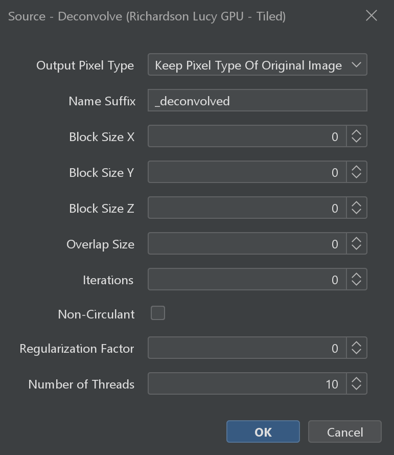
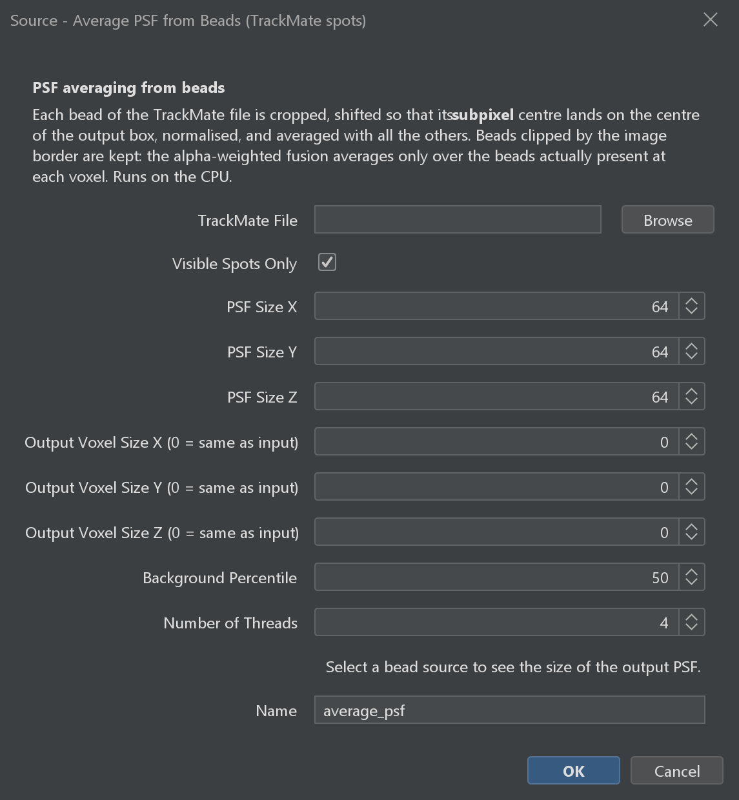
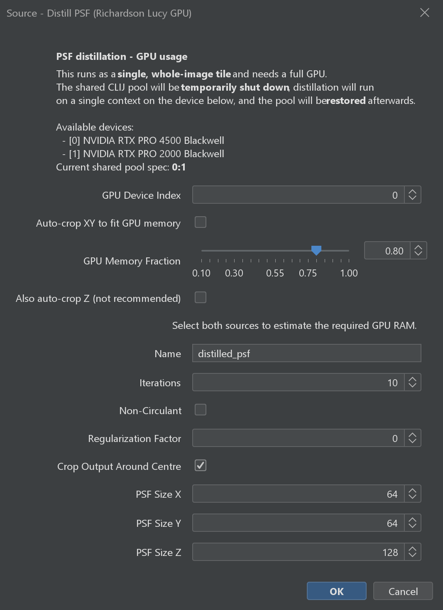

# Deconvolution

GPU-accelerated Richardson-Lucy deconvolution, computed lazily in tiles. The deconvolved result is a virtual source — tiles are deconvolved on-the-fly as you navigate or export.

:::{important}
GPU deconvolution requires CLIJ2 and an OpenCL-compatible graphics card. See the [Installation Guide](#gpu-deconvolution-clij) for setup instructions.
:::

---

## Typical workflow

1. **Open your image** using any of the import commands (e.g. **Dataset - Create [Bio-Formats]**).
2. **Load the PSF** — import your point spread function image the same way. It appears as a separate source in the tree.
   If you have imaged sub-resolution beads instead of a ready-made PSF, measure one first with the
   commands in [Measuring a PSF from Bead Images](#measuring-a-psf).
3. **Run the deconvolution command** (see below). The result is registered immediately as a new virtual source.
4. **Inspect the result** in BigDataViewer. Tiles are computed by the GPU on demand as you navigate — expect a short delay per tile the first time you visit each region.

:::{note}
A single PSF is applied to all selected sources. If you have measured a separate PSF per channel — for example, one bead image per emission wavelength — run the command once per channel, selecting that channel's source and its matching PSF each time.
:::

---

## Source - Deconvolve (Richardson Lucy GPU - Tiled)

*Source: {biop-src}`SourcesDeconvolveCommand.java <ch/epfl/biop/command/process/deconvolve/SourcesDeconvolveCommand.java>`*

| Parameter | Description |
|-----------|-------------|
| Select Source(s) | The sources to deconvolve |
| PSF Source | Point spread function source (applied to all sources) |
| Iterations | Number of Richardson-Lucy iterations |
| Block Size X/Y/Z | Tile size in each dimension for GPU processing (pixels) |
| Overlap Size | Overlap between adjacent tiles to avoid edge artifacts (pixels) |
| Non-Circulant | Use non-circulant boundary conditions (reduces edge artifacts) |
| Regularization Factor | Regularization strength to prevent noise amplification (0 = none) |
| Output Pixel Type | Pixel type for the deconvolved output (`Float` or `Keep Pixel Type Of Original Image`) |
| Name Suffix | Suffix appended to source names for the deconvolved outputs |
| Number of Threads | Number of parallel threads for tile processing |

:::{tip}
The PSF must be loaded as a source in BigDataViewer Playground before running deconvolution. You can import a PSF image using any of the import commands (e.g. **Dataset - Create [Bio-Formats]** or **Dataset - Create [Current ImagePlus]**).
:::

:::::{tab-set}

::::{tab-item} GUI
{menuselection}`Plugins --> BigDataViewer-Playground --> Process --> Deconvolve --> Source - Deconvolve (Richardson Lucy GPU - Tiled)`


::::

::::{tab-item} IJ Macro
```ijm
// Sources and PSF are selected interactively from the dialog.
run("Source - Deconvolve (Richardson Lucy GPU - Tiled)");
```
::::

::::{tab-item} Groovy
```imagej-groovy
#@SourceAndConverter[] sources
#@SourceAndConverter psf
#@CommandService cs

import ch.epfl.biop.command.process.deconvolve.SourcesDeconvolveCommand

def result = cs.run(SourcesDeconvolveCommand, true,
    "sources", sources,
    "psf", psf,
    "num_iterations", 20,
    "block_size_x", 256,
    "block_size_y", 256,
    "block_size_z", 64,
    "overlap_size", 16,
    "non_circulant", true,
    "regularization_factor", 0.002f,
    "output_pixel_type", "Float",
    "suffix", "_deconvolved",
    "n_threads", 4
).get()

def deconvolved = result.getOutput("sources_out")
```
::::

::::{tab-item} Python
```python
#@SourceAndConverter[] sources
#@SourceAndConverter psf
#@CommandService cs

from ch.epfl.biop.command.process.deconvolve import SourcesDeconvolveCommand

result = cs.run(SourcesDeconvolveCommand, True,
    ["sources", sources,
     "psf", psf,
     "num_iterations", 20,
     "block_size_x", 256,
     "block_size_y", 256,
     "block_size_z", 64,
     "overlap_size", 16,
     "non_circulant", True,
     "regularization_factor", 0.002,
     "output_pixel_type", "Float",
     "suffix", "_deconvolved",
     "n_threads", 4]
).get()

deconvolved = result.getOutput("sources_out")
```
::::

:::::


---

(measuring-a-psf)=
## Measuring a PSF from Bead Images

Deconvolution is only as good as its PSF. Rather than reusing a theoretical or borrowed PSF, you can
measure one from your own instrument by imaging sub-resolution fluorescent beads and combining them
into a single, low-noise PSF. Two commands do this, and they take opposite approaches:

| Command | Approach | Hardware |
|---------|----------|----------|
| **Source - Average PSF from Beads (TrackMate spots)** | Crops a box around each bead and averages them, re-centring on subpixel spot positions | CPU |
| **Source - Distill PSF (Richardson Lucy GPU)** | Solves `points ⊗ PSF = bead image` by deconvolving the bead image with a mask of bead centres | GPU (CLIJ2) |

Averaging is the more forgiving of the two — it needs no GPU and degrades gracefully with few beads.
Distillation recovers more of the PSF's faint outer structure, but processes the whole volume as a
single tile and so needs a lot of VRAM.

Both commands accept several bead sources at once (e.g. the channels of a multi-channel acquisition)
and produce one PSF source per input, in the same order.

(psf-average-from-beads)=
### Source - Average PSF from Beads (TrackMate spots)

*Source: {biop-src}`AveragePSFFromSpotsCommand.java <ch/epfl/biop/command/process/deconvolve/AveragePSFFromSpotsCommand.java>`*

Averages sub-resolution beads into an experimental PSF, re-centring each bead with subpixel precision
on the spot positions stored in a TrackMate XML file. Because the beads sit at random subpixel offsets,
the average can be computed on a **finer voxel grid than the input** — that is what the output voxel
size parameters are for.

| Parameter | Description |
|-----------|-------------|
| Bead Image Source(s) | One or more 3D images containing sub-resolution beads. Each is averaged separately, using the same spot list |
| TrackMate File | TrackMate XML file holding the detected bead positions (`POSITION_X/Y/Z`, in the physical units of the source). Spots of frame 0 are used |
| Visible Spots Only | Use only the spots that pass the filters saved in the TrackMate file. Uncheck to average every detected spot |
| PSF Size X / Y / Z | Output PSF dimensions, in output voxels |
| Output Voxel Size X / Y / Z (0 = same as input) | Voxel size of the averaged PSF, in the unit of the input source |
| Background Percentile | Percentile of each bead's crop taken as its background level, subtracted before the bead is normalised to its own peak |
| Number of Threads | Number of parallel threads used to compute the average |
| Name | Name of the averaged PSF output source |

:::{tip}
Leave **Background Percentile** at 50 (the median) unless the bead fills a large part of its box. A bead is
tiny compared to its crop, so the median is the right background estimator; a lower percentile sits below the
background and leaves a positive pedestal in the averaged PSF.
:::

:::{note}
Detect the bead positions in TrackMate first (a LoG detector on the bead channel works well) and save the
TrackMate XML. The command reads the spots of frame 0 from that file.
:::

:::::{tab-set}

::::{tab-item} GUI
{menuselection}`Plugins --> BigDataViewer-Playground --> Process --> Deconvolve --> Source - Average PSF from Beads (TrackMate spots)`


::::

::::{tab-item} IJ Macro
```ijm
// The bead sources are selected interactively from the dialog.
run("Source - Average PSF from Beads (TrackMate spots)");
```
::::

::::{tab-item} Groovy
```imagej-groovy
#@SourceAndConverter[] beads
#@CommandService cs

import ch.epfl.biop.command.process.deconvolve.AveragePSFFromSpotsCommand

def result = cs.run(AveragePSFFromSpotsCommand, true,
    "beads", beads,
    "trackmate_file", new java.io.File("/path/to/beads.xml"),
    "visible_spots_only", true,
    "psf_size_x", 64,
    "psf_size_y", 64,
    "psf_size_z", 64,
    "voxel_size_x", 0.0,
    "voxel_size_y", 0.0,
    "voxel_size_z", 0.0,
    "background_percentile", 50.0,
    "n_threads", 4,
    "name", "average_psf"
).get()

def psf = result.getOutput("psf_out")
```
::::

::::{tab-item} Python
```python
#@SourceAndConverter[] beads
#@CommandService cs

from ch.epfl.biop.command.process.deconvolve import AveragePSFFromSpotsCommand
from java.io import File

result = cs.run(AveragePSFFromSpotsCommand, True,
    ["beads", beads,
     "trackmate_file", File("/path/to/beads.xml"),
     "visible_spots_only", True,
     "psf_size_x", 64,
     "psf_size_y", 64,
     "psf_size_z", 64,
     "voxel_size_x", 0.0,
     "voxel_size_y", 0.0,
     "voxel_size_z", 0.0,
     "background_percentile", 50.0,
     "n_threads", 4,
     "name", "average_psf"]
).get()

psf = result.getOutput("psf_out")
```
::::

:::::

(psf-distill-gpu)=
### Source - Distill PSF (Richardson Lucy GPU)

*Source: {biop-src}`DistillPSFCommand.java <ch/epfl/biop/command/process/deconvolve/DistillPSFCommand.java>`*

Distills a PSF from a bead image and a mask of bead centres, using the GPU Richardson-Lucy engine
(CLIJ2). Conceptually it solves `points ⊗ PSF = bead image` for the PSF. Unlike the tiled
deconvolution command, it processes the whole volume as a **single tile**, so it needs a full GPU
and a lot of VRAM.

| Parameter | Description |
|-----------|-------------|
| Bead Image Source(s) | One or more 3D images containing sub-resolution beads. Each is distilled sequentially against the same point mask |
| Bead Centres (Point Mask) Source | A same-sized image with a single non-zero pixel at the centre of each bead |
| GPU Device Index | Index of the GPU device the distillation runs on |
| Auto-crop XY to fit GPU memory | Crop the bead image and mask in XY (centred) to the largest size that fits the GPU |
| GPU Memory Fraction | Fraction of the GPU's total memory the padded-FFT peak may reach (0.1 – 1.0). Lower is safer. Only used when auto-crop is enabled |
| Also auto-crop Z (not recommended) | Also shrink Z if the volume still does not fit — this truncates the PSF along the optical axis |
| Iterations | Number of Richardson-Lucy iterations |
| Non-Circulant | Use non-circulant boundary conditions (reduces edge artifacts) |
| Regularization Factor | Regularization strength to prevent noise amplification (0 = none) |
| Crop Output Around Centre | Crop the distilled PSF, which sits at the centre of the volume, to the size below |
| PSF Size X / Y / Z | Cropped PSF dimensions, clamped to the image size (never zero-padded) |
| Name | Name of the distilled PSF output source |

:::{important}
This command requires CLIJ2 and an OpenCL-compatible GPU, like the deconvolution command itself. If the
volume does not fit in VRAM, enable **Auto-crop XY to fit GPU memory** and lower the **GPU Memory Fraction**
before resorting to cropping Z — truncating Z truncates the PSF along the optical axis, which is exactly
the direction you care about.
:::

:::{tip}
Crop the bead stack to a manageable size first — 256 × 256 × 128 pixels is usually plenty — and keep the
point mask exactly the same size as the bead image.
:::

:::::{tab-set}

::::{tab-item} GUI
{menuselection}`Plugins --> BigDataViewer-Playground --> Process --> Deconvolve --> Source - Distill PSF (Richardson Lucy GPU)`


::::

::::{tab-item} IJ Macro
```ijm
// The bead and point mask sources are selected interactively from the dialog.
run("Source - Distill PSF (Richardson Lucy GPU)");
```
::::

::::{tab-item} Groovy
```imagej-groovy
#@SourceAndConverter[] beads
#@SourceAndConverter point_mask
#@CommandService cs

import ch.epfl.biop.command.process.deconvolve.DistillPSFCommand

def result = cs.run(DistillPSFCommand, true,
    "beads", beads,
    "point_mask", point_mask,
    "device_index", 0,
    "auto_crop_xy", false,
    "gpu_memory_fraction", 0.8,
    "auto_crop_z", false,
    "num_iterations", 10,
    "non_circulant", false,
    "regularization_factor", 0f,
    "crop_output", true,
    "psf_size_x", 64,
    "psf_size_y", 64,
    "psf_size_z", 128,
    "name", "distilled_psf"
).get()

def psf = result.getOutput("psf_out")
```
::::

::::{tab-item} Python
```python
#@SourceAndConverter[] beads
#@SourceAndConverter point_mask
#@CommandService cs

from ch.epfl.biop.command.process.deconvolve import DistillPSFCommand

result = cs.run(DistillPSFCommand, True,
    ["beads", beads,
     "point_mask", point_mask,
     "device_index", 0,
     "auto_crop_xy", False,
     "gpu_memory_fraction", 0.8,
     "auto_crop_z", False,
     "num_iterations", 10,
     "non_circulant", False,
     "regularization_factor", 0.0,
     "crop_output", True,
     "psf_size_x", 64,
     "psf_size_y", 64,
     "psf_size_z", 128,
     "name", "distilled_psf"]
).get()

psf = result.getOutput("psf_out")
```
::::

:::::
