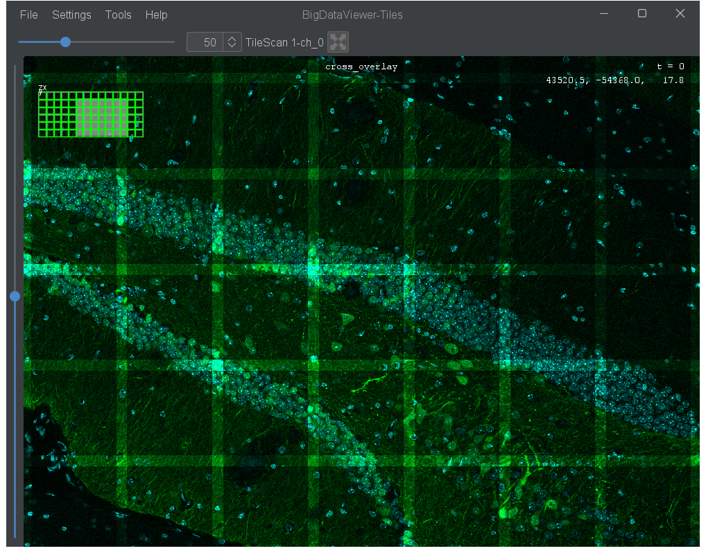
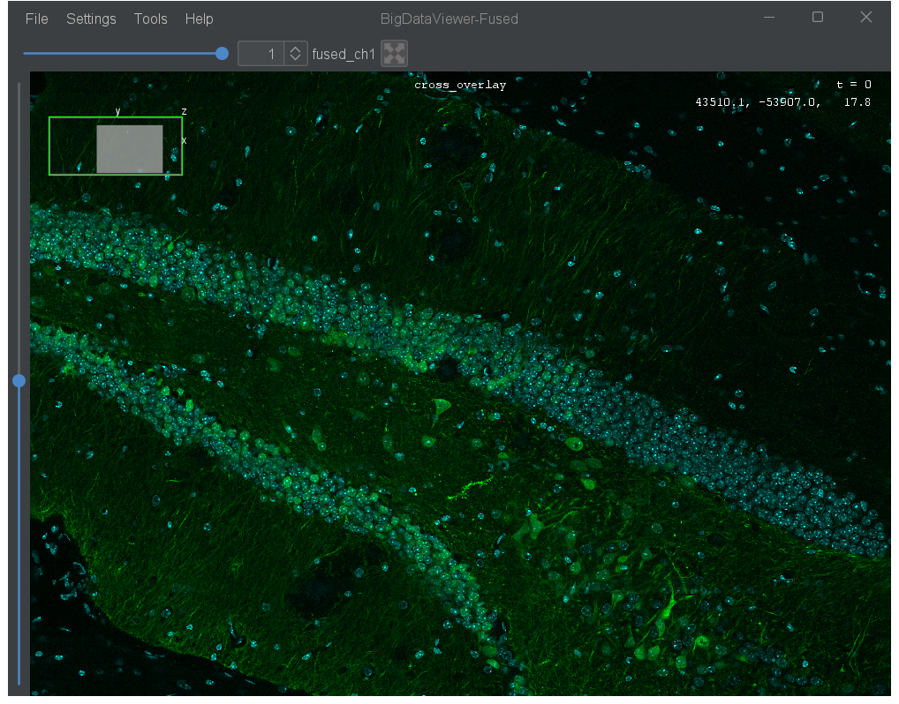
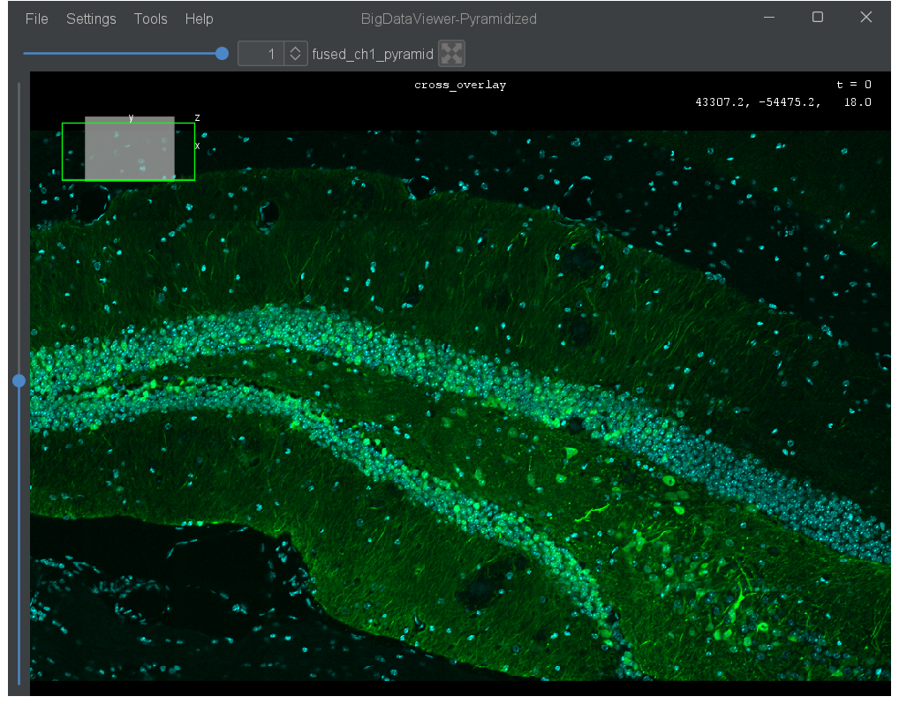

# Fuse & Resample

Fusing and resampling let you combine multiple sources into one and/or change the voxel grid of your data. This is essential when you need to:

- Merge overlapping tiles into a single seamless image
- Change the resolution or voxel size of your data
- Produce a single output from multi-channel or multi-tile acquisitions

The general workflow is: **define a target grid** (the output voxel size and extent), then **resample or fuse** your sources onto that grid.

All commands are found under:

{menuselection}`Plugins > BigDataViewer-Playground > Process > Fuse & Resample`

---

## Typical workflow

1. **Open your tiled dataset** using any of the import commands (e.g. **Dataset - Create [Bio-Formats]**). Each tile appears as a separate source in the tree.
2. **Display the sources in BigDataViewer** to verify their spatial placement before fusing.
3. **Define a resampling grid** with **Source - Define Resampling Grid**: set the desired output voxel size and select all input sources so that the model spans the full field of view.
4. **Fuse each channel** separately with **Source - Fuse And Resample Sources**: pass the tiles for one channel and the model source, then repeat for the other channel.
5. **Inspect the result** by opening the fused sources in a new BDV window, optionally synchronised with the raw tiles.
6. **Pyramidize** the fused sources (optional) with **Source - Pyramidize** to generate multi-resolution levels — this makes navigation smooth at any zoom level.

:::{note}
Run **Source - Fuse And Resample Sources** once per channel. The model source is shared across all channels; only the input tile selection changes between calls.
:::

---

## Source - Define Resampling Grid

Creates an empty model source that spans the bounding box of multiple sources with a custom voxel size. Use this to define the output grid before fusing.

| Parameter | Description |
|-----------|-------------|
| Select Source(s) | The sources whose combined bounding box defines the model extent |
| Model Name | Name for the model source |
| Voxel Size X/Y/Z | Output voxel size in each dimension (in world coordinate units) |
| Resolution Levels | Number of pyramid resolution levels to create |
| X/Y/Z Downscale Factor | Downscaling factor between resolution levels in each dimension |
| Number of Timepoints | Number of timepoints in the model source |
| Model Timepoint | Reference timepoint used to compute the bounding box |

:::{tip}
Choose the voxel size based on your desired output resolution. For example, if your sources have 0.3 µm pixels but you want a 1 µm isotropic output, set all three voxel sizes to 1.0. Set **Resolution Levels** to 1 if you plan to pyramidize later with **Source - Pyramidize**.
:::

:::::{tab-set}

::::{tab-item} GUI
{menuselection}`Plugins --> BigDataViewer-Playground --> Process --> Fuse & Resample --> Source - Define Resampling Grid`
::::

::::{tab-item} IJ Macro
```ijm
// Sources are selected interactively from the dialog.
run("Source - Define Resampling Grid");
```
::::

::::{tab-item} Groovy
```imagej-groovy
#@SourceAndConverter[] sources
#@CommandService cs

import ch.epfl.biop.command.process.resample.SourcesGridModelMakeCommand

def result = cs.run(SourcesGridModelMakeCommand, true,
    "sources", sources,
    "name", "grid_model",
    "vox_size_x", 0.25,
    "vox_size_y", 0.25,
    "vox_size_z", 0.4,
    "n_resolution_levels", 1,
    "n_timepoints", 1,
    "timepoint", 0,
    "downscale_x", 2,
    "downscale_y", 2,
    "downscale_z", 2
).get()

def model = result.getOutput("source_out")
```
::::

::::{tab-item} Python
```python
#@SourceAndConverter[] sources
#@CommandService cs

from ch.epfl.biop.command.process.resample import SourcesGridModelMakeCommand

result = cs.run(SourcesGridModelMakeCommand, True,
    ["sources", sources,
     "name", "grid_model",
     "vox_size_x", 0.25,
     "vox_size_y", 0.25,
     "vox_size_z", 0.4,
     "n_resolution_levels", 1,
     "n_timepoints", 1,
     "timepoint", 0,
     "downscale_x", 2,
     "downscale_y", 2,
     "downscale_z", 2]
).get()

model = result.getOutput("source_out")
```
::::

:::::

---

## Source - Create Resampling Grid From Source

A simpler alternative: creates a model source that occupies the same volume as a single existing source but with a different voxel size. Useful when you want to resample one source to a different resolution without changing its spatial extent.

{menuselection}`Plugins > BigDataViewer-Playground > Process > Fuse & Resample > Source - Create Resampling Grid From Source`

| Parameter | Description |
|-----------|-------------|
| Model Source | The source whose volume defines the extent of the new grid |
| Source name | Name for the new model source |
| Timepoint | Timepoint to use from the model source (0-based) |
| Voxel Size X/Y/Z | Voxel size in each dimension (in world coordinate units) |

---

## Source - Resample Source

Resamples one or more sources to match the voxel grid of a model source. The model source defines the output resolution and dimensions — the resampled source will have exactly the same grid.

{menuselection}`Plugins > BigDataViewer-Playground > Process > Fuse & Resample > Source - Resample Source`

| Parameter | Description |
|-----------|-------------|
| Select Source(s) | The source(s) to resample |
| Model Source | The source whose voxel grid defines the output |
| Name(s) | Name(s) for the resampled source(s), comma-separated for multiple |
| Interpolate | Use interpolation when resampling (recommended for intensity data) |
| Re-use MipMaps | Reuse existing pyramid levels for efficiency |
| MipMap level if not re-used | Resolution level to use when not reusing MipMaps (0 = highest resolution) |
| Cache | Cache the resampled data in memory |

---

## Source - Fuse And Resample Sources

Fuses multiple sources into a single source, resampled to match a model source's grid. This is the main command for merging overlapping tiles or combining channels with blending.

{menuselection}`Plugins > BigDataViewer-Playground > Process > Fuse & Resample > Source - Fuse And Resample Sources`

| Parameter | Description |
|-----------|-------------|
| Select Source(s) | The sources to fuse together |
| Model Source | The source whose grid defines the output resolution and dimensions |
| Output Name | Name for the fused source |
| Blending Mode | Method used to combine overlapping sources |
| Interpolate | Use interpolation when resampling |
| Re-use MipMaps | Use existing pyramid levels for efficiency |
| Default MipMap Level | Pyramid level to use if not reusing mipmaps (0 = highest resolution) |
| Cache | Cache computed blocks in memory |
| Cache Block X/Y/Z | Cache block size in each dimension |
| Cache Size Limit | Maximum number of blocks in cache (-1 = unlimited) |
| Number of Threads | Number of parallel threads for computation |

:::{tip}
For smooth transitions where tiles overlap, apply **L1 alpha blending masks** to your sources before fusing (see below). Without blending masks, hard edges will be visible at tile boundaries.
:::

:::::{tab-set}

::::{tab-item} GUI
{menuselection}`Plugins --> BigDataViewer-Playground --> Process --> Fuse & Resample --> Source - Fuse And Resample Sources`
::::

::::{tab-item} IJ Macro
```ijm
// Sources and model are selected interactively from the dialog.
// Run once per channel.
run("Source - Fuse And Resample Sources");
```
::::

::::{tab-item} Groovy
```imagej-groovy
#@SourceAndConverter[] sources_ch0
#@SourceAndConverter model
#@CommandService cs

import ch.epfl.biop.command.process.resample.SourcesFuseAndResampleCommand

// Run once per channel — change sources_ch0 to sources_ch1 for the second channel.
def result = cs.run(SourcesFuseAndResampleCommand, true,
    "sources", sources_ch0,
    "model", model,
    "name", "fused_ch0",
    "blending_mode", "AVERAGE",
    "interpolate", true,
    "reusemipmaps", false,
    "defaultmipmaplevel", 0,
    "cache", true,
    "cache_x", 512,
    "cache_y", 512,
    "cache_z", 32,
    "cache_bounds", -1,
    "n_threads", 4
).get()

def fused = result.getOutput("source_out")
```
::::

::::{tab-item} Python
```python
#@SourceAndConverter[] sources_ch0
#@SourceAndConverter model
#@CommandService cs

from ch.epfl.biop.command.process.resample import SourcesFuseAndResampleCommand

# Run once per channel — change sources_ch0 to sources_ch1 for the second channel.
result = cs.run(SourcesFuseAndResampleCommand, True,
    ["sources", sources_ch0,
     "model", model,
     "name", "fused_ch0",
     "blending_mode", "AVERAGE",
     "interpolate", True,
     "reusemipmaps", False,
     "defaultmipmaplevel", 0,
     "cache", True,
     "cache_x", 512,
     "cache_y", 512,
     "cache_z", 32,
     "cache_bounds", -1,
     "n_threads", 4]
).get()

fused = result.getOutput("source_out")
```
::::

:::::





---

## Source - Set Linear Blending Mask (L1 Alpha)

Sets a distance-based alpha blending mask on selected sources. The mask fades pixel intensity based on the distance from the source edge (L1 distance), so that overlapping regions blend smoothly when fused.

{menuselection}`Plugins > BigDataViewer-Playground > Process > Fuse & Resample > Source - Set Linear Blending Mask (L1 Alpha)`

| Parameter | Description |
|-----------|-------------|
| Select Source(s) | The sources to apply L1 alpha blending to |

Apply this to all overlapping sources **before** calling **Source - Fuse And Resample Sources**.

---

## Source - Pyramidize

Adds multi-resolution pyramid levels to one or more sources by progressively downsampling. The result is a new source with built-in mipmaps — navigation stays smooth at any zoom level because BDV automatically picks the appropriate resolution.

{menuselection}`Plugins > BigDataViewer-Playground > Process > Source - Pyramidize`

| Parameter | Description |
|-----------|-------------|
| Select Source(s) | The sources to pyramidize |

:::{tip}
Run **Source - Pyramidize** on fused or resampled sources to get efficient multi-resolution viewing. This is especially useful after **Source - Fuse And Resample Sources** when you set **Resolution Levels** to 1 in the grid model — pyramidize handles downscaling lazily without recomputing the full fusion.
:::

:::::{tab-set}

::::{tab-item} GUI
{menuselection}`Plugins --> BigDataViewer-Playground --> Process --> Source - Pyramidize`
::::

::::{tab-item} IJ Macro
```ijm
// Sources are selected interactively from the dialog.
run("Source - Pyramidize");
```
::::

::::{tab-item} Groovy
```imagej-groovy
#@SourceAndConverter[] sources
#@CommandService cs

import ch.epfl.biop.command.process.SourcesPyramidizeCommand

def result = cs.run(SourcesPyramidizeCommand, true,
    "sources", sources
).get()

def pyramidized = result.getOutput("sources_out")
```
::::

::::{tab-item} Python
```python
#@SourceAndConverter[] sources
#@CommandService cs

from ch.epfl.biop.command.process import SourcesPyramidizeCommand

result = cs.run(SourcesPyramidizeCommand, True,
    ["sources", sources]
).get()

pyramidized = result.getOutput("sources_out")
```
::::

:::::

