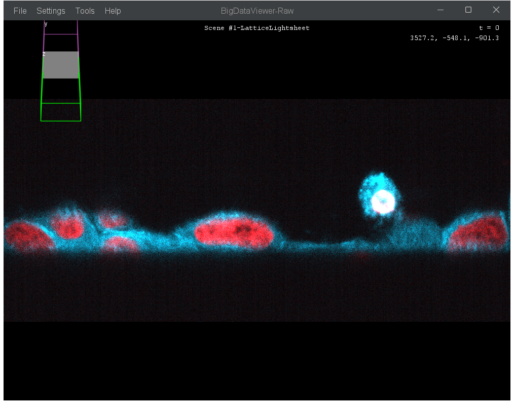
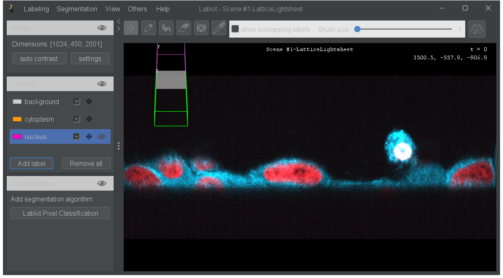
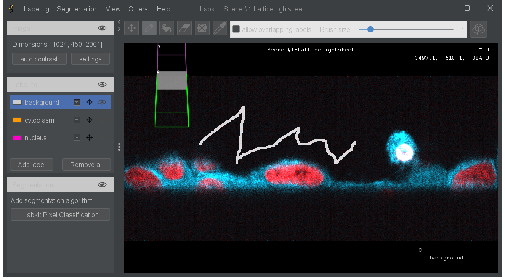
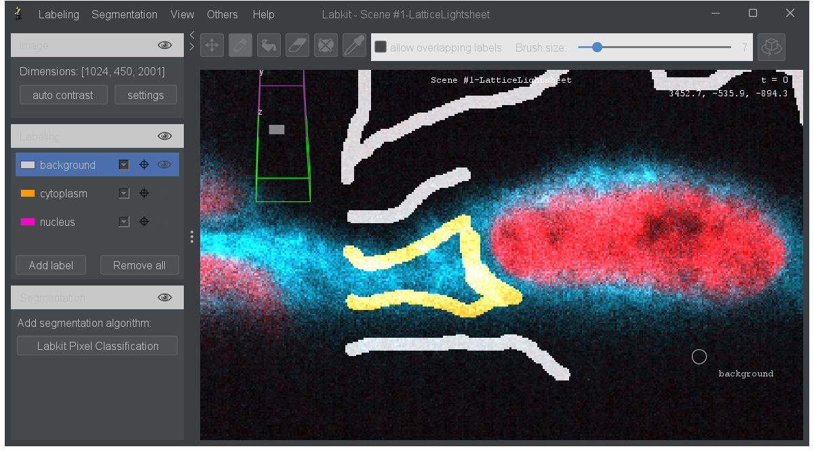
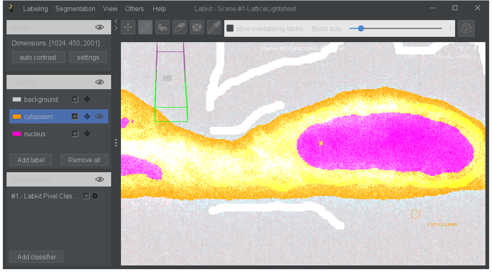
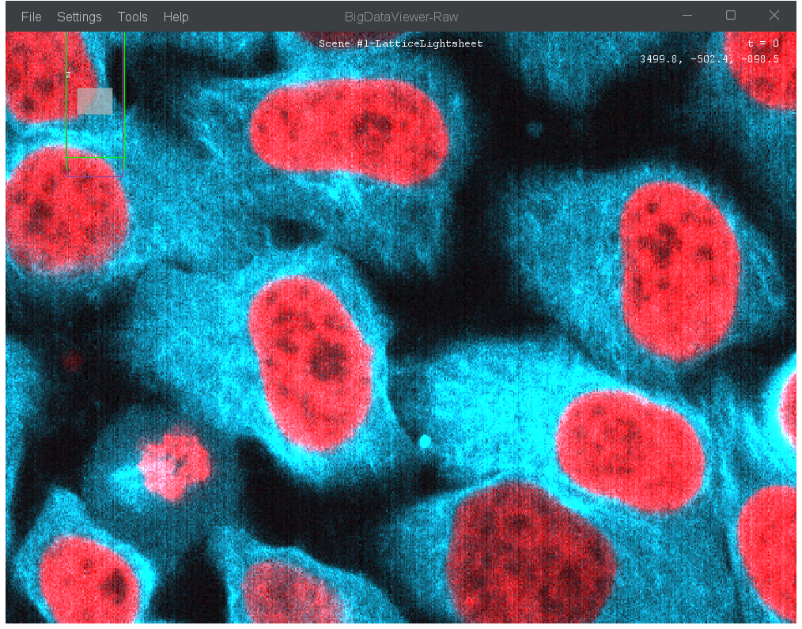
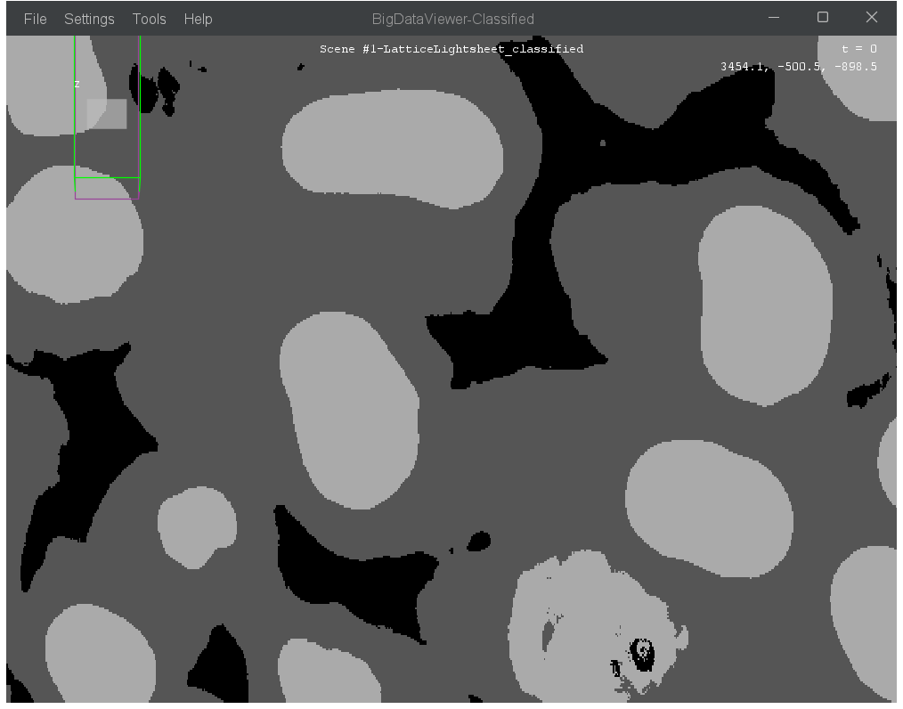

# Pixel Classification (Labkit)

Labkit integration lets you train a pixel classifier interactively and then apply it lazily to your full dataset. This is the recommended way to segment large images — you train on a small region, then the classifier is applied on-the-fly as you navigate or export.

All commands are found under:

{menuselection}`Plugins > BigDataViewer-Playground > Process > Classify (Labkit)`

The workflow below is illustrated on the LLS7 HeLa dataset (two channels). We start by visualising the raw data, train a three-class classifier (background / cytoplasm / nucleus) inside Labkit, save it, and then apply it lazily to the whole volume.



---

## Source - Open Labkit

*Source: {biop-src}`SourcesLabkitOpenCommand.java <ch/epfl/biop/command/process/labkit/SourcesLabkitOpenCommand.java>`*

Opens the Labkit pixel classification GUI for the selected sources. Each source is treated as a separate channel input to the classifier.

| Parameter | Description |
|-----------|-------------|
| Select Source(s) | The sources to open in Labkit (each treated as a channel) |
| Resolution Level | Resolution level to use (0 = full resolution, higher = lower resolution) |

:::{tip}
For large datasets, start with a higher resolution level (e.g. 2 or 3) to train your classifier quickly. Once you're satisfied, apply it at full resolution using **Source - Apply Labkit Classifier**.
:::

:::::{tab-set}

::::{tab-item} GUI
{menuselection}`Plugins --> BigDataViewer-Playground --> Process --> Classify (Labkit) --> Source - Open Labkit`


::::

::::{tab-item} IJ Macro
```ijm
// Sources are selected interactively from the dialog.
run("Source - Open Labkit");
```
::::

::::{tab-item} Groovy
```imagej-groovy
#@SourceAndConverter[] sources
#@CommandService cs

import ch.epfl.biop.command.process.labkit.SourcesLabkitOpenCommand

cs.run(SourcesLabkitOpenCommand, true,
    "sources", sources,
    "resolution_level", 2
).get()
```
::::

::::{tab-item} Python
```python
#@SourceAndConverter[] sources
#@CommandService cs

from ch.epfl.biop.command.process.labkit import SourcesLabkitOpenCommand

cs.run(SourcesLabkitOpenCommand, True,
    ["sources", sources,
     "resolution_level", 2]
).get()
```
::::

:::::

### Training the classifier in Labkit

Inside Labkit, create one label per class and scribble representative strokes on a few slices. A handful of strokes per class is usually enough — add more only where the live segmentation fails. Once satisfied, save the classifier via {menuselection}`Segmentation --> Save Classifier as...` and close the Labkit window.

::::{grid} 3
:::{grid-item}


*1. Background scribbles*
:::
:::{grid-item}


*2. Cytoplasm scribbles*
:::
:::{grid-item}


*3. Nucleus scribbles + Train Classifier*
:::
::::

---

## Source - Apply Labkit Classifier

*Source: {biop-src}`SourcesLabkitClassifyCommand.java <ch/epfl/biop/command/process/labkit/SourcesLabkitClassifyCommand.java>`*

Creates a lazy segmentation source by applying a previously saved Labkit classifier. The classification is computed on-the-fly — only the pixels you view or export are actually classified.

| Parameter | Description |
|-----------|-------------|
| Select Source(s) | The sources to classify (each treated as a channel) |
| Classifier File | Path to the Labkit `.classifier` file |
| Resolution Level | Resolution level to use from input sources (0 = full resolution) |
| Output Name Suffix | Suffix appended to the source name for the classified output |
| Use GPU | Use GPU acceleration for classification (requires compatible GPU and OpenCL) |

:::::{tab-set}

::::{tab-item} GUI
{menuselection}`Plugins --> BigDataViewer-Playground --> Process --> Classify (Labkit) --> Source - Apply Labkit Classifier`
::::

::::{tab-item} IJ Macro
```ijm
// Sources and classifier file are selected interactively from the dialog.
run("Source - Apply Labkit Classifier");
```
::::

::::{tab-item} Groovy
```imagej-groovy
#@SourceAndConverter[] sources
#@File classifier_file
#@CommandService cs

import ch.epfl.biop.command.process.labkit.SourcesLabkitClassifyCommand

def result = cs.run(SourcesLabkitClassifyCommand, true,
    "sources", sources,
    "classifier_file", classifier_file,
    "resolution_level", 0,
    "suffix", "_classified",
    "use_gpu", false
).get()

def classified = result.getOutput("source_out")
```
::::

::::{tab-item} Python
```python
#@SourceAndConverter[] sources
#@File classifier_file
#@CommandService cs

from ch.epfl.biop.command.process.labkit import SourcesLabkitClassifyCommand

result = cs.run(SourcesLabkitClassifyCommand, True,
    ["sources", sources,
     "classifier_file", classifier_file,
     "resolution_level", 0,
     "suffix", "_classified",
     "use_gpu", False]
).get()

classified = result.getOutput("source_out")
```
::::

:::::

The classified source behaves like any other source — you can browse it in BDV side by side with the raw data (synchronised with {menuselection}`Display --> BDV - Synchronize Views`), export it, or feed it into downstream commands. Only the tiles you look at are actually computed.

::::{grid} 2
:::{grid-item}


*Raw image*
:::
:::{grid-item}


*Lazy classification result*
:::
::::