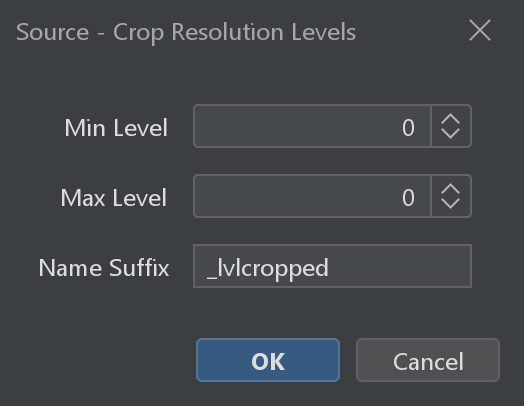
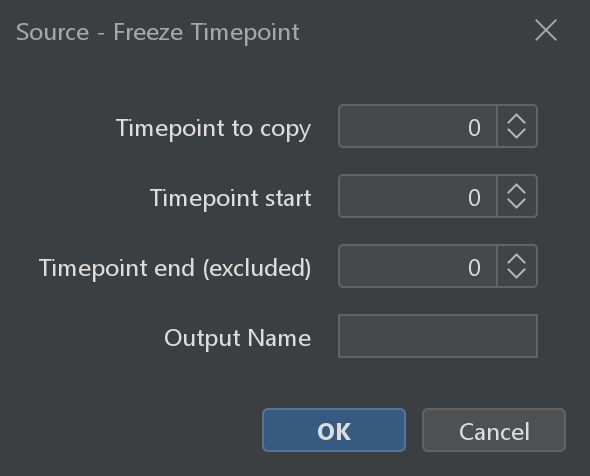
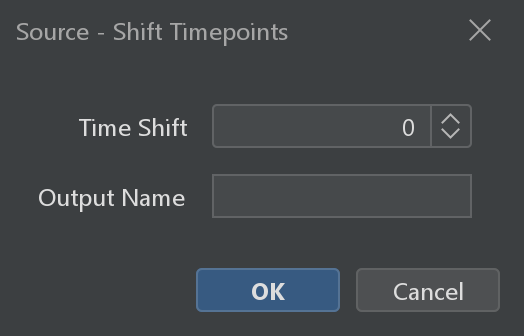
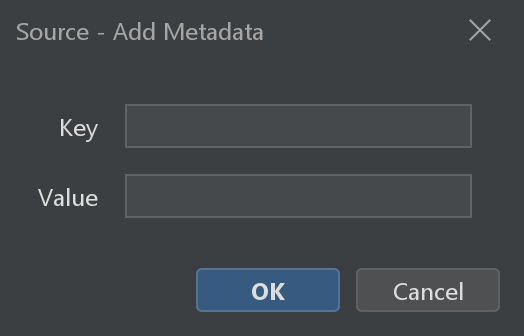

# Source Utilities

Utility commands for managing multi-resolution pyramids, timepoints, and sources in the workspace.

---

## Multi-Resolution

These commands manage the pyramid (multi-resolution) levels of your sources. Pyramid levels are crucial for interactive navigation — they let the viewer load lower-resolution tiles when zoomed out, keeping browsing responsive even on very large datasets.

### Source - Pyramidize

Generates multi-resolution pyramid levels for sources that don't already have them (e.g. sources derived from processing operations).

See [Source - Pyramidize](#fuse-resample-source-pyramidize) in the Fuse & Resample page for the full parameter table and scripting tabs.

### Source - Crop Resolution Levels

*Source: {biop-src}`SourcesResolutionLevelsCropCommand.java <ch/epfl/biop/command/process/SourcesResolutionLevelsCropCommand.java>`*

Creates a new source with only a subset of the original resolution levels. Useful when you want to restrict which pyramid levels are available — for example, to skip the lowest-resolution levels or to start from a specific level.

| Parameter | Description |
|-----------|-------------|
| Select Sources | The sources to crop resolution levels from |
| Min Level | Minimum resolution level to keep (0 = highest resolution) |
| Max Level | Maximum resolution level to keep (inclusive) |
| Name Suffix | Suffix to append to the source name |

:::::{tab-set}

::::{tab-item} GUI
{menuselection}`Plugins --> BigDataViewer-Playground --> Process --> Source - Crop Resolution Levels`


::::

::::{tab-item} IJ Macro
```ijm
// Sources are selected interactively from the dialog.
run("Source - Crop Resolution Levels");
```
::::

::::{tab-item} Groovy
```imagej-groovy
#@SourceAndConverter[] sources
#@CommandService cs

import ch.epfl.biop.command.process.SourcesResolutionLevelsCropCommand

def result = cs.run(SourcesResolutionLevelsCropCommand, true,
    "sources", sources,
    "minLevel", 0,
    "maxLevel", 3,
    "suffix", "_cropped"
).get()

def cropped = result.getOutput("sources_out")
```
::::

::::{tab-item} Python
```python
#@SourceAndConverter[] sources
#@CommandService cs

from ch.epfl.biop.command.process import SourcesResolutionLevelsCropCommand

result = cs.run(SourcesResolutionLevelsCropCommand, True,
    ["sources", sources,
     "minLevel", 0,
     "maxLevel", 3,
     "suffix", "_cropped"]
).get()

cropped = result.getOutput("sources_out")
```
::::

:::::

---

## Timepoint Operations

Commands for manipulating the time dimension of your sources.

### Source - Freeze Timepoint

*Source: {biop-src}`SourcesOverTimeDuplicateCommand.java <ch/epfl/biop/command/process/SourcesOverTimeDuplicateCommand.java>`*

Creates a new source that shows a single fixed timepoint across a range of timepoints. Useful for creating a static reference from a time-series — for example, freezing a pre-treatment timepoint so it can be compared side-by-side with later timepoints.

| Parameter | Description |
|-----------|-------------|
| Select Sources | The sources to freeze |
| Timepoint to copy | The timepoint to replicate |
| Timepoint start | Start of the output time range |
| Timepoint end (excluded) | End of the output time range (exclusive) |
| Output Name | Suffix for the resulting source |

:::::{tab-set}

::::{tab-item} GUI
{menuselection}`Plugins --> BigDataViewer-Playground --> Process --> Source - Freeze Timepoint`


::::

::::{tab-item} IJ Macro
```ijm
// Sources are selected interactively from the dialog.
run("Source - Freeze Timepoint");
```
::::

::::{tab-item} Groovy
```imagej-groovy
#@SourceAndConverter[] sources
#@CommandService cs

import ch.epfl.biop.command.process.SourcesOverTimeDuplicateCommand

def result = cs.run(SourcesOverTimeDuplicateCommand, true,
    "sources", sources,
    "timepoint_to_copy", 0,
    "t_start", 0,
    "t_end", 10,
    "suffix", "_frozen"
).get()

def frozen = result.getOutput("sources_out")
```
::::

::::{tab-item} Python
```python
#@SourceAndConverter[] sources
#@CommandService cs

from ch.epfl.biop.command.process import SourcesOverTimeDuplicateCommand

result = cs.run(SourcesOverTimeDuplicateCommand, True,
    ["sources", sources,
     "timepoint_to_copy", 0,
     "t_start", 0,
     "t_end", 10,
     "suffix", "_frozen"]
).get()

frozen = result.getOutput("sources_out")
```
::::

:::::

### Source - Shift Timepoints

*Source: {biop-src}`SourcesTimeShiftDuplicateCommand.java <ch/epfl/biop/command/process/SourcesTimeShiftDuplicateCommand.java>`*

Creates a new source with timepoints offset by a fixed amount. Useful for aligning time-series data that was acquired with different starting times.

| Parameter | Description |
|-----------|-------------|
| Select Sources | The sources to time-shift |
| Time Shift | Number of timepoints to shift (positive = forward, negative = backward) |
| Output Name | Suffix for the resulting source |

:::::{tab-set}

::::{tab-item} GUI
{menuselection}`Plugins --> BigDataViewer-Playground --> Process --> Source - Shift Timepoints`


::::

::::{tab-item} IJ Macro
```ijm
// Sources are selected interactively from the dialog.
run("Source - Shift Timepoints");
```
::::

::::{tab-item} Groovy
```imagej-groovy
#@SourceAndConverter[] sources
#@CommandService cs

import ch.epfl.biop.command.process.SourcesTimeShiftDuplicateCommand

def result = cs.run(SourcesTimeShiftDuplicateCommand, true,
    "sources", sources,
    "timeshift", 5,
    "suffix", "_shifted"
).get()

def shifted = result.getOutput("sources_out")
```
::::

::::{tab-item} Python
```python
#@SourceAndConverter[] sources
#@CommandService cs

from ch.epfl.biop.command.process import SourcesTimeShiftDuplicateCommand

result = cs.run(SourcesTimeShiftDuplicateCommand, True,
    ["sources", sources,
     "timeshift", 5,
     "suffix", "_shifted"]
).get()

shifted = result.getOutput("sources_out")
```
::::

:::::

---

## Source Management

### Source - Delete

*Source: {bdvpg-src}`SourceDeleteCommand.java <sc/fiji/bdvpg/command/process/SourceDeleteCommand.java>`*

Removes selected sources from the workspace.

| Parameter | Description |
|-----------|-------------|
| Select Source(s) | The sources to remove |

:::::{tab-set}

::::{tab-item} GUI
{menuselection}`Plugins --> BigDataViewer-Playground --> Process --> Source - Delete`
::::

::::{tab-item} IJ Macro
```ijm
// Sources are selected interactively from the dialog.
run("Source - Delete");
```
::::

::::{tab-item} Groovy
```imagej-groovy
#@SourceAndConverter[] sources
#@CommandService cs

import sc.fiji.bdvpg.command.process.SourceDeleteCommand

cs.run(SourceDeleteCommand, true,
    "sources", sources
).get()
```
::::

::::{tab-item} Python
```python
#@SourceAndConverter[] sources
#@CommandService cs

from sc.fiji.bdvpg.command.process import SourceDeleteCommand

cs.run(SourceDeleteCommand, True,
    ["sources", sources]
).get()
```
::::

:::::

### Source - Duplicate

*Source: {bdvpg-src}`SourceDuplicateCommand.java <sc/fiji/bdvpg/command/process/SourceDuplicateCommand.java>`*

Creates a copy of the selected sources. The duplicated sources appear under the **Other Sources** node in the sources tree.

| Parameter | Description |
|-----------|-------------|
| Select Source(s) | The sources to duplicate |

:::::{tab-set}

::::{tab-item} GUI
{menuselection}`Plugins --> BigDataViewer-Playground --> Process --> Source - Duplicate`
::::

::::{tab-item} IJ Macro
```ijm
// Sources are selected interactively from the dialog.
run("Source - Duplicate");
```
::::

::::{tab-item} Groovy
```imagej-groovy
#@SourceAndConverter[] sources
#@CommandService cs

import sc.fiji.bdvpg.command.process.SourceDuplicateCommand

cs.run(SourceDuplicateCommand, true,
    "sources", sources
).get()
// The duplicated sources appear under "Other Sources" in the sources tree.
```
::::

::::{tab-item} Python
```python
#@SourceAndConverter[] sources
#@CommandService cs

from sc.fiji.bdvpg.command.process import SourceDuplicateCommand

cs.run(SourceDuplicateCommand, True,
    ["sources", sources]
).get()
# The duplicated sources appear under "Other Sources" in the sources tree.
```
::::

:::::

### Source - Add Metadata

*Source: {bdvpg-src}`SourceMetadataAddCommand.java <sc/fiji/bdvpg/command/process/SourceMetadataAddCommand.java>`*

Attaches a key-value metadata string to selected sources. Metadata is useful for filtering in the tree view (e.g. group sources by experiment condition).

| Parameter | Description |
|-----------|-------------|
| Select Source(s) | The sources to tag |
| Key | Metadata key |
| Value | Metadata value |

:::::{tab-set}

::::{tab-item} GUI
{menuselection}`Plugins --> BigDataViewer-Playground --> Process --> Source - Add Metadata`


::::

::::{tab-item} IJ Macro
```ijm
// Sources are selected interactively from the dialog.
run("Source - Add Metadata");
```
::::

::::{tab-item} Groovy
```imagej-groovy
#@SourceAndConverter[] sources
#@CommandService cs

import sc.fiji.bdvpg.command.process.SourceMetadataAddCommand

cs.run(SourceMetadataAddCommand, true,
    "sources", sources,
    "key", "condition",
    "value", "treated"
).get()
```
::::

::::{tab-item} Python
```python
#@SourceAndConverter[] sources
#@CommandService cs

from sc.fiji.bdvpg.command.process import SourceMetadataAddCommand

cs.run(SourceMetadataAddCommand, True,
    ["sources", sources,
     "key", "condition",
     "value", "treated"]
).get()
```
::::

:::::