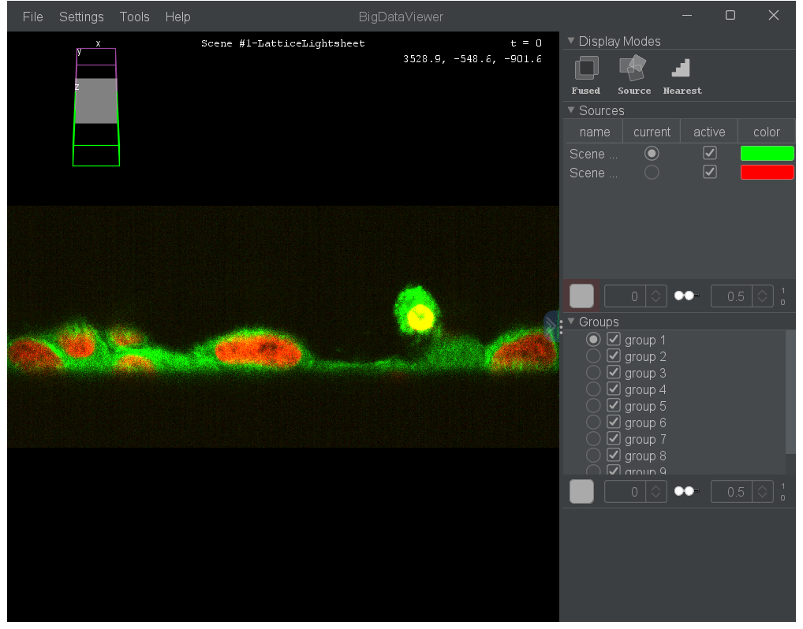
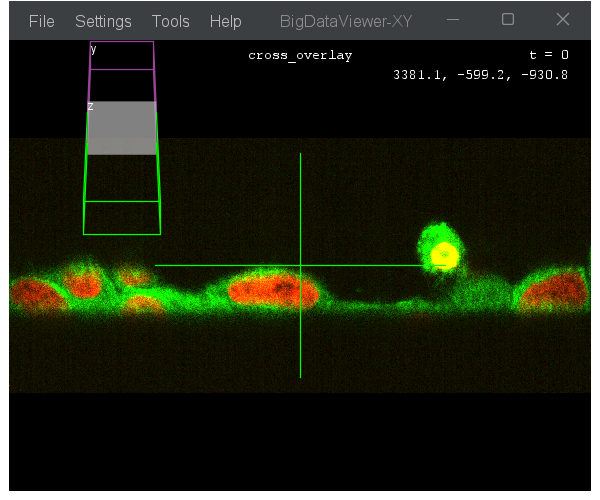
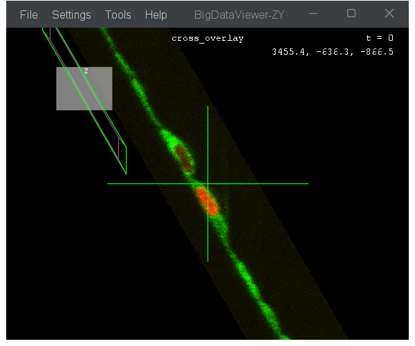
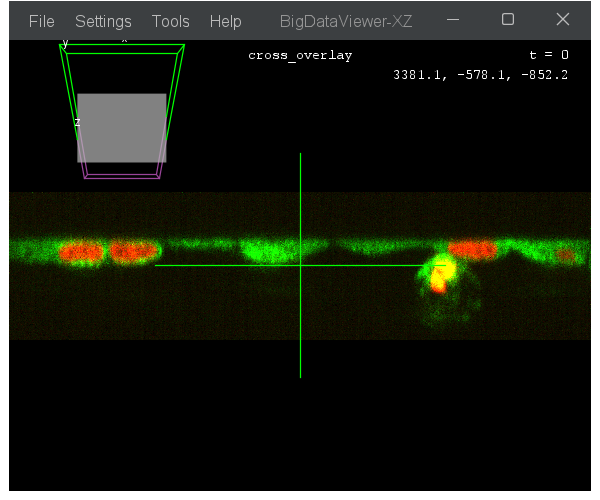
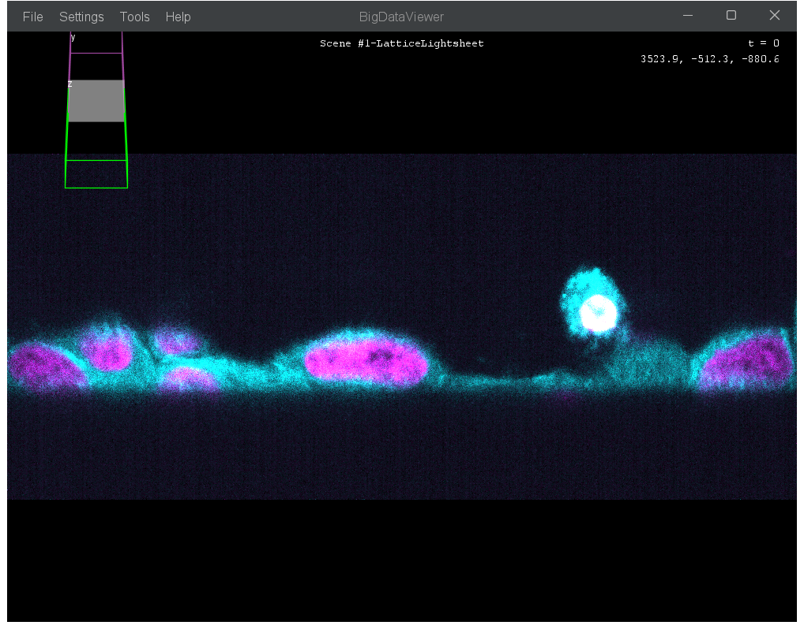
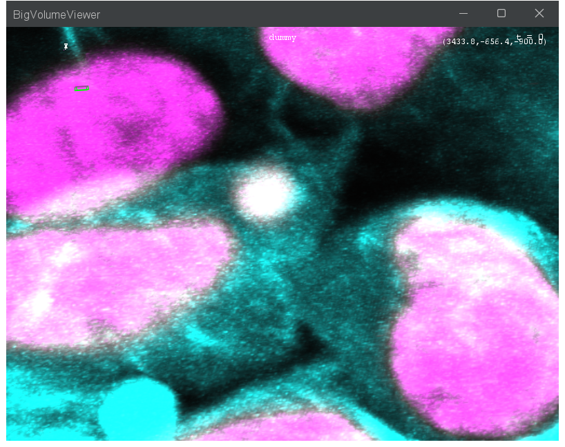
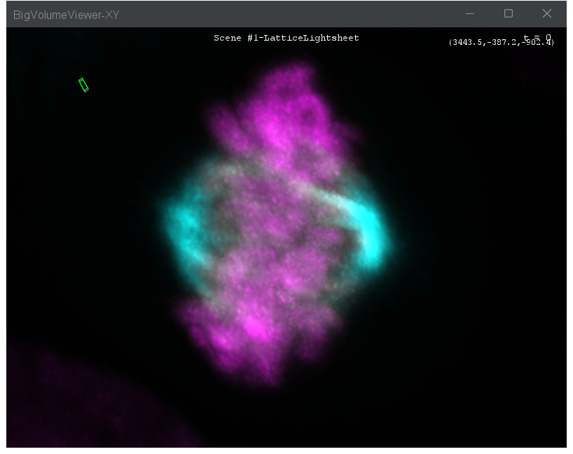
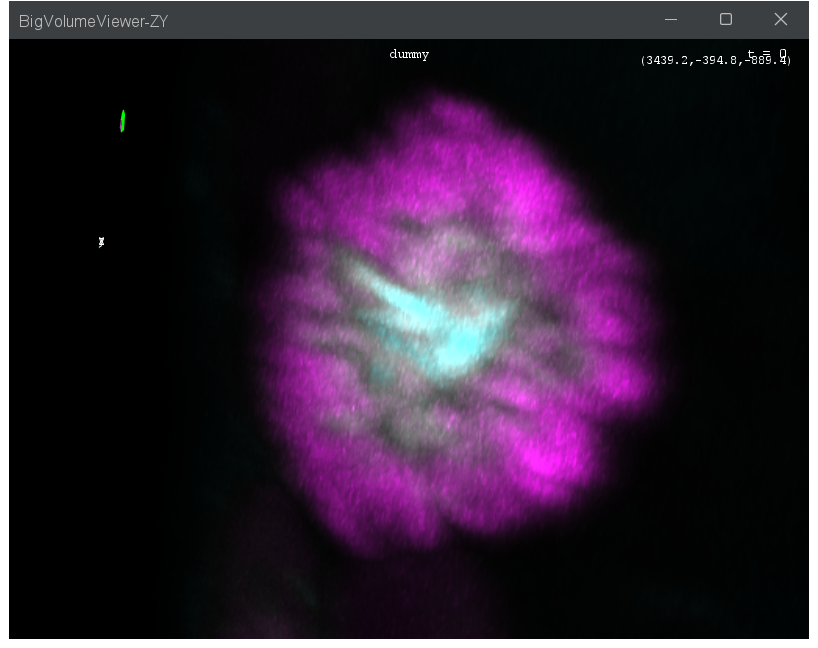
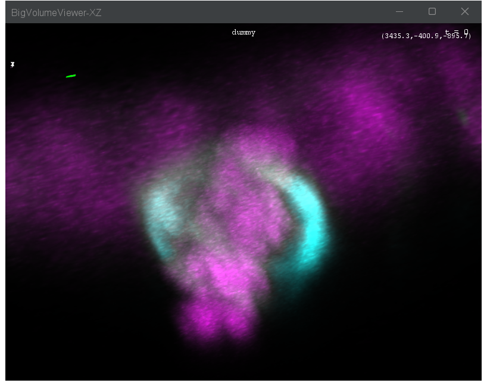

# Visualizing Images

This guide covers how to display your datasets in viewer windows and control their appearance.

BigDataViewer Playground provides two types of viewers:

- **BDV (BigDataViewer)** — a 2D slice viewer that lets you navigate freely through 3D data by slicing at any orientation. This is the primary viewer for most tasks.
- **BVV (BigVolumeViewer)** — a GPU-accelerated 3D volume renderer that shows your data as a translucent volume. Useful for getting a spatial overview of 3D structures.

Both viewers share the same lazy-loading architecture: only the pixels currently visible on screen are fetched, so even terabyte-scale datasets can be explored interactively.

All display commands are found under:

```
Menu: Plugins > BigDataViewer-Playground > Display
```

---

## Opening a BDV Window

### BDV - Show Sources

The most common way to visualize your data. Creates a new BDV window and displays the selected sources in it.

```
Menu: Plugins > BigDataViewer-Playground > Display > BDV > BDV - Show Sources
```

| Parameter | Description |
|-----------|-------------|
| Select Source(s) | The source(s) to display |
| Adjust View on Sources | Centers and zooms the view to fit the displayed sources |
| Auto Contrast | Automatically adjusts brightness and contrast based on the current timepoint |
| Interpolate | Enables interpolation for smoother rendering |
| Open In New Window | Force creation of a new window (otherwise reuses an existing one) |

:::{tip}
If you have already opened a BDV window and want to add more sources to it, uncheck **Open In New Window**. The sources will be added to the last active BDV window.
:::



### BDV - Create

Creates an empty BDV window without any sources. You can then add sources to it later using **BDV - Show Sources** or **BDV - Show Sources In Multiple Windows**.

```
Menu: Plugins > BigDataViewer-Playground > Display > BDV > BDV - Create
```

### BDV - Show Sources In Multiple Windows

Adds sources to several existing BDV windows at once.

```
Menu: Plugins > BigDataViewer-Playground > Display > BDV > BDV - Show Sources In Multiple Windows
```

| Parameter | Description |
|-----------|-------------|
| Select BDV Windows | The BDV windows to add sources to |
| Select Source(s) | The source(s) to add |

---

## Navigating in BDV

BigDataViewer uses a combination of mouse and keyboard controls for navigation. Here are the essential shortcuts:

### Mouse Controls

| Action | Effect |
|--------|--------|
| Left-click + drag | Pan (translate) the view |
| Right-click + drag (or middle-click + drag) | Rotate the view in 3D |
| Scroll wheel | Zoom in/out |
| Shift + scroll wheel | Walk through Z slices (translate along the viewing axis) |

### Keyboard Shortcuts

| Key | Effect |
|-----|--------|
| {kbd}`X` / {kbd}`Y` / {kbd}`Z` | Align the view to the X, Y, or Z axis |
| {kbd}`Shift+X` / {kbd}`Shift+Y` / {kbd}`Shift+Z` | Align to the opposite direction of that axis |
| {kbd}`I` | Toggle between nearest-neighbor and interpolated rendering |
| {kbd}`S` | Toggle brightness/contrast dialog |
| {kbd}`F6` | Toggle visibility settings (choose which sources are shown) |
| {kbd}`T` | Toggle timepoint slider |
| {kbd}`[` / {kbd}`]` | Step backward/forward through timepoints |
| {kbd}`Numpad 1`–`0` | Toggle visibility of source 1–10 |
| {kbd}`Shift+Numpad 1`–`0` | Toggle whether source 1–10 belongs to the current group |
| {kbd}`F` | Set the view transform to show the entire dataset |

:::{note}
These are the default BigDataViewer key bindings. They can be customized via **BDV - Preferences - Set (Key) Bindings**.
:::

---

## Orthogonal Views

### BDV - Create Orthogonal Views

Opens three synchronized BDV windows showing XY (front), ZY (right), and XZ (bottom) views. Navigating in one window automatically updates the other two.

```
Menu: Plugins > BigDataViewer-Playground > Display > BDV > BDV - Create Orthogonal Views
```

| Parameter | Description |
|-----------|-------------|
| Window Width / Height | Size in pixels for each BDV window |
| X/Y Front Window Location | Screen position for the front (XY) window |
| Number of timepoints | Total number of timepoints (use 1 for a single timepoint) |
| Display | Screen index for window placement (use 0 if you have one screen) |
| Add cross overlay | Draws a cross at the center of each window |
| Interpolate | Enables interpolation for smoother rendering |
| Synchronize sources | Sources added to one window will automatically appear in all three |

  

---

## Grid Overview

When working with many sources (e.g. multiple tiles or channels), it can be helpful to see them all at once.

### BDV - Show Sources On Grid

Arranges selected sources in a grid layout within a new BDV window. Each cell shows one source, giving you a quick overview of all your data.

```
Menu: Plugins > BigDataViewer-Playground > Display > BDV > BDV - Show Sources On Grid
```

| Parameter | Description |
|-----------|-------------|
| Select Source(s) | The sources to display on the grid |
| Number of Columns | Number of columns in the grid layout |
| Split by Entities | Comma-separated entity types to split by (e.g. `channel, fileseries`) |
| Start Timepoint | The timepoint to use for determining source dimensions |


### BDV - Create Grid BDV

Creates an empty BDV window pre-configured for grid display. You can then add sources to it.

```
Menu: Plugins > BigDataViewer-Playground > Display > BDV > BDV - Create Grid BDV
```

---

## Adjusting Source Appearance

These commands control how individual sources look in any viewer window — color, brightness, and visibility. They affect display only, never the underlying data.

### Source - Set Color

Changes the display color of one or more sources.

```
Menu: Plugins > BigDataViewer-Playground > Display > Source > Source - Set Color
```

| Parameter | Description |
|-----------|-------------|
| Select Source(s) | The source(s) to recolor |
| Color | The new display color |



### Source - Set Brightness

Sets the display range (min and max intensity values) for one or more sources. This is the equivalent of adjusting the "Brightness & Contrast" in Fiji.

```
Menu: Plugins > BigDataViewer-Playground > Display > Source > Source - Set Brightness
```

| Parameter | Description |
|-----------|-------------|
| Select Source(s) | The source(s) to adjust |
| Min | Minimum value of the display range |
| Max | Maximum value of the display range |

### Source - Make Visible / Make Invisible

Toggles whether sources are drawn in all BDV windows where they are present.

```
Menu: Plugins > BigDataViewer-Playground > Display > Source > Source - Make Visible
Menu: Plugins > BigDataViewer-Playground > Display > Source > Source - Make Invisible
```

---

## Managing BDV Windows

### BDV - Adjust View On Sources

Reframes the current view to fit the selected sources. Useful when you have lost your bearings or want to quickly navigate to a specific source.

```
Menu: Plugins > BigDataViewer-Playground > Display > BDV > BDV - Adjust View On Sources
```

| Parameter | Description |
|-----------|-------------|
| Select BDV Window | The BDV window to adjust |
| Select Source(s) | The source(s) to frame |

### BDV - Remove Sources

Removes sources from one or more BDV windows. This only removes them from the viewer — it does not delete the sources from the dataset.

```
Menu: Plugins > BigDataViewer-Playground > Display > BDV > BDV - Remove Sources
```

| Parameter | Description |
|-----------|-------------|
| Select BDV Windows | The windows to remove sources from |
| Select Source(s) | The source(s) to remove |

### BDV - Close

Closes one or more BDV windows.

```
Menu: Plugins > BigDataViewer-Playground > Display > BDV > BDV - Close
```

### BDV - Set Title

Changes the title of a BDV window.

```
Menu: Plugins > BigDataViewer-Playground > Display > BDV > Settings > BDV - Set Title
```

---

## Overlays

Overlays add visual annotations on top of the viewer without modifying the data.

### BDV - Add Center Cross Overlay

Draws a crosshair at the center of the BDV window. Helpful for orthogonal view setups to see where the three planes intersect.

```
Menu: Plugins > BigDataViewer-Playground > Display > BDV > Overlay > BDV - Add Center Cross Overlay
```

### BDV - Add Sources Name Overlay

Displays the name of each visible source as a text label on the viewer.

```
Menu: Plugins > BigDataViewer-Playground > Display > BDV > Overlay > BDV - Add Sources Name Overlay
```

| Parameter | Description |
|-----------|-------------|
| Select BDV Windows | The windows to add overlays to |
| Font | Font family for the labels |
| Font Size | Font size for the labels |

### BDV - Add Debug Overlay

Shows the internal tiled rendering grid. Primarily useful for debugging rendering performance.

```
Menu: Plugins > BigDataViewer-Playground > Display > BDV > Overlay > BDV - Add Debug Overlay
```

---

## BDV Settings

These commands add UI elements or configure defaults for BDV windows.

### BDV - Add Z Slider

Adds a Z-position slider to the bottom of BDV windows, giving you a familiar way to scroll through Z slices.

```
Menu: Plugins > BigDataViewer-Playground > Display > BDV > Settings > BDV - Add Z Slider
```

### BDV - Add Sources Slider

Adds a slider to step through sources one by one. Useful when you have many sources and want to flip through them.

```
Menu: Plugins > BigDataViewer-Playground > Display > BDV > Settings > BDV - Add Sources Slider
```

### BDV - Add Editor

Installs a source selection editor on BDV windows. Press the toggle key to switch between navigation and editor mode.

```
Menu: Plugins > BigDataViewer-Playground > Display > BDV > Settings > BDV - Add Editor
```

| Parameter | Description |
|-----------|-------------|
| Select BDV Windows | The windows to install the editor on |
| Toggle key | Keyboard shortcut to toggle between navigation and editor mode |

### Timepoints

BDV windows have a fixed number of timepoints. If your data has more timepoints than the window allows, you won't be able to navigate to them.

```
Menu: Plugins > BigDataViewer-Playground > Display > BDV > Settings > BDV - Set Number Of Timepoints
Menu: Plugins > BigDataViewer-Playground > Display > BDV > Settings > BDV - Adapt Number Of Timepoints To Sources
```

**Set Number Of Timepoints** lets you specify the number manually. **Adapt Number Of Timepoints To Sources** automatically sets it to match the sources currently in the window.

### BDV - Preferences - Set (Key) Bindings

Opens a dialog to customize the keyboard and mouse bindings for BDV windows.

```
Menu: Plugins > BigDataViewer-Playground > Display > BDV > Settings > BDV - Preferences - Set (Key) Bindings
```

---

## Customizing BDV Defaults

These commands configure the default appearance and behavior of **newly created** BDV windows. They do not affect windows that are already open.

### BDV - Set Style (Default)

```
Menu: Plugins > BigDataViewer-Playground > Display > BDV > Settings > BDV - Set Style (Default)
```

| Parameter | Description |
|-----------|-------------|
| Window title | Default title for new BDV windows |
| Window width / height | Default window dimensions in pixels |
| Interpolate | Enable interpolation by default |
| 2D mode | Restricts navigation to 2D (only Z-rotations allowed) |
| Number of timepoints | Default number of timepoints |
| Number of rendering threads | Threads used for rendering |
| Number of source groups | Source groups available in the window |
| Screen scales | Comma-separated scale factors for multi-resolution rendering (e.g. `1, 0.5, 0.25`) |
| Target render time (ms) | Target time per frame in milliseconds |
| Reset to default | Ignore all parameters and reset to defaults |

### BDV - Set Style (BIOP)

An alternative default style provided by the BIOP team. Includes additional options like font and font size for the source name overlay.

```
Menu: Plugins > BigDataViewer-Playground > Display > BDV > Settings > BDV - Set Style (BIOP)
```

### BDV - Set Style (Alpha)

A style that supports alpha (transparency) blending and white background. Useful when preparing figures or overlaying partially transparent sources.

```
Menu: Plugins > BigDataViewer-Playground > Display > BDV > Settings > BDV - Set Style (Alpha)
```

---

## Synchronizing Viewers

When working with multiple viewer windows, you can synchronize them so they move together.

### Viewers - Synchronize Views

Locks the navigation of multiple BDV and/or BVV windows together. When you pan, zoom, or rotate in one window, all synchronized windows follow. A small popup window appears — close it to stop the synchronization.

```
Menu: Plugins > BigDataViewer-Playground > Display > Viewers - Synchronize Views
```

| Parameter | Description |
|-----------|-------------|
| Select BDV Windows to synchronize | BDV windows to include |
| Select BVV Windows to synchronize | BVV windows to include |
| Synchronize timepoints | Also synchronizes the current timepoint across windows |

### Viewers - Synchronize States

Synchronizes which sources are visible across multiple viewer windows. When you toggle a source on or off in one window, all synchronized windows update. Close the popup window to stop.

```
Menu: Plugins > BigDataViewer-Playground > Display > Viewers - Synchronize States
```

---

## Capturing the Current View

The current BDV view can be exported as a standard Fiji ImagePlus or as new sources for further processing. These commands are covered in detail in the Exporting Images guide, but here is a quick overview:

| Command | What it does |
|---------|-------------|
| BDV - Export Current View As ImagePlus | Full control over pixel size, region, and Z thickness |
| BDV - Export Current View As ImagePlus (Match Window) | Quick capture using the current window dimensions |
| BDV - Export Current View As Sources | Creates new sources resampled at the current view orientation (oblique slicing) |

```
Menu: Plugins > BigDataViewer-Playground > Display > BDV > Export
```

---

## Volume Rendering with BVV

BigVolumeViewer (BVV) renders your data as a 3D volume using GPU acceleration. This is useful for getting a spatial overview of structures that are hard to appreciate in 2D slices.

:::{note}
BVV requires a GPU with OpenGL 3.3+ support. It may not be available on all systems.
:::

### BVV - Create

Creates an empty BVV window.

```
Menu: Plugins > BigDataViewer-Playground > Display > BVV > BVV - Create
```

| Parameter | Description |
|-----------|-------------|
| Title of the new BVV window | Window title |

### BVV - Show Sources

Adds sources to an existing BVV window.

```
Menu: Plugins > BigDataViewer-Playground > Display > BVV > BVV - Show Sources
```

| Parameter | Description |
|-----------|-------------|
| Select BVV Window | The BVV window to add sources to |
| Select source(s) | The source(s) to display |
| Adjust View on Source | Centers and zooms the view to fit the added sources |



### BVV - Create Orthogonal Views

Creates three synchronized BVV windows with orthogonal orientations, analogous to the BDV orthogonal views but with volume rendering.

```
Menu: Plugins > BigDataViewer-Playground > Display > BVV > BVV - Create Orthogonal Views
```

  

### BVV - Remove Sources

Removes sources from BVV windows.

```
Menu: Plugins > BigDataViewer-Playground > Display > BVV > BVV - Remove Sources
```

### BVV - Set Number Of Timepoints

Sets the number of timepoints available in BVV windows.

```
Menu: Plugins > BigDataViewer-Playground > Display > BVV > Settings > BVV - Set Number Of Timepoints
```