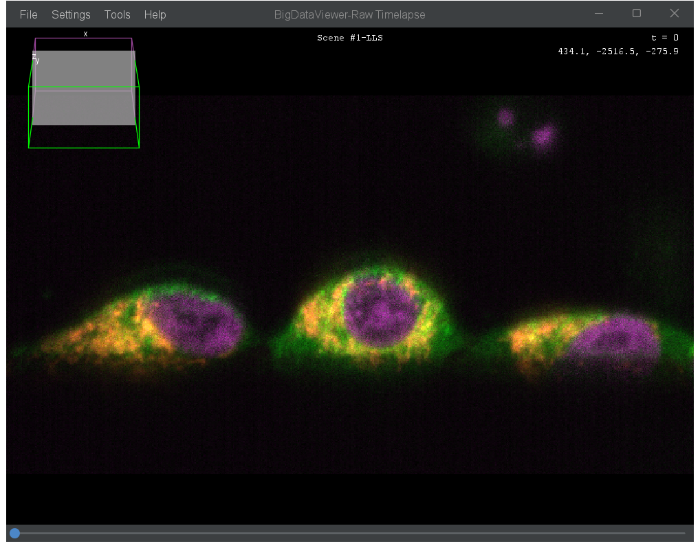
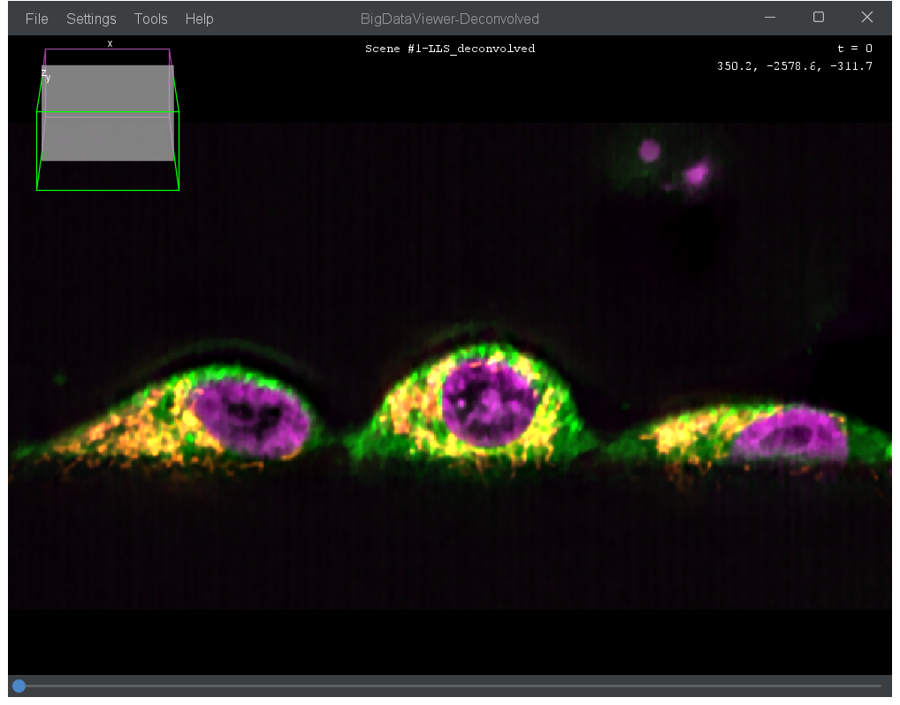
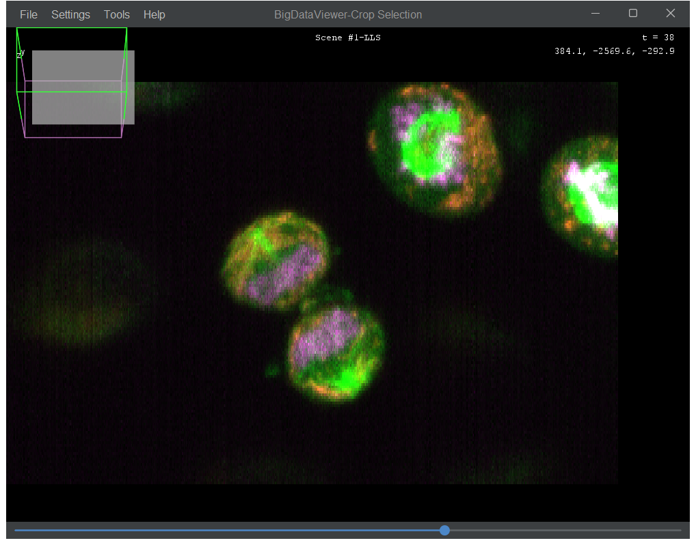
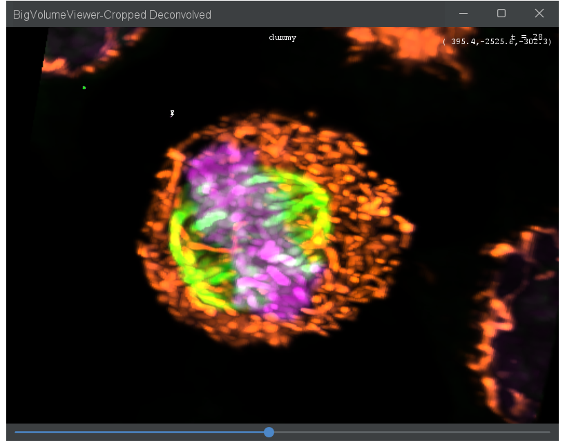

# Process LLS7 Timelapse

This workflow guides you through processing lattice light-sheet (LLS7) timelapse data using BigDataViewer Playground's lazy processing capabilities.

## Goal

Transform raw LLS7 acquisitions into analysis-ready data:
- Visualize skewed data directly (no recomputation needed)
- Deconvolve for improved resolution (on skewed data for efficiency)
- Correct Z-drift over time
- Crop and deskew in a single step
- Export for downstream analysis

## Prerequisites

- [ ] BigDataViewer Playground installed ([Installation Guide](../installation/installation.md))
- [ ] **Quick Start CZI Reader** update site enabled (for optimal CZI handling)
- [ ] CLIJ/CLIJ2 + clijx-deconvolution update sites (for GPU deconvolution)
- [ ] LLS7 raw data (.czi format)
- [ ] PSF image in skewed geometry (for deconvolution)

## Overview

```
┌─────────────┐     ┌──────────────┐     ┌─────────────┐     ┌──────────────┐     ┌──────────────┐
│ Open LLS7   │ --> │ Deconvolve   │ --> │ Correct     │ --> │ Crop         │ --> │ Export       │
│ Raw Data    │     │ (optional)   │     │ Drift       │     │ (& Deskew)   │     │              │
└─────────────┘     └──────────────┘     └─────────────┘     └──────────────┘     └──────────────┘
```

---

## Step 1: Open LLS7 Data

### Load Raw Acquisition

With the **Quick Start CZI Reader** update site enabled, use the standard Bio-Formats opener:

```
Menu: Plugins > BigDataViewer-Playground > BDVDataset > Create BDV Dataset [Bio-Formats]
```

The opener automatically recognizes that the dataset is skewed and applies the proper 3D transformation for display. **There is no need to compute a deskewed dataset** - BigDataViewer supports arbitrary 3D transformations, so the skewed data is displayed with the correct geometry directly.



### Verify Loading

After opening, the source appears in the BDV Sources tree. You can:
- Right-click and use the contextual menu to display it in a viewer
- Double click to adjust the viewer on the sources.

:::{tip}
**Quick preview**: You can also open the MIP (Maximum Intensity Projection) images automatically generated by the LLS7 for each acquisition. This allows quick visualization without loading the full dataset.
:::

:::{note}
The raw data appears in its native skewed geometry when visualized, but BDV applies the correct transform so structures appear properly oriented. The actual deskewing (resampling to orthogonal coordinates) happens later during the crop step.
:::

---

## Step 2: Deconvolve (Recommended)

GPU-accelerated Richardson-Lucy deconvolution significantly improves image quality.

### Key Concept: Deconvolve in Skewed Space

**Important**: Deconvolution is performed directly on the skewed dataset. This saves computation time.

- No resampling is needed before deconvolution
- The PSF must also be in the skewed geometry

### PSF Requirements

You need a Point Spread Function (PSF) acquired in the same skewed geometry as your data.

**Best option**: Experimentally measured PSF using fluorescent beads in agarose, acquired on your system. See [PSF Acquisition Guide](lls7_psf_acquisition.md) for details.

**Alternative**: Use pre-measured PSFs from the BIOP system, available on Zenodo with different Z-spacings:
- [BIOP LLS7 PSFs (Zenodo)](https://zenodo.org/records/11396388) - Available in 200nm, 300nm, and 400nm Z-spacing

Do not use an oversized PSF image. Crop it in all directions until fluorescence values are significant. This will speed computation time significantly.

### Load the PSF

Open your PSF image in BigDataViewer Playground using the same Bio-Formats opener:

```
Menu: Plugins > BigDataViewer-Playground > BDVDataset > Create BDV Dataset [Bio-Formats]
```

:::{tip}
**Multi-channel tip**: For best results with multi-channel data, use wavelength-specific PSFs. Execute the deconvolution command separately for each channel with its corresponding PSF.
:::

### Configure GPU Pool (Optional)

If you have multiple GPUs or want to optimize GPU usage, configure the OpenCL device pool:

```
Menu: Edit > Options > CLIJ Pool Options
```

This allows you to specify how OpenCL-compatible devices are split and used for parallel processing.

### Run Deconvolution

```
Menu: Plugins > BigDataViewer-Playground > Sources > Deconvolve sources (Richardson Lucy GPU - Tiled)
```

| Parameter | Description | Recommended                     |
|-----------|-------------|---------------------------------|
| Select Source(s) | The LLS7 sources to deconvolve | Your raw data                   |
| PSF Source | Point spread function | Your loaded PSF                 |
| Output Pixel Type | Keep original or convert to float | Keep Pixel Type                 |
| Name Suffix | Appended to output names | `_deconvolved`                  |
| Block Size X/Y/Z | Tile size for GPU processing | 128-256 (depends on GPU memory) |
| Overlap Size | Overlap between tiles | 16-64 pixels                    |
| Iterations | Richardson-Lucy iterations | 30-60                           |
| Non-Circulant | Reduces edge artifacts | ✓ Recommended                   |
| Regularization Factor | Prevents noise amplification | 0.0001-0.01                     |
| Number of Threads | Parallel tile processing | 4-10                            |

Choose at least as many threads as you have defined GPU workers in your pool. If you have 2x4090 GPU, each split in 4, this means at least 8 threads. If you have a single GPU undivided, choose 2.

::::{grid} 2
:::{grid-item}

:::
:::{grid-item}

:::
::::

:::{note}
**Lazy processing**: The deconvolved sources are created instantly and appear in the tree view, but computation happens on-demand when you view or export. This is a core feature of BigDataViewer - everything is computed lazily.
:::

---

## Step 3: Correct Z-Drift (Optional)

For timelapse acquisitions, the sample may drift in Z over time. This command automatically detects and compensates for Z-drift.

### How It Works

The algorithm:
1. Extracts the middle XZ plane for each timepoint
2. Computes a Z intensity profile via median projection
3. Finds where intensity exceeds a threshold (sample position)
4. Calculates drift relative to the first timepoint
5. Applies Z translation to compensate

### Run Drift Correction

```
Menu: Plugins > BigDataViewer-Playground > BDV > LLS7 - Compensate Z-drift
```

| Parameter | Description                                                   |
|-----------|---------------------------------------------------------------|
| Model Source | Source used to detect drift (choose a bright, stable channel) |
| Sources to Correct | All sources that will receive the correction                  |
| Intensity Threshold | Value above which sample is considered present (e.g., 250)    |
| Transform Mode | `Mutate` modifies existing transform; `Append` adds new layer |
| Debug Mode | Shows XZ planes used for detection                            |

:::{tip}
**Run on raw data**: It's more efficient to run drift correction on the raw (non-deconvolved) data since it requires no computation - just loading. The correction automatically propagates to deconvolved sources because their transforms are linked.
:::


---

## Step 4: Crop and Deskew

This step combines cropping and deskewing into a single operation. An interactive 3D bounding box lets you select the region of interest, and the output is resampled to standard orthogonal coordinates.

### Run Interactive Crop

```
Menu: Plugins > BigDataViewer-Playground > BDV > LLS7 - Crop 3D
```

| Parameter | Description |
|-----------|-------------|
| Select BDV Window | The viewer showing your data |
| Output Name | Name for the cropped image |
| Select Source(s) | Sources to crop |

### Interactive Selection

1. A 3D bounding box appears in the viewer
2. Adjust the box position and size to encompass your region of interest
3. Confirm the selection



### What Happens

The command creates a new **lazy source** that:
- Has standard orthogonal (non-skewed) geometry
- Resamples from the underlying skewed source on-demand
- Applies both deskewing AND cropping in one step

The cropped sources appear in the tree view and can be displayed immediately.

:::{tip}
**Clever workflow**: You can define the crop region based on the raw data visualization, but actually apply the crop to the deconvolved sources. This way you don't wait for deconvolution while setting up the crop boundaries.
:::

---

## Step 5: Export

Export the processed (cropped, deskewed, optionally deconvolved) data for downstream analysis.

### Export to OME-TIFF

```
Menu: Plugins > BigDataViewer-Playground > Sources > Export > Export Sources To OME Tiff (build pyramid)
```

| Parameter | Description | Recommended |
|-----------|-------------|-------------|
| Sources to export | Your cropped/processed sources | |
| Selected Channels | Leave blank for all | |
| Selected Slices | Leave blank for all | |
| Selected Timepoints | Leave blank for all, or specify range | |
| Output file | Destination .ome.tiff file | |
| Physical unit | MICROMETER or MILLIMETER | MICROMETER |
| Number of resolution levels | Pyramid levels | 4 |
| Scaling factor | Downsampling between levels | 2 |
| Tile Size X/Y | Tile dimensions | 512 |
| Number of threads | Parallel processing | 8 |
| Compression type | LZW, JPEG-2000, etc. | LZW |

---

## Expected Output



After completing this workflow:

- ✅ Deconvolved data with improved resolution (optional)
- ✅ Z-drift corrected across timepoints (optional)
- ✅ Cropped and deskewed to orthogonal coordinates
- ✅ Exported as multi-resolution OME-TIFF

---

## Understanding Lazy Processing

A key concept in this workflow is **lazy (on-demand) processing**:

| Stage | What's Stored | When Computed |
|-------|---------------|---------------|
| Raw data | Reference to file | When viewed/exported |
| Deconvolved | Processing parameters | When viewed/exported |
| Drift-corrected | Transform matrix | Applied during access |
| Cropped/deskewed | Resampling parameters | When viewed/exported |

This means you can set up the entire pipeline instantly, preview results interactively, and only compute the final output when you export.

---

## Troubleshooting

| Problem | Cause | Solution |
|---------|-------|----------|
| GPU out of memory | Block size too large | Reduce Block Size X/Y/Z |
| Deconvolution artifacts | Too many iterations | Reduce iterations, increase regularization |
| Drift correction fails | Threshold too high/low | Adjust intensity threshold, use debug mode |
| Slow export | Many threads competing | Reduce thread count |
| Wrong PSF | PSF not in skewed geometry | Use PSF acquired on LLS7 in same configuration |

---

## Related Topics

- [PSF Acquisition Guide](lls7_psf_acquisition.md) - How to acquire PSFs for LLS7
- [Installation](../installation/installation.md) - Required update sites
- [Export Formats](../processing_images/export_formats.md) - Export options
