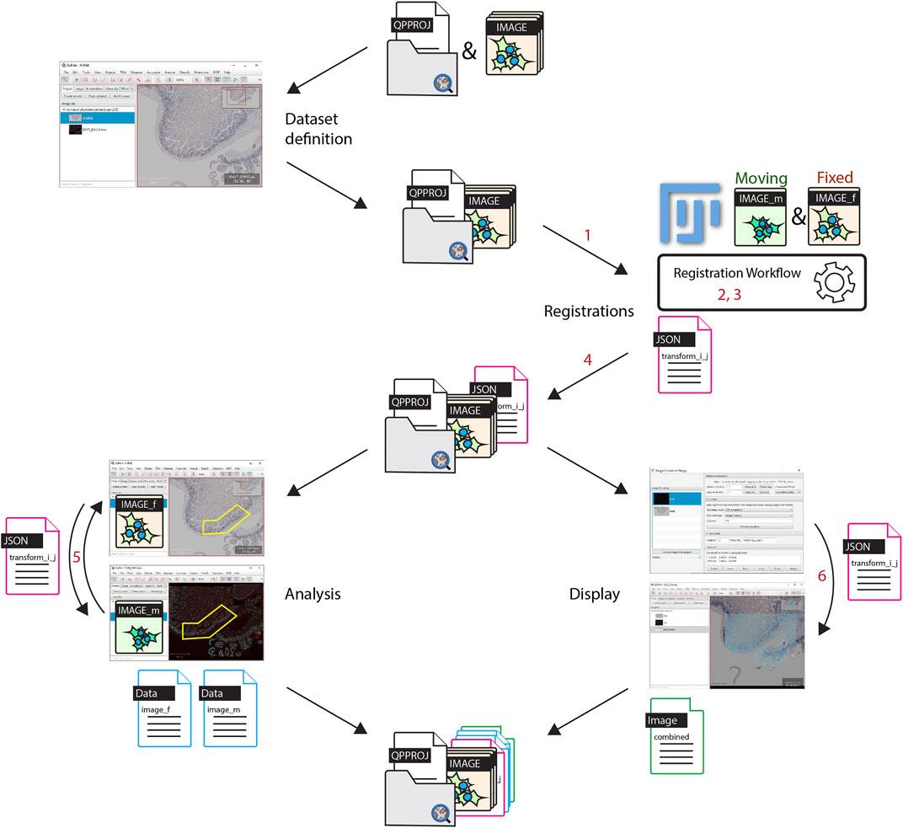

# Warpy Image Registration Workshop

**Expected duration:** ~90 minutes  
**Online document:** [go.epfl.ch/warpy](https://go.epfl.ch/warpy)

Welcome to this workshop about image registration!

## Color Code

- **Highlighted in yellow** 🟡 - An action you need to do
- **Highlighted in gray** ⚪ - Optional actions you may do  
- **Highlighted in purple** 🟣 - Names of Fiji commands (searchable in the search bar)

## What is this workshop about?

This workshop tackles the registration of large 2D images, specifically whole slide images (WSI), using QuPath and Fiji.

### Covered in this workshop:
- Registration of large 2D images (WSI) in pairs
- Application of linear and non-linear transformations
- Automated and semi-automated registration

### Not covered (not possible in Warpy):
- 2D+t or 3D+t registration

## Background

This workshop introduces tools developed at BIOP to integrate previously incompatible tools:
- **QuPath** for its user-friendly and robust WSI analysis
- **ImgLib2 library** for advanced transformation capabilities

The core tools used here act as a compatibility layer between QuPath, Fiji, and ImgLib2-realtransform. They include:
- A reader to import QuPath projects into Fiji
- A reader to import ImgLib2 transformations into QuPath

For more details, refer to the [Warpy publication](https://doi.org/10.3389/fcomp.2021.780026).

## Workflow Overview

The set of images to be registered are all put into a single QuPath project. Registrations are performed in Fiji, images are opened from a QuPath project and each registration result is stored as a file within the project entry folder. 

For the analysis, thanks to the registration result found between two images, regions of interest can be transferred in QuPath from one image to another, in order to generate correlated data. It is additionally possible to create a new combined image within QuPath.

## Workshop Contents

1. **[Installation](installation.md)** - Software and data setup
2. **[Registration with GUI](registration-gui.md)** - Interactive registration of fluorescent onto DAB images
3. **[Automated Registration](registration-automated.md)** - Headless batch registration
4. **[Using Registration in QuPath](qupath-usage.md)** - Transfer annotations and create combined images
5. **[Serial Sections Registration](serial-sections.md)** - Register and reconstruct 3D stacks

## Other References and Future Work

Check also:
- [BigStitcher](https://imagej.net/plugins/bigstitcher/)
- [WSIReg](https://github.com/NHPatterson/wsireg)
- [Valis](https://github.com/MathOnco/valis)
