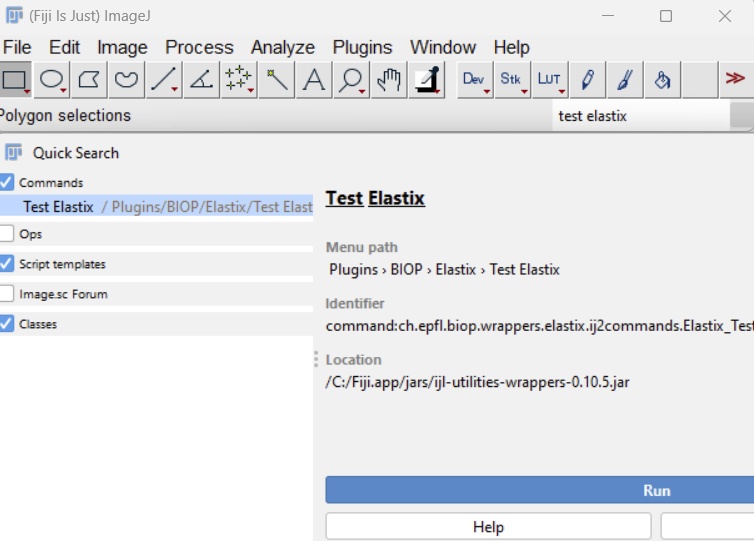
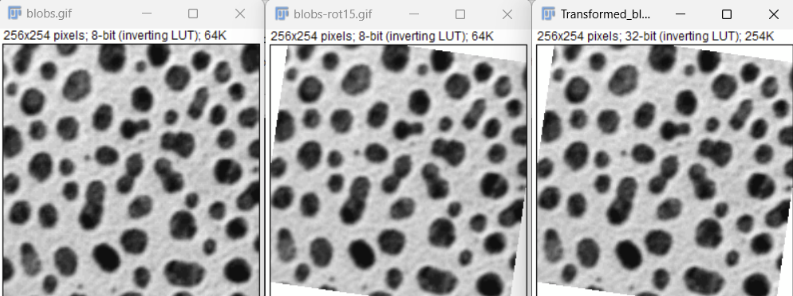

# Installation

## Data

We will be using data from this repository: [doi.org/10.5281/zenodo.5675686](https://doi.org/10.5281/zenodo.5675686)

1. Download the file `warpy-demo-project.zip`
2. Unzip it to a location on your computer

## Software

### ImageJ/Fiji

Please follow the instructions found in [the bdv-playground installation instructions](installation.md).

### QuPath

QuPath is required as well as the Warpy extension.

1. **Install QuPath 0.7**
   - Download from [https://qupath.github.io/](https://qupath.github.io/)
   - Follow installation instructions for your operating system

2. **Install the Warpy extension via the BIOP catalog:**
   - Open QuPath
   - Go to `Extensions → Manage extensions`
   - Click `Manage extension catalogs`
   - Enter the catalog URL: `https://github.com/BIOP/qupath-biop-catalog`
   - Browse and install the Warpy extension

## Installation Check

### Test Elastix in Fiji

1. In Fiji, type `Test Elastix` in the search bar and run the command

   

2. Set the Elastix and Transformix executable paths when asked

3. Verify you obtain the following images at the end of the script:

   

### Troubleshooting

**Windows:** If this doesn't work, make sure you have installed Visual C++ redistributable:
- Download from [https://aka.ms/vs/17/release/vc_redist.x64.exe](https://aka.ms/vs/17/release/vc_redist.x64.exe)

**Mac:** You probably need to run the `elastix.sh`, `transformix.sh`, and `.dylib` files once to make security exceptions.

> **In Mac, you probably need to run once the elastix sh and transformix sh and .dylib files to make security exceptions.**

### Test QuPath Project

1. Open QuPath
2. Drag and drop the `project.qpproj` file from `warpy-demo-project` into the main window
3. You will be asked to update the URLs of the images - please do this
4. Make sure you can view and browse the third/last image of the project
   - This indicates that Warpy is installed and working

## Next Steps

Once installation is complete, proceed to:
- **[Registration with GUI](registration-gui.md)** for the interactive workflow
- **[Automated Registration](registration-automated.md)** for batch processing
