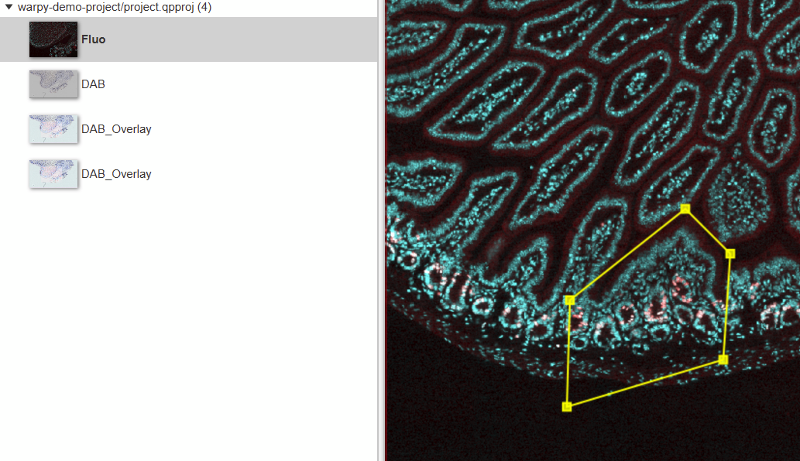
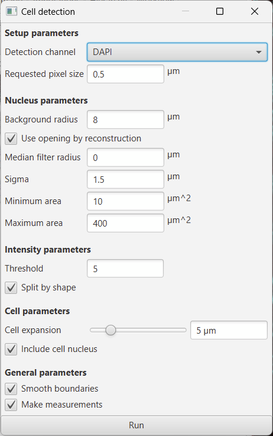
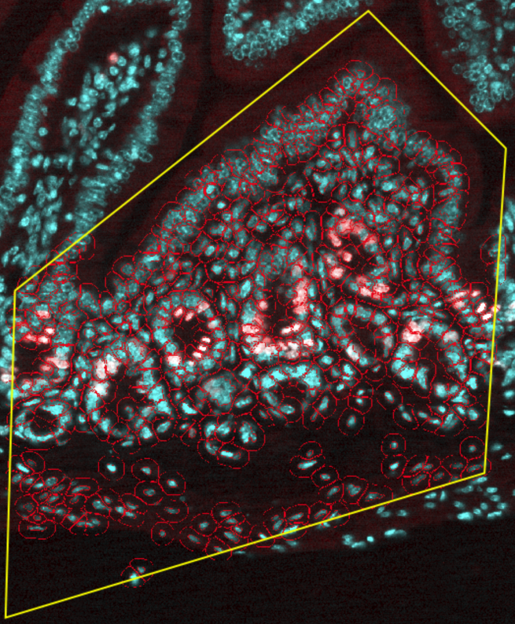
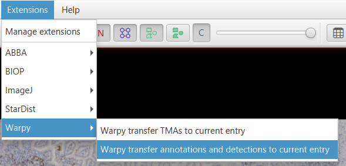
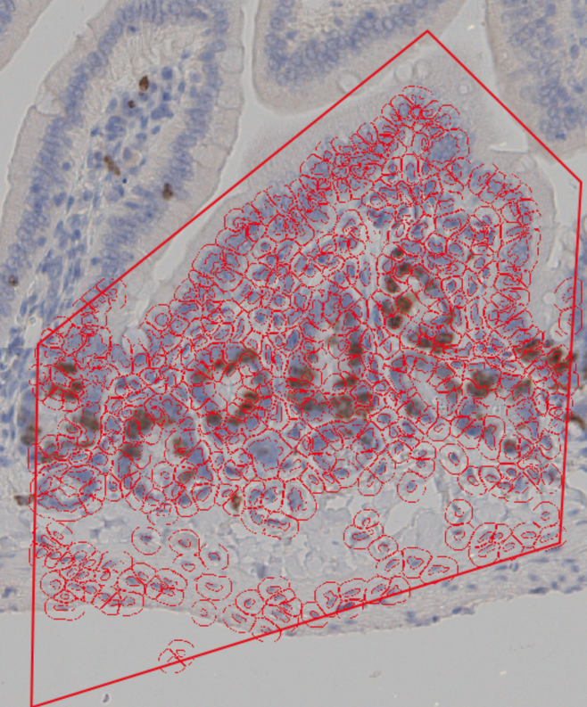
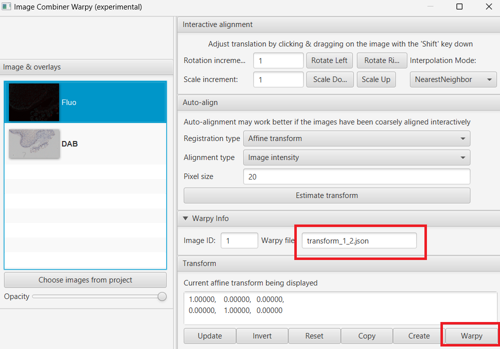

# Using the Registration Result in QuPath

The export from Fiji to QuPath merely consists of writing a JSON file that contains all information necessary to map coordinates of the fixed image into coordinates of the moving image.

If the deformation is not too pathological, the transform will be invertible, meaning that you can choose both directions when transforming images or QuPath objects.

Inside QuPath, you can use the resulting transformation files in two ways:

1. **Transfer annotations or detections** from one image to another (the deformation is applied to the vector shape)
2. **Generate a new image** that combines the fixed image and the moving images (with on-the-fly computation)

> ⚠️ **Warning:** Images in QuPath project entries created with this tool may not show the original pixel values! The pixel difference between the original and the transformed image depends on the transformation, the interpolation used, and the downsampling in the current viewer. This must be taken into account in all analysis steps performed on such transformed images.

## 1. Convert Annotations from One Image to Another

### Detect Cells in the Fluorescent Image

1. Open QuPath and the `warpy-demo-project` project
2. Open the fluorescent image **Fluo** in the viewer
3. Draw a region of your choice somewhere in the image that contains cells
4. Run **Cell detection**, keep the default parameters except:
   - Lower **threshold** to **5**

You should see many cells being detected:

### Transfer to DAB Image

5. Now open the **DAB** image (you can create a multi-viewer if you want):
   - Right-click → **Multi-View…** → **Set grid size 1x2**

6. Go to **Extensions > Warpy > Warpy transfer annotations and detections to current entry**

   

7. Run the script

After a few seconds you should see the annotations and detections transferred to the image:

> **Note:** The measurements from the fluorescent images are transferred as well. Each detection thus contains measures from both the H-DAB and the fluorescent image.

## 2. Create a Combined Image

### Using the Interactive Image Combiner

1. Open the **fixed image** (DAB)
2. Go to **Analyze > Interactive image combiner Warpy**
3. Click **Images from project**, choose **Fluo**, click **OK**
4. Select the **Fluo** image, you should see a JSON file being detected:

   

5. Click the **Warpy** button, then confirm

   

You can now see the new combined image as a new QuPath entry.

### Understanding the Combined Image

The combined image is created through on-the-fly transformation and can be:
- Browsed interactively in QuPath
- Used for analysis (with the caveat about pixel values mentioned above)
- Exported as OME-TIFF for permanent storage

---

## Next Steps

- **[Serial Sections Registration](serial-sections.md)** - Learn to register and reconstruct 3D stacks from serial sections
