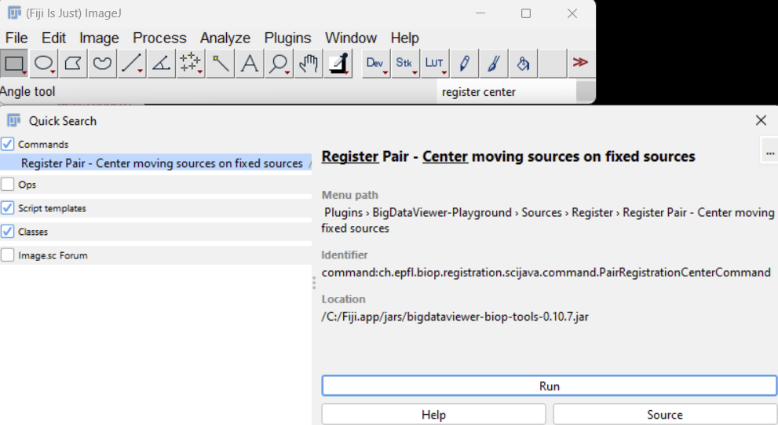
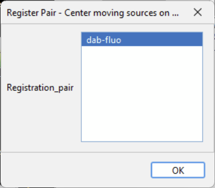

# Headless Registration (Automated)

All the commands used previously (overlayed in purple) also exist directly in Fiji's search bar and are **macro recordable**. This is the basis of how we will perform headless registration.

> **NOTE:** A registration may fail (for instance if SIFT does not find any corresponding landmarks). The macro way of batching can't handle this failure currently. If you want to handle registration failures, scripting should be done with another language (groovy, jython).

## Recording the Macro

1. **Close and restart Fiji** (NO NEED if you started the recorder at the start of Part A)
2. Run `Plugins > Macros > Record…`
3. Repeat the commands we've done previously, but running them from Fiji's search bar

### Summary of Commands

Here's a summary of what we've done:

1. `Create BDV Dataset [QuPath]`
2. `Create registration pair`
3. `Register Pair - Center moving sources on fixed sources`
4. `Register Pair 2D - Sift Affine`
5. `Register Pair 2D - Elastix Spline`
6. `Register Pair - Export registration result to QuPath project`

> **NOTE:** If you want to clean up and clear memory, you can run the command `Delete registration pair`. You can also run `Clear Bdv Playground State` when you're fully done with a specific QuPath project.

4. Press **Create** on the recorder window

## Editing the Recorded Macro

You will get a draft macro that will need to be slightly tweaked to perform registration in a fully automated manner.

### Initial Recorded Macro

```{code-block} imagej
:caption: ImageJ Macro
run("Create BDV Dataset [QuPath]",
"qupath_project=C:\\Users\\oburri\\Desktop\\warpy-demo-project\\project.qpproj
datasetname=warpy-demo-project unit=MILLIMETER split_rgb_channels=false
plane_origin_convention=[TOP LEFT]");

run("BDV - Set BDV window (biop)", "resettodefault=false width=640 height=480
screenscales=[1, 0.5, 0.25, 0.125] numrenderingthreads=3 numsourcegroups=10
frametitle=BigDataViewer is2d=true interpolate=false numtimepoints=1 fontsize=18
font=Courier");

run("Create registration pair", "fixed_sources=[Lbdv.viewer.SourceAndConverter;@794c6f92
moving_sources=[Lbdv.viewer.SourceAndConverter;@7c555e51 registration_name=[Fluo to
DAB]");

run("Register Pair - Center moving sources on fixed sources");

run("Register Pair 2D - Sift Affine", "bounds=intersection px=-1.029893000000037
py=-0.7710045000000371 sx=2.0596159999999997 sy=1.5418389999999993
channels_fixed_csv=0 channels_moving_csv=0 pixel_size_micrometer=1.0 invert_moving=true
invert_fixed=false");

run("Register Pair 2D - Elastix Spline", "bounds=intersection px=-1.2157094775991526
py=-0.7215601283964763 sx=2.022231206667339 sy=1.4959165183359435
nb_control_points_x=8 channels_fixed_csv=0 channels_moving_csv=0
pixel_size_micrometer=2.0 show_imageplus_registration_result=false");

run("Register Pair - Export registration to QuPath project", "allow_overwrite=true");
```

### Required Edits

#### 1. Replace px, py, sx, sy with 0

All the `px`, `py`, `sx`, and `sy` parameters are irrelevant but still need to be there.

- Replace these parameter values with **0**

#### 2. Format Parameters on Multiple Lines

Take the time to format all parameters in multiple lines for readability:

```imagej
run("Create BDV Dataset [QuPath]",
"qupath_project=C:\\Users\\oburri\\Desktop\\warpy-demo-project\\project.qpproj "+
"datasetname=warpy-demo-project "+
"unit=MILLIMETER "+
"split_rgb_channels=false "+
"plane_origin_convention=[TOP LEFT]");

run("Create registration pair",
"fixed_sources=[Lbdv.viewer.SourceAndConverter;@794c6f92 "+
"moving_sources=[Lbdv.viewer.SourceAndConverter;@7c555e51 "+
"registration_name=[Fluo to DAB]");

run("Register Pair - Center moving sources on fixed sources");

run("Register Pair 2D - Sift Affine",
"bounds=intersection "+
"px=0 "+
"py=0 "+
"sx=0 "+
"sy=0 "+
"channels_fixed_csv=0 "+
"channels_moving_csv=0 "+
"pixel_size_micrometer=1.0 "+
"invert_moving=true "+
"invert_fixed=false");

run("Register Pair 2D - Elastix Spline",
"bounds=intersection "+
"px=0 "+
"py=0 "+
"sx=0 "+
"sy=0 "+
"nb_control_points_x=8 "+
"channels_fixed_csv=0 "+
"channels_moving_csv=0 "+
"pixel_size_micrometer=2.0 "+
"show_imageplus_registration_result=false");

run("Register Pair - Export registration to QuPath project", "allow_overwrite=true");
```

#### 3. Fix Source Selection

The remaining blocking point is the way to set the **fixed sources** and **moving sources** in the `Create registration pair` command (highlighted above). These parameters are unfortunately not well recorded, and running the script will give an error.

The way to specify the sources is to write the path of the sources as it appears in the BDV Sources window. Multiple paths can lead to the same sources.

**Example paths:**
- `warpy-demo-project>All Sources>Fluo-DAPI`
- `warpy-demo-project>QuPathEntryIdEntity>QuPathEntryIdEntity 1>All Sources>Fluo-DAPI`

To select several sources, identify the parent of this path.

**Corrected example:**

```imagej
run("Create registration pair",
"fixed_sources=[warpy-demo-project>QuPathEntryIdEntity>QuPathEntryIdEntity 2] "+
"moving_sources=[warpy-demo-project>QuPathEntryIdEntity>QuPathEntryIdEntity 1] "+
"registration_name=[Fluo to DAB]");
```

- Edit the macro according to your choices to get the right selection of fixed and moving sources
- Add a `print("Done")` message at the end

### Important: Add Registration Pair Parameter

⚠️ **Warning:** When registration commands are run through the GUI, there is a parameter missing in the recorder that tells the software which registration pair to work on.

You can correct this by adding a line to each registration command:

**Before:**
```imagej
run("Register Pair - Center moving sources on fixed sources");
```

**After:**
```imagej
run("Register Pair - Center moving sources on fixed sources",
"registration_pair=[Fluo to DAB]");
```

**Complete corrected command:**

```imagej
run("Register Pair 2D - Sift Affine",
"registration_pair=[Fluo to DAB] "+
"bounds=intersection "+
"px=0 "+
"py=0 "+
"sx=0 "+
"sy=0 "+
"channels_fixed_csv=0 "+
"channels_moving_csv=0 "+
"pixel_size_micrometer=1.0 "+
"invert_moving=true "+
"invert_fixed=false");
```

**OR** run the command outside of the GUI during the registration process.

When you run the command from outside the registration pair GUI, you will be prompted to specify which registration pair you need to work on (don't forget to click the line, even if it's a single line):



## Optional: Add Script Parameters

A last thing that can be done is to modularize the hard-coded parameters and use SciJava script parameters instead.

- Optional: Edit your macro to replace some hard-coded parameters with script parameters

## Final Macro Example

You can find an example of a full macro including SciJava parameters:

```imagej
#@ File qupath_project (label="QuPath Project File")
#@ String registration_dataset_name (label = "Name of Dataset for registration", value="Warpy demo project")
#@ Integer fixed_source_qupath_entry_id (label = "Fixed Source QuPath Entry ID", value=2)
#@ Integer moving_source_qupath_entry_id (label = "Moving Source QuPath Entry ID", value=1)
#@ String registration_pair_name (label = "Name of registration pair", value="Fluo to DAB")

// Make sure there are no sources before we start with the registration
run("Clear Bdv Playground State");

// Load the data from the QuPath project
run("Create BDV Dataset [QuPath]",
"qupath_project=["+qupath_project+"] "+
"datasetname=["+registration_dataset_name+"] "+
"unit=MILLIMETER "+
"split_rgb_channels=false "+
"plane_origin_convention=[TOP LEFT]");

// This macro will only create one registration pair, but of course we could do multiple,
// as long as they are uniquely named
run("Create registration pair",
"fixed_sources=["+registration_dataset_name+">QuPathEntryIdEntity>QuPathEntryIdEntity "+fixed_source_qupath_entry_id+"] "+
"moving_sources=["+registration_dataset_name+">QuPathEntryIdEntity>QuPathEntryIdEntity "+moving_source_qupath_entry_id+"] "+
"registration_name=["+registration_pair_name+"]");

// First registration: Centering the two sources
run("Register Pair - Center moving sources on fixed sources",
"registration_pair=["+registration_pair_name+"]");

// An affine transform using Scale Invariant Features
run("Register Pair 2D - Sift Affine",
"registration_pair=["+registration_pair_name+"] "+
"bounds=intersection "+
"px=0 "+
"py=0 "+
"sx=0 "+
"sy=0 "+
"channels_fixed_csv=0 "+
"channels_moving_csv=0 "+
"pixel_size_micrometer=1.0 "+
"invert_moving=true "+
"invert_fixed=false");

// A fancier local registration using a grid of 8x8 spline registrations
run("Register Pair 2D - Elastix Spline",
"registration_pair=["+registration_pair_name+"] "+
"bounds=intersection "+
"px=0 "+
"py=0 "+
"sx=0 "+
"sy=0 "+
"nb_control_points_x=8 "+
"channels_fixed_csv=0 "+
"channels_moving_csv=0 "+
"pixel_size_micrometer=2.0 "+
"show_imageplus_registration_result=false");

// Finish the job: Export the necessary results to QuPath so Warpy can detect the work we did
run("Register Pair - Export registration to QuPath project",
"registration_pair=["+registration_pair_name+"] "+
"allow_overwrite=true");

print("Registration Workflow Demo Finished");
```



## Running the Macro

1. Save your macro
2. Close and open Fiji
3. Open the macro
4. Run the macro and make sure it proceeds completely until "Done" appears, without any user input (except script parameters if you've added some)

---

## Next Steps

- **[Using Registration in QuPath](qupath-usage.md)** - Transfer annotations and create combined images
- **[Serial Sections Registration](serial-sections.md)** - Register multiple sequential slices
