# Registration with Graphical User Interface

## Goal

Register a fluorescent image onto a RGB H-DAB image using an interactive GUI.

::::{grid} 2
:::{grid-item}
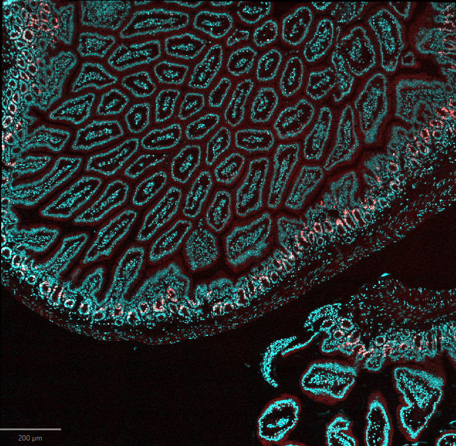
*Fluorescent image showing EdU labeling*
:::
:::{grid-item}
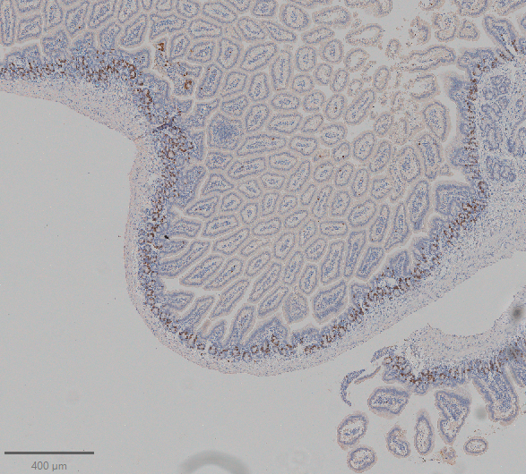
*H-DAB stained image*
:::
::::

Dividing cells are labeled with DAB in the RGB image, and as fluorescent EdU within the second channel of the fluorescent image. More information about the dataset is provided in the [Zenodo repository](https://doi.org/10.5281/zenodo.5675686).

### The goal of this example workflow is to:

1. **Register** a fluorescent image onto a RGB H-DAB image
   - We will choose the Fluorescent image as the **moving source**
   - The H-DAB image is the **fixed source**

2. **Use this registration** to transfer objects from one image to another in QuPath (reversibly)

3. **Generate** within QuPath a new entry that combines both images

---

:::{note}
You can run the macro recorder (`Plugins > Macro > Record…`) while doing this part in order to see how each command can be recorded.
:::

## Part A: Registration with GUI

### 1. Open a QuPath Project within Fiji

We will be working on the project named `warpy-demo-project`.

1. In Fiji's search bar, type `QuPath`
2. Find and run the command **`Dataset - Create [QuPath]`**

   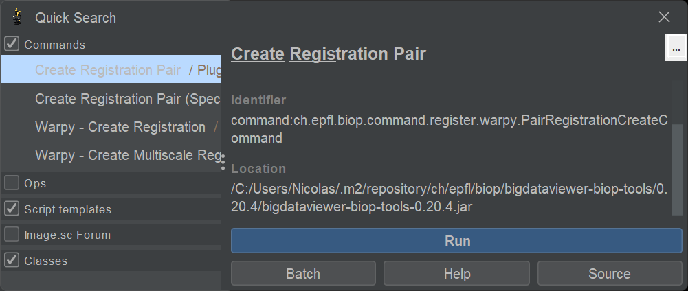

3. Select the file `project.qpproj` within the warpy project folder (you can also drag and drop the file in the field)
4. Make sure that **MILLIMETER** is set in the `World coordinate units` field. That's the conventional unit for Warpy, this also means that your image data needs to be calibrated in physical units when used in Warpy (i.e. not '1 pixel').
5. Make sure that **TOP LEFT** is set in the `Plane Origin Convention` field
6. **Split RGB channels** should be **unchecked**
7. Click **OK**

> **Note:** You can ignore the error `"[ERROR] Unsupported channels server builder"`. The resulting combined image that already exists in the QuPath project for the purposes of this exercise cannot be opened in Fiji.

A **BDV Sources** window will pop up. You can double click on nodes to reveal the data contained in it:

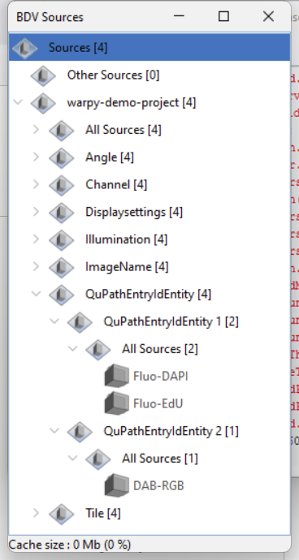

QuPath images are uniquely identified within the `QuPathEntryIdEntity` (1 and 2), also in the `ImageName` subnodes (as 'Fluo' and 'DAB'). The first image consists of 2 fluorescent channels: `Fluo-DAPI` and `Fluo-EdU`.

### 2. Visualize with BigDataViewer

For those unfamiliar with the BigDataViewer visualizer, there may be too many degrees of freedom (slicing in any direction), especially for a 2D dataset.

To restrict the viewer to 2D movements:

1. Right-click anywhere on the **BDV Sources** window
2. Select **`BDV - Set Style (BIOP)`** as per the screenshot

   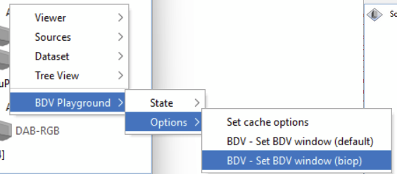

3. Keep the default options, but check the checkbox **`is2D`**

   

4. Click **OK**

#### Display the Images

To visualize the images within the QuPath project:

1. Select the sources **`Fluo-DAPI`** and **`Fluo-EdU`** inside the BDV Sources window
2. Right-click and select **`Sources > Display > BDV - Show Sources (new Bdv window)`**

   

3. Then select **`Auto Contrast`**, **`Adjust View on Sources`** and **`Open In New Window`

   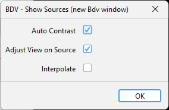

#### Common Commands within the Viewer

- **Zoom in and out** - Mouse wheel
- **Rotate** - Left click + drag
- **Pan** - Right click + drag

#### Show/Hide Sources

You can Hide/Show sources and modify their min/max display range with the controls on the right panel:

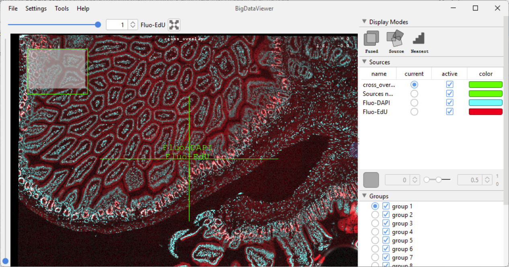

#### Visualize the DAB Image

Drag and drop the **RGB-DAB** source from the BDV window to the viewer:

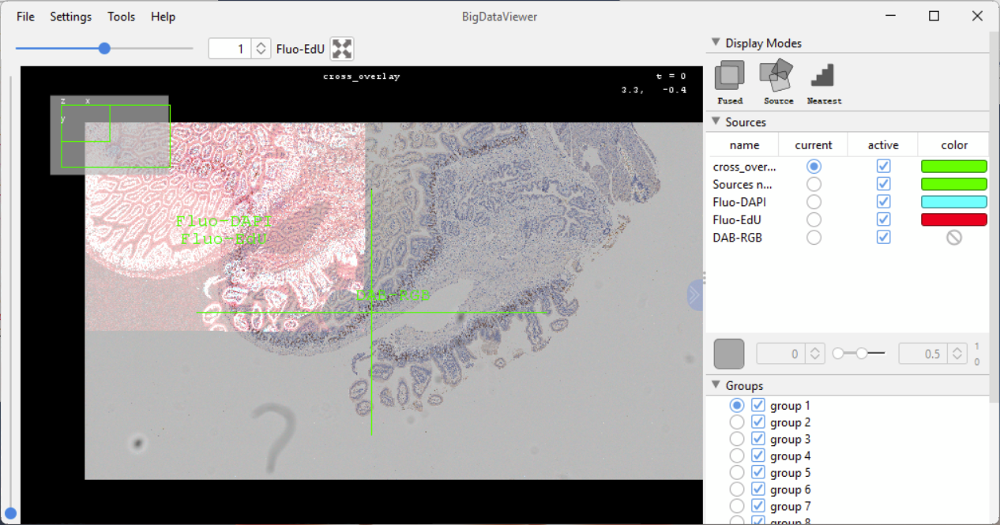

### 3. Defining a Pair: Fixed/Moving Images to Register

1. Run the **`Create Registration Pair`** command

   

2. Select the **DAB-RGB** image as the **fixed source**
3. Select the fluorescent channels **Fluo-DAPI** and **Fluo-EdU** as the **moving sources**
4. Drag and drop the sources from left to right
5. Set any name for the registration (e.g., `dab_fluo`) - this serves as an identifier

   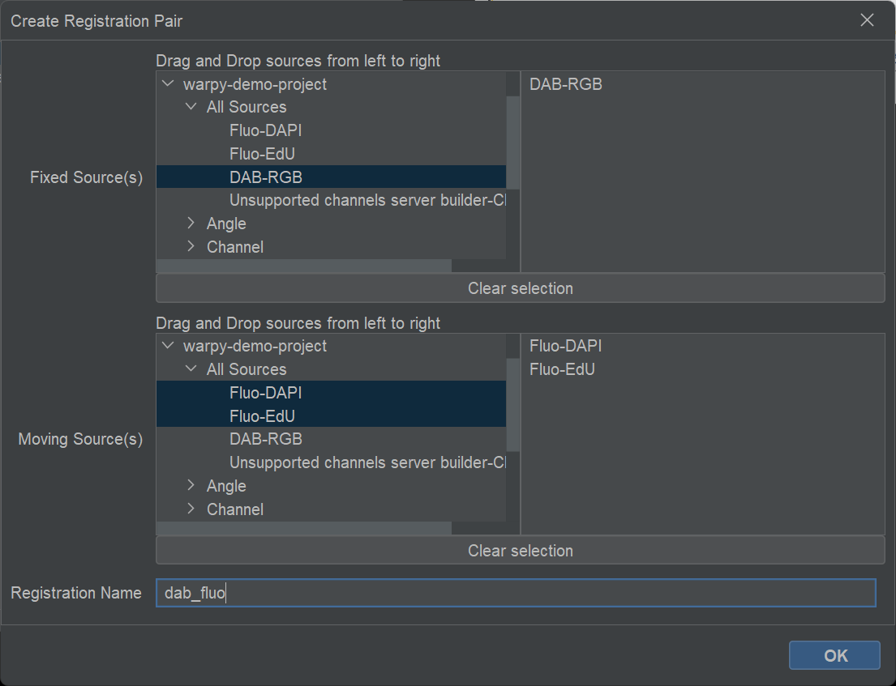

After clicking OK, there will be a registration pair object in memory that holds a reference to both images and all registration steps that will be performed later on.

#### Add GUI for Registration Pair

To have a graphical user interface that allows you to easily find registration types and monitor results:

1. Find and run the command **`Registration Pair - Add GUI`**
2. Select the registration pair you created in the list
3. Run **OK**

   

You will then have a view of the data:

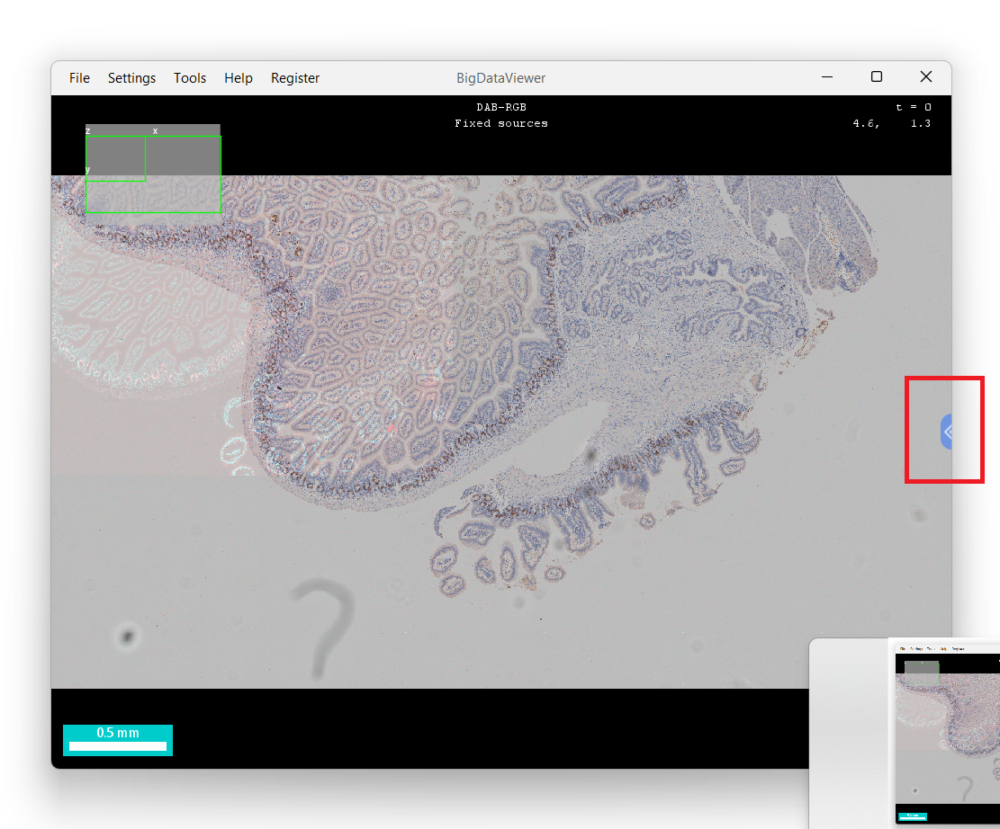

4. Hover your mouse over the right part of the viewer
5. Find the blue arrow (red rectangle above) that shows up and click it

You can now see in the group panel the **fixed source** and the **moving sources** whose display can be controlled via checkboxes. Each time you create a new registration step, a new group will be created.

One can thus browse the different steps and assess their usefulness.

5. To see better the moving sources, decrease the **max value** of the moving sources to **60** as shown:

   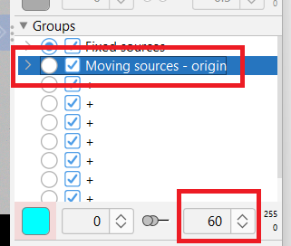

### 4. Registration Process

To get a correct registration, you will apply 3 successive registration steps among the options displayed in the viewer window:

- Center sources
- Register with SIFT
- Register with Elastix spline

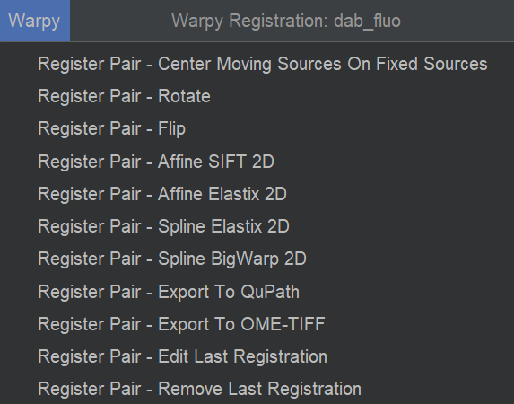

#### Step 1: Center Sources

Click **`Register Pair - Center Moving Sources On Fixed Sources`**

It's a parameter-less registration. Note how the image is centered but still does not match the DAB image:

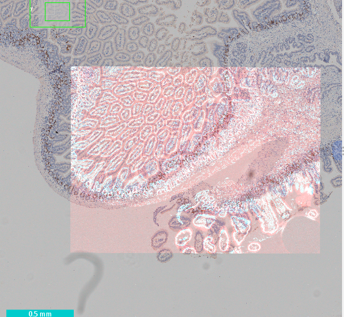

#### Step 2: Register with SIFT

1. Click **`Register Pair - Affine SIFT 2D`**
2. Select the following parameters (you can set anything for the 4 ROI parameters `pos x`, `pos y`, `size x`, `size y`: their values are ignored because **intersection** is selected instead of **custom**)

   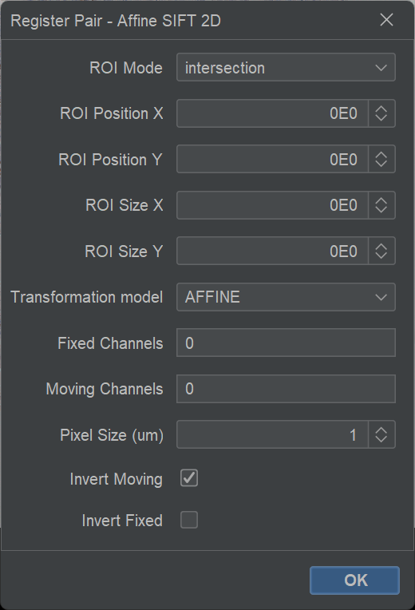

3. Click **OK**

##### Parameter Explanation

**ROI mode:** The moving and fixed images are not necessarily occupying the same physical area. When the registration is performed, it is performed on resampled images (see registration re-sampling) over a certain region of the physical space.

You can set this region manually with the `pos xy` and `size xy` parameters, or (and that's easier) you can let the software compute either the **union** or the **intersection** of the moving and the fixed sources.

- Choosing **intersection** is faster and will work here because the images are already closely aligned
- If we had not recentered the images beforehand, we should have selected **union** instead

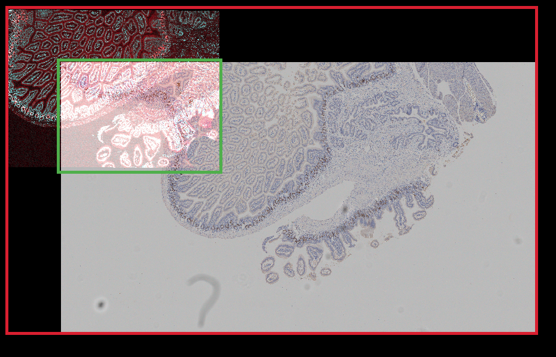
*Effect of choosing intersection (Green) or union (Red)*

As you can see in the case above, within the intersection, there is no matching area between fixed and moving image. All automated registration method will fail. As soon as the fixed and moving images are approximately aligned, choosing `intersection` is usually recommended.

**invert_moving_image:** Since we are registering an image with a black background with an image with a white background, it is important to invert one of the two images so they are as similar as possible before running any registration algorithms.

**Pixel size (um):** The registration re-sampling parameter defines the resolution at which the images will be recomputed before being registered. A high value leads to a faster registration but the registration may be imprecise or fail due to the failure of detection of matching features.

After the SIFT registration step you should obtain a decent matching:

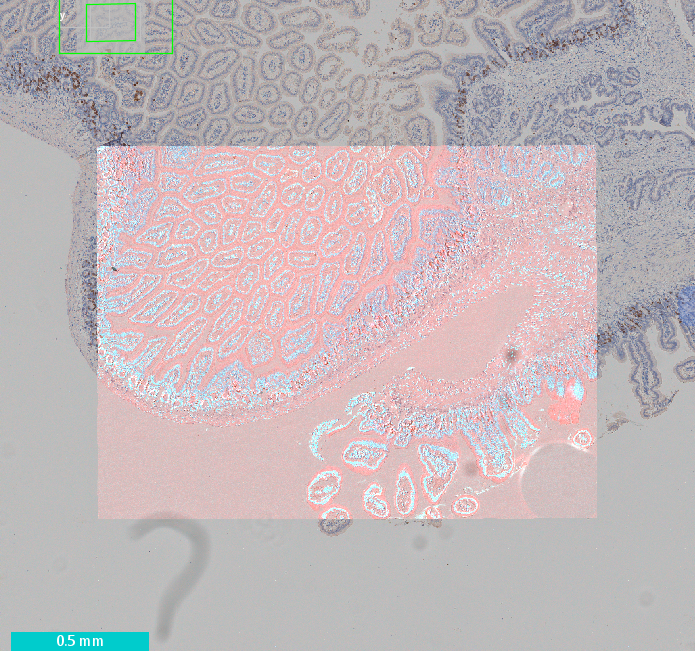

4. Toggle on and off the different registration steps to see how the positioning was improved

   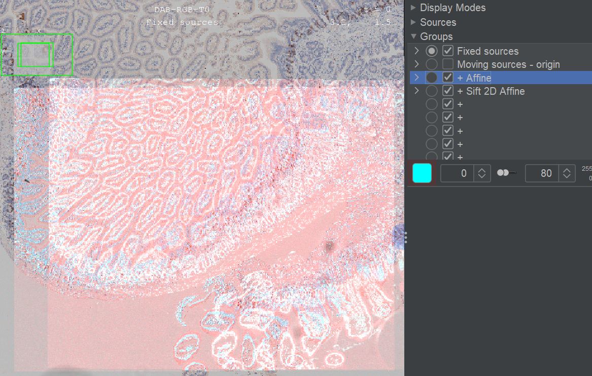

#### Step 3: Elastix Spline Registration

So far the two registration steps are concatenated affine transforms (center and then SIFT), but it is possible to go beyond and apply non-linear spline transforms. There is a choice between:

- **`Register Pair - Spline BigWarp Spline`** (fully manual transformation method)
- **`Register Pair - Spline Elastix 2D`** (fully automated, output can be loaded in BigWarp for manual adjustment)

Let's try Elastix Spline:

1. Run **`Register Pair - Spline Elastix 2D`**
2. Select the following parameters:

   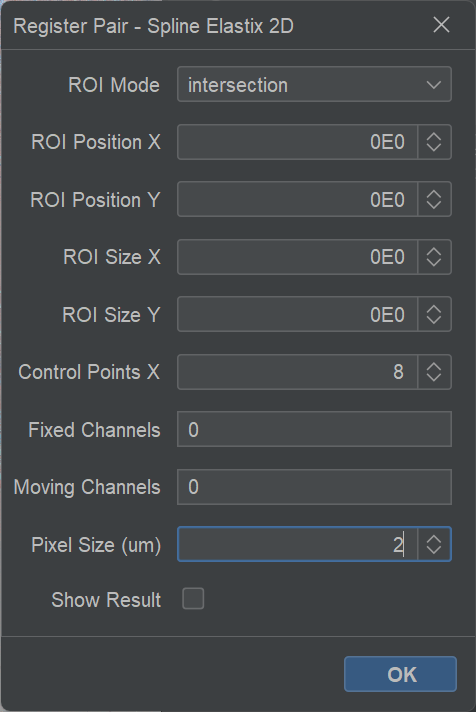

The only different parameter is the **number of control points**. This parameter corresponds to the warping grid size.

To visualize what it means, here's a comparison of the positioned landmarks when this parameter is set to 4 versus 8:

::::{grid} 2
:::{grid-item}
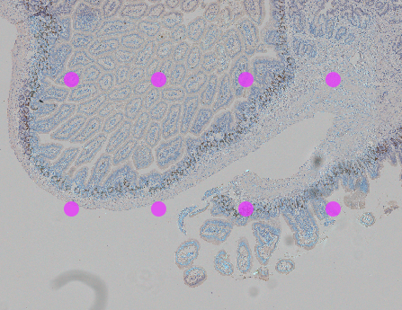
*#ctrl points in X = 4; 8 total landmarks*
:::
:::{grid-item}
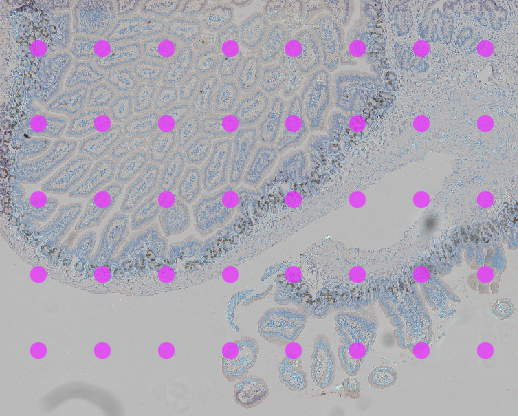
*#ctrl points in X = 8; 40 total landmarks*
:::
::::

> **Note:** Having a total number of landmarks above a few hundred can lead to pretty long computations.

### 5. Optional: Edit the Last Spline Transformation

This optional part demonstrates how to use BigWarp to edit the result of the Elastix spline transformation:

1. Run **`Register Pair - Edit Last Registration`**
2. Press **Space** to enter landmark edition mode and move landmarks around
3. Add new landmarks by pressing **Ctrl + left-click** before moving them around
4. Click **OK** on the "choose slice" window to save your edition

### 6. Write the Registration Result to QuPath

1. Run **`Register Pair - Export To QuPath`**
2. Make sure that **`allow_overwrite`** is checked
   - Otherwise, because there is already a transformation in the QuPath project, the software will not write the new transformation

This is done almost immediately.

We will see how to use the registration in QuPath in the [QuPath Usage Guide](qupath-usage.md). But before that, let's see how to automate the steps we've done so far in the [Automated Registration Guide](registration-automated.md).

---

## Next Steps

- **[Automated Registration](registration-automated.md)** - Learn to batch process registrations
- **[Using Registration in QuPath](qupath-usage.md)** - Transfer annotations and create combined images
