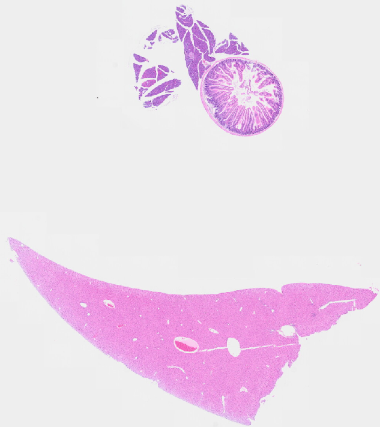
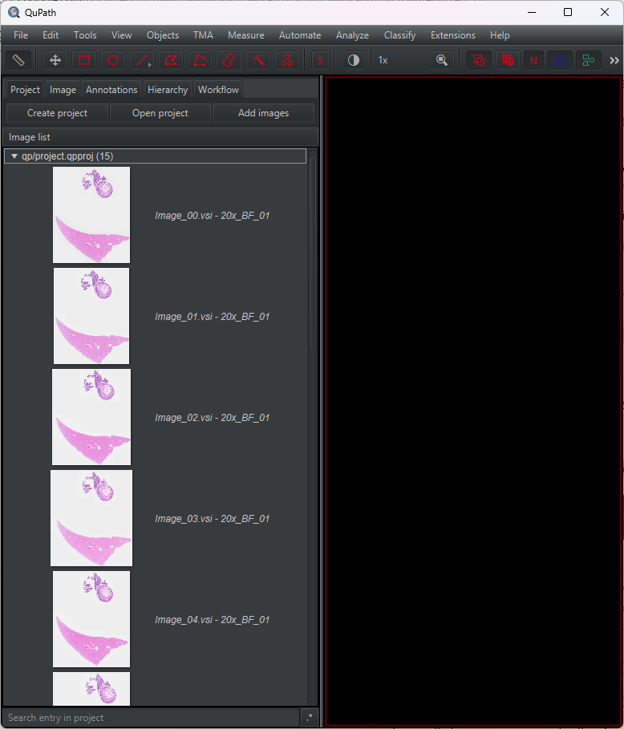
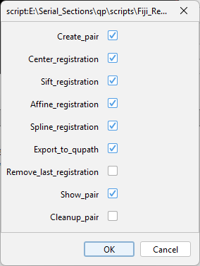

# Registration of Serial Sections

## Goal

The dataset consists of serial sections, almost consecutive:



The goal of this part will be to:
1. Register successive pairs of slices
2. Reconstruct a 3D image in QuPath based on these registrations

## Data

The installation procedure is the same as before, except the example dataset is:
- [https://zenodo.org/records/12072433](https://zenodo.org/records/12072433)

Download and extract this dataset.

## Part A: Registration of Successive Pairs of Slices with Fiji

### 1. Create and Open a QuPath Project in Fiji

Create a new QuPath project and insert all VSI images in it:



#### Open the QuPath Project in Fiji

1. In Fiji's search bar, type `QuPath`
2. Find and run the command **`Dataset - Create [QuPath]`**

   

3. Select the file `project.qpproj` within the warpy project folder (you can also drag and drop)
4. Make sure that **MILLIMETER** is set in the `World coordinate units` field
5. Make sure that **TOP LEFT** is set in the `Plane Origin Convention` field
6. **Split RGB Channels** should be **unchecked**
7. Click **OK**

### 2. Registration Process

The process consists of:
- Creating registration pairs for successive slices
- Registering them in various ways (affine, with SIFT, with Elastix)
- Then exporting the registration results to QuPath

Using the GUI for registering all successive pairs is doable but tedious. Instead, we will use a script to automate the process.

## Automated Registration Script

Here's the complete script for batch registration of serial sections:

```{code-block} imagej-groovy
:caption: ImageJ Groovy
#@boolean create_pair
#@boolean center_registration
#@boolean sift_registration
#@boolean affine_registration
#@boolean spline_registration
#@boolean export_to_qupath
#@boolean remove_last_registration
#@boolean show_pair
#@boolean cleanup_pair
#@TaskService taskService

String project_name = "qp";

def source_paths_sequence = [
    project_name+">ImageName>Image_10.vsi - 20x_BF_01",
    project_name+">ImageName>Image_11.vsi - 20x_BF_01",
    project_name+">ImageName>Image_12.vsi - 20x_BF_01",
    project_name+">ImageName>Image_13.vsi - 20x_BF_01",
    project_name+">ImageName>Image_14.vsi - 20x_BF_01",
    project_name+">ImageName>Image_00.vsi - 20x_BF_01",
    project_name+">ImageName>Image_01.vsi - 20x_BF_01",
    project_name+">ImageName>Image_02.vsi - 20x_BF_01",
    project_name+">ImageName>Image_03.vsi - 20x_BF_01",
    project_name+">ImageName>Image_04.vsi - 20x_BF_01",
    project_name+">ImageName>Image_05.vsi - 20x_BF_01",
    project_name+">ImageName>Image_06.vsi - 20x_BF_01",
    project_name+">ImageName>Image_07.vsi - 20x_BF_01",
    project_name+">ImageName>Image_08.vsi - 20x_BF_01",
    project_name+">ImageName>Image_09.vsi - 20x_BF_01",
]

def task = taskService.createTask("Registration task images")
def channels_reg = "0"

try {
    task.setProgressMaximum(source_paths_sequence.size())
    task.start()
    
    for (int idx = 0; idx<source_paths_sequence.size()-1; idx++) {
        if (!task.isCanceled()) {
            def moving_source_path = source_paths_sequence.get(idx)
            def fixed_source_path = source_paths_sequence.get(idx+1)
            def registration_pair_name = "seq_pair_"+moving_source_path+"_"+fixed_source_path
            
            println("FIXED - "+fixed_source_path)
            println("MOVING - "+moving_source_path)
            
            if (create_pair) {
                IJ.run("Create Registration Pair",
                    "fixed_sources=["+fixed_source_path+"] "+
                    "moving_sources=["+moving_source_path+"] "+
                    "registration_name=["+registration_pair_name+"]");
            }
            
            if (center_registration) {
                IJ.run("Register Pair - Center Moving Sources On Fixed Sources",
                    "registration_pair=["+registration_pair_name+"]");
            }
            
            if (sift_registration) {
                IJ.run("Register Pair - Affine SIFT 2D",
                    "bounds=union px=-1 py=-1 sx=-1 sy=-1 "+
                    "registration_pair=["+registration_pair_name+"] "+
                    "channels_fixed_csv=0 "+
                    "channels_moving_csv=0 "+
                    "pixel_size_micrometer=5 "+
                    "invert_moving=false "+
                    "invert_fixed=false "
                )
            }
            
            if (affine_registration) {
                IJ.run("Register Pair - Affine Elastix 2D",
                    "bounds=union px=-1 py=-1 sx=-1 sy=-1 "+
                    "registration_pair=["+registration_pair_name+"] "+
                    "channels_fixed_csv="+channels_reg+" "+
                    "channels_moving_csv="+channels_reg+" "+
                    "pixel_size_micrometer=20 "+
                    "show_imageplus_registration_result=false");
            }
            
            if (spline_registration) {
                IJ.run("Register Pair - Spline Elastix 2D",
                    "bounds=union px=-1 py=-1 sx=-1 sy=-1 "+
                    "registration_pair=["+registration_pair_name+"] "+
                    "channels_fixed_csv="+channels_reg+" "+
                    "channels_moving_csv="+channels_reg+" "+
                    "pixel_size_micrometer=20 "+
                    "nb_control_points_x=12 "+
                    "show_imageplus_registration_result=false");
            }
            
            if (export_to_qupath) {
                IJ.run("Register Pair - Export To QuPath",
                    "registration_pair=["+registration_pair_name+"] "+
                    "allow_overwrite=true");
            }
            
            if (remove_last_registration) {
                IJ.run("Register Pair - Remove Last Registration",
                    "registration_pair=["+registration_pair_name+"] ");
            }
            
            if (show_pair) {
                IJ.run("Register Pair - Add GUI",
                    "registration_pair=["+registration_pair_name+"]");
            }
            
            if (cleanup_pair) {
                IJ.run("Delete Registration Pair",
                    "registration_pair=["+registration_pair_name+"]");
            }
            
            task.setProgressValue(task.getProgressValue()+1)
        }
    }
} finally {
    // Block always executed, irrespective of a previous potential crash
    task.finish()
}

IJ.log("Processing done");

import ij.IJ
```

### Script Breakdown

#### 1. Image Sequence Definition

```groovy
def source_paths_sequence = [
    project_name+">ImageName>Image_10.vsi - 20x_BF_01",
    project_name+">ImageName>Image_11.vsi - 20x_BF_01",
    // ... etc
]
```

This defines, as a list, the names of the images in the proper order. Note that this dataset is not ordered by name (that's an error in the naming, but thanks to the flexibility of scripting we can correct it).

#### 2. Boolean Checkboxes for Each Step

```{code-block} imagej-groovy
:caption: ImageJ Groovy
#@boolean create_pair
#@boolean center_registration
#@boolean sift_registration
#@boolean affine_registration
#@boolean spline_registration
#@boolean export_to_qupath
#@boolean remove_last_registration
#@boolean show_pair
#@boolean cleanup_pair
```

For each step of the registration, a boolean checkbox is available as a SciJava parameter to do or skip each step at a time.

The GUI looks like this:



#### Registration Steps Explained

- **create_pair**: Needs to be executed only once! If you repeat this step several times, multiple pairs of the same kind will be created
- **center_registration**: Applies a registration where the center of the fixed image and the center of the moving image match
- **sift_registration**: Applies an affine transformation based on SIFT point matching. Can fail if no match is found
- **affine_registration**: Applies an affine registration based on Elastix, can use multiple channels
- **spline_registration**: Applies a spline registration based on Elastix, can use multiple channels, needs an extra argument for the number of control points
- **export_to_qupath**: Export the registration result to QuPath
- **remove_last_registration**: Remove the last registration applied
- **show_pair**: Will trigger the display of the registration pair
- **cleanup_pair**: Removes all current registration pairs created so far

#### Hardcoded Parameters

Some parameters are hardcoded in the script and can be modified:

**SIFT registration:**
```groovy
"pixel_size_micrometer=5 "  // Image resampling resolution
"channels_fixed_csv=0 "      // Channel to use
```

**Spline registration:**
```groovy
"nb_control_points_x=12 "    // Number of control points along X
"pixel_size_micrometer=20 "  // Resampling resolution
```

These settings work nicely on the demo sample but may need adjustment for your data. They can be made modular with script parameters.

### Running the Full Registration

To perform the full registration of all pairs:

1. Copy the full script code into the Fiji script editor
2. Run the script **one time** with these options checked:
   - ☑ create_pair
   - ☑ center_registration
   - ☑ sift_registration
   - ☑ spline_registration
   - ☑ export_to_qupath
   - ☑ cleanup_pair

This will take a few minutes.

## Part B: Reconstruction of a 3D Image in QuPath

The output of the previous part is the transformation needed to apply between two consecutive slices. To recombine the full stack, we need to **propagate these transforms**.

### Understanding Transform Propagation

Suppose we have 5 slices: 1, 2, 3, 4, and 5. It's natural to set slice 3 as the reference (the one that won't be transformed).

The registration of pairs gives us these links:
- L1 = 1 to 2
- L2 = 2 to 3
- L3 = 3 to 4
- L4 = 4 to 5

**How to apply transforms:**
- For slice 2: Apply L2
- For slice 4: Apply inverse of L3
- For slice 1: Apply L1, then L2 (because slice 1 → slice 2 → slice 3)
- For slice 5: Apply inverse of L4, then inverse of L3

### Reconstruction Script

This Groovy script will propagate transforms and create a 3D stack in QuPath:

```groovy
// Get the current project
def project = getProject()

def image_sequence_names = [
    "Image_10.vsi - 20x_BF_01",
    "Image_11.vsi - 20x_BF_01",
    "Image_12.vsi - 20x_BF_01",
    "Image_13.vsi - 20x_BF_01",
    "Image_14.vsi - 20x_BF_01",
    "Image_00.vsi - 20x_BF_01",
    "Image_01.vsi - 20x_BF_01",
    "Image_02.vsi - 20x_BF_01",
    "Image_03.vsi - 20x_BF_01",
    "Image_04.vsi - 20x_BF_01",
    "Image_05.vsi - 20x_BF_01",
    "Image_06.vsi - 20x_BF_01",
    "Image_07.vsi - 20x_BF_01",
    "Image_08.vsi - 20x_BF_01",
    "Image_09.vsi - 20x_BF_01",
]

// User-defined reference image
def image_reference = "Image_07.vsi - 20x_BF_01"

// Check if the project is not null
if (project == null) {
    println("No project is currently open!")
    return
}

// Get the list of image data from the project
def imageList = project.getImageList()
allServers = []

// Find the reference image index in the sequence
def referenceSequenceIndex = image_sequence_names.findIndexOf {
    it.equals(image_reference) 
}

if (referenceSequenceIndex == -1) {
    println("Reference image not found in the sequence!")
    return
}

// Find the reference image index in the project image list
def referenceIndex = imageList.findIndexOf { it.getImageName().equals(image_reference) }

if (referenceIndex == -1) {
    println("Reference image not found in the project!")
    return
}

// Add placeholders for the servers
for (int i = 0; i < image_sequence_names.size(); i++) {
    allServers.add(null)
}

// Add the reference server at the correct position
def referenceServer = imageList.get(referenceIndex).readImageData().getServer()
allServers.set(referenceSequenceIndex, referenceServer)

// Propagate transformations through the sequence
for (int i = 0; i < image_sequence_names.size(); i++) {
    def currentImageName = image_sequence_names.get(i)
    
    if (currentImageName == image_reference) {
        continue
    }
    
    def currentImageData = imageList.find { it.getImageName().equals(currentImageName) }
    
    if (currentImageData) {
        // Initialize the transformation sequence
        net.imglib2.realtransform.InvertibleRealTransformSequence irts = 
            new InvertibleRealTransformSequence()
        def server = currentImageData.readImageData().getServer()
        
        if (i < referenceSequenceIndex) {
            // Propagate transformations in reverse order for images before the reference
            for (int j = i; j < referenceSequenceIndex; j++) {
                def prevImageName = image_sequence_names.get(j)
                def nextImageName = image_sequence_names.get(j+1)
                def prevImageData = imageList.find { it.getImageName().equals(prevImageName) }
                def nextImageData = imageList.find { it.getImageName().equals(nextImageName) }
                
                if (prevImageData && nextImageData) {
                    def transform = Warpy.getRealTransform(prevImageData, nextImageData)
                    irts.add(transform)
                }
            }
            
            allServers.set(i, new RealTransformImageServer(server, 
                new RealTransformInterpolation(irts.inverse(), 0, true, 128)))
                
        } else {
            // Propagate transformations in the usual order for images after the reference
            for (int j = referenceSequenceIndex; j < i; j++) {
                def prevImageName = image_sequence_names.get(j)
                def nextImageName = image_sequence_names.get(j+1)
                def prevImageData = imageList.find { it.getImageName().equals(prevImageName) }
                def nextImageData = imageList.find { it.getImageName().equals(nextImageName) }
                
                if (prevImageData && nextImageData) {
                    def transform = Warpy.getRealTransform(prevImageData, nextImageData)
                    irts.add(transform)
                }
            }
            
            allServers.set(i, new RealTransformImageServer(server, 
                new RealTransformInterpolation(irts, 0, true, 128)))
        }
    }
}

allServers.each { println(it) }

def concatenationServer = new ConcatenationServer(allServers)

Platform.runLater(() -> getCurrentViewer().setImageData(new ImageData<>(concatenationServer)))

// Concatenation Server Class Definition
public class ConcatenationServer extends AbstractTileableImageServer {
    private final List<ImageServer<BufferedImage>> servers;
    private ImageServerMetadata cachedMeta;

    public ConcatenationServer(List<ImageServer<BufferedImage>> servers) {
        this.servers = servers;
    }

    @Override
    protected BufferedImage readTile(TileRequest tileRequest) throws IOException {
        def server = servers.get(tileRequest.getZ())
        return server.readRegion(
            tileRequest.getRegionRequest().updatePath(path).updateZ(0)
        )
    }

    @Override
    protected ImageServerBuilder.ServerBuilder<BufferedImage> createServerBuilder() {
        return null;
    }

    @Override
    protected String createID() {
        return getURIs().toString();
    }

    @Override
    public Collection<URI> getURIs() {
        return servers.stream()
            .map(ImageServer::getURIs)
            .flatMap(Collection::stream)
            .toList();
    }

    @Override
    public String getServerType() {
        return "Concatenation server";
    }

    @Override
    public synchronized ImageServerMetadata getOriginalMetadata() {
        if (cachedMeta == null) {
            cachedMeta = new ImageServerMetadata.Builder(servers.get(0).getMetadata())
                .sizeZ(servers.size())
                .build()
        }
        return cachedMeta
    }
}

import qupath.lib.images.servers.ImageServerProvider
import qupath.lib.images.servers.AbstractTileableImageServer
import qupath.lib.images.servers.ImageServer
import qupath.lib.images.servers.ImageServerBuilder
import qupath.lib.images.servers.ImageServerMetadata
import qupath.lib.images.servers.ImageServerProvider
import qupath.lib.images.servers.TileRequest
import qupath.lib.images.writers.ome.OMEPyramidWriter
import java.awt.image.BufferedImage
import java.io.IOException
import java.net.URI
import java.util.Collection
import java.util.stream.Stream
import net.imglib2.realtransform.InvertibleRealTransformSequence
import qupath.ext.warpy.Warpy
import qupath.lib.projects.ProjectImageEntry
import qupath.ext.imagecombinerwarpy.gui.RealTransformImageServer
import qupath.ext.imagecombinerwarpy.gui.RealTransformInterpolation
```

### Important Script Parameters

#### Image Sequence
```groovy
def image_sequence_names = [
    "Image_10.vsi - 20x_BF_01",
    // ... list all images in order
]
```
This should contain the list of image names that will be reconstructed.

#### Reference Image
```groovy
def image_reference = "Image_07.vsi - 20x_BF_01"
```
Defines the image that will be untransformed. Usually select one at the center of the stack.

#### Interpolation Parameter
```groovy
new RealTransformInterpolation(irts, 0, true, 128)
//                                           ^^^ This parameter
```

The `128` parameter is important:
- Computes exact transformation only once every 128 pixels
- For pixels in between, the transformation field is linearly interpolated
- Can lead to **10,000× speed up**
- Works well when transformation is locally smooth (which is usually the case)
- If transformation is very abrupt (< 128 pixels), interpolated transform may not match perfectly

### Running the Reconstruction

1. Copy the code into QuPath script editor
2. Run it and wait a bit - the stack will appear in the viewer
3. Browse through Z slices
   - Initially not super responsive
   - Becomes fast once all slices have been visited (transformation field is cached)

### Next Steps with the 3D Image

At this point you can either:
- **Analyze the 3D image directly** (not recommended as it can't be stored permanently)
- **Export as OME-TIFF** and work on it later (recommended)

---

## Summary

You've now learned to:
1. Register successive pairs of serial sections
2. Propagate transformations through the stack
3. Create a browsable 3D reconstruction in QuPath

This workflow enables 3D analysis of serial section data while maintaining the flexibility of QuPath's analysis tools.
