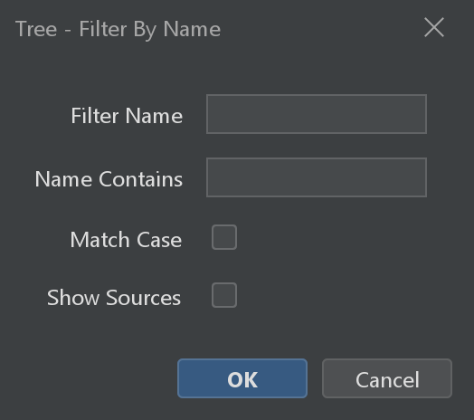
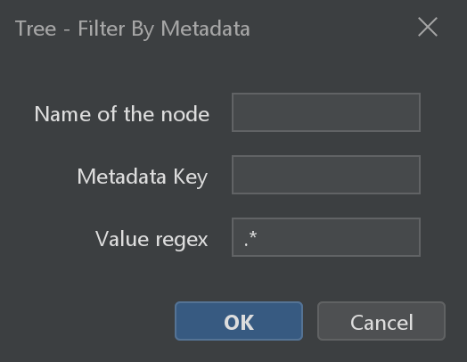
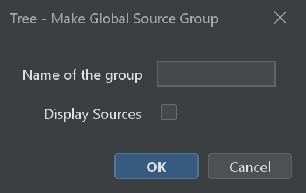
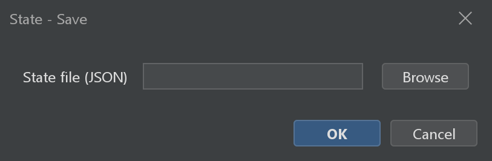
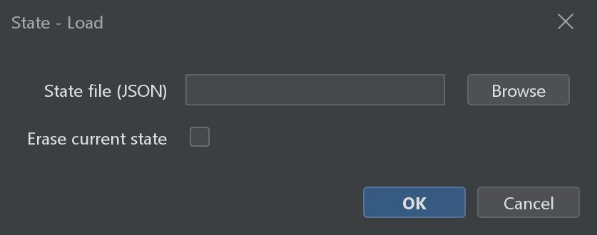
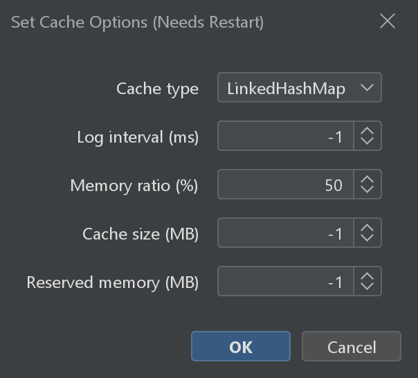
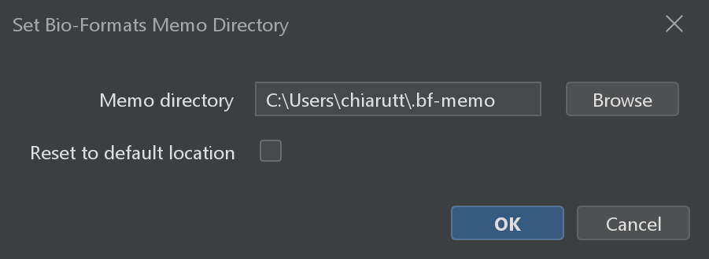

# Workspace

The workspace is the central hub of BigDataViewer Playground. It keeps track of every source you have opened or created during your session and provides tools for organizing, inspecting, saving, and restoring your work.

All workspace commands are found under:


{menuselection}`Plugins --> BigDataViewer-Playground --> Workspace`

---

## The BDV Playground Window

The main workspace interface is a window with a **hierarchical tree view** showing all sources currently loaded in the session.

{menuselection}`Plugins --> BigDataViewer-Playground --> Workspace --> Show BDV Playground Window`

This window is your primary way of interacting with sources outside of the viewers. Key interactions:

- **Right-click** on sources to open a contextual menu — from there you can visualize them in a BDV or BVV window, apply processing commands, export, and more
- **Double-click** on a source to center the current viewer (if one is open) on that source
- **Select multiple sources** to apply batch operations (e.g. show all selected sources in a viewer, export them together, apply the same transform)
- Organize sources into **groups** for easier management

The tree is organized hierarchically: datasets appear as top-level nodes, with individual channels, tiles, and timepoints nested below. As you process sources (fuse, classify, resample, etc.), the resulting sources also appear in the tree, under the `Other Sources` node.

:::{tip}
If you close the BDV Playground window by accident, re-open it with **Show BDV Playground Window**. Your sources are not lost — the window is just a view into the workspace, not the workspace itself.
:::

---

## Tree Organization

When working with many sources, the tree can become crowded. These commands help you organize it by creating filter and group nodes.

### Tree - Filter By Name

*Source: {biop-src}`FilterNodeNameAddCommand.java <ch/epfl/biop/command/workspace/FilterNodeNameAddCommand.java>`*

Adds a filter node to the tree that shows (or hides) sources matching a text pattern. Useful for quickly finding specific channels or tiles in a large dataset.

| Parameter | Description |
|-----------|-------------|
| Filter Name | Display name for this filter node in the tree |
| Name Contains | Text pattern that source names must contain to match |
| Match Case | When checked, matching is case-sensitive |
| Show Sources | When checked, shows matching sources; when unchecked, shows non-matching sources (inverted filter) |

:::::{tab-set}

::::{tab-item} GUI
{menuselection}`Plugins --> BigDataViewer-Playground --> Workspace --> Tree --> Tree - Filter By Name`


::::

::::{tab-item} IJ Macro
```ijm
run("Tree - Filter By Name");
```
::::

::::{tab-item} Groovy
```imagej-groovy
#@CommandService cs

import ch.epfl.biop.command.workspace.FilterNodeNameAddCommand

cs.run(FilterNodeNameAddCommand, true,
    "filter_name", "My Filter",
    "string_filter", "channel",
    "match_case", false,
    "show_sources", true
).get()
```
::::

::::{tab-item} Python
```python
#@CommandService cs

from ch.epfl.biop.command.workspace import FilterNodeNameAddCommand

cs.run(FilterNodeNameAddCommand, True,
    ["filter_name", "My Filter",
     "string_filter", "channel",
     "match_case", False,
     "show_sources", True]
).get()
```
::::

:::::

### Tree - Filter By Metadata

*Source: {bdvpg-src}`FilterNodeMetadataAddCommand.java <sc/fiji/bdvpg/command/workspace/tree/FilterNodeMetadataAddCommand.java>`*

Adds a filter node that selects sources based on a metadata key-value pair. This is useful for filtering by properties you have attached with **Source - Add Metadata** (see [Source Utilities](../processing_images/source_utilities.md)).

| Parameter | Description |
|-----------|-------------|
| Name of the node | Display name for the filter node |
| Metadata Key | The metadata key to filter by |
| Value regex | Regular expression to match metadata values (`.*` matches everything) |

:::::{tab-set}

::::{tab-item} GUI
{menuselection}`Plugins --> BigDataViewer-Playground --> Workspace --> Tree --> Tree - Filter By Metadata`


::::

::::{tab-item} IJ Macro
```ijm
run("Tree - Filter By Metadata");
```
::::

::::{tab-item} Groovy
```imagej-groovy
#@CommandService cs

import sc.fiji.bdvpg.command.workspace.tree.FilterNodeMetadataAddCommand

cs.run(FilterNodeMetadataAddCommand, true,
    "group_name", "My Metadata Filter",
    "key", "class",
    "value_regex", ".*"
).get()
```
::::

::::{tab-item} Python
```python
#@CommandService cs

from sc.fiji.bdvpg.command.workspace.tree import FilterNodeMetadataAddCommand

cs.run(FilterNodeMetadataAddCommand, True,
    ["group_name", "My Metadata Filter",
     "key", "class",
     "value_regex", ".*"]
).get()
```
::::

:::::

### Tree - Make Global Source Group

*Source: {bdvpg-src}`SourceGroupMakeCommand.java <sc/fiji/bdvpg/command/workspace/tree/SourceGroupMakeCommand.java>`*

Creates a named group node containing specific sources. Use this to manually curate a subset of sources — for example, grouping all channels of a particular region of interest.

| Parameter | Description |
|-----------|-------------|
| Select Source(s) | The sources to include in the group |
| Name of the group | Display name for the group node |
| Display Sources | When checked, shows individual sources under the group node |

:::::{tab-set}

::::{tab-item} GUI
{menuselection}`Plugins --> BigDataViewer-Playground --> Workspace --> Tree --> Tree - Make Global Source Group`


::::

::::{tab-item} IJ Macro
```ijm
run("Tree - Make Global Source Group");
```
::::

::::{tab-item} Groovy
```imagej-groovy
#@SourceAndConverter[] sources
#@CommandService cs

import sc.fiji.bdvpg.command.workspace.tree.SourceGroupMakeCommand

cs.run(SourceGroupMakeCommand, true,
    "sources", sources,
    "group_name", "My Group",
    "display_sources", true
).get()
```
::::

::::{tab-item} Python
```python
#@SourceAndConverter[] sources
#@CommandService cs

from sc.fiji.bdvpg.command.workspace.tree import SourceGroupMakeCommand

cs.run(SourceGroupMakeCommand, True,
    ["sources", sources,
     "group_name", "My Group",
     "display_sources", True]
).get()
```
::::

:::::

### Tree - Inspect Sources

*Source: {bdvpg-src}`SourceInspectCommand.java <sc/fiji/bdvpg/command/workspace/tree/SourceInspectCommand.java>`*

Adds an inspection node for each selected source, showing details about its properties and type hierarchy. Useful for debugging or understanding what kind of source you are working with.

| Parameter | Description |
|-----------|-------------|
| Source(s) to inspect | The sources to inspect |

:::::{tab-set}

::::{tab-item} GUI
{menuselection}`Plugins --> BigDataViewer-Playground --> Workspace --> Tree --> Tree - Inspect Sources`
::::

::::{tab-item} IJ Macro
```ijm
run("Tree - Inspect Sources");
```
::::

::::{tab-item} Groovy
```imagej-groovy
#@SourceAndConverter[] sources
#@CommandService cs

import sc.fiji.bdvpg.command.workspace.tree.SourceInspectCommand

cs.run(SourceInspectCommand, true,
    "sources", sources
).get()
```
::::

::::{tab-item} Python
```python
#@SourceAndConverter[] sources
#@CommandService cs

from sc.fiji.bdvpg.command.workspace.tree import SourceInspectCommand

cs.run(SourceInspectCommand, True,
    ["sources", sources]
).get()
```
::::

:::::

---

## State Save and Load

You can save the entire workspace state — all sources, their display settings, and their transforms — to a JSON file, and restore it later. This is different from saving a dataset XML: the state captures *everything* in the workspace, including virtual (lazy-computed) sources created by processing commands. Note: the processed data is not saved, but rather the "recipe" to compute data, which makes the saving near instantaneous. 

### State - Save

*Source: {bdvpg-src}`StateSaveCommand.java <sc/fiji/bdvpg/command/workspace/state/StateSaveCommand.java>`*

| Parameter | Description |
|-----------|-------------|
| State file (JSON) | Path to save the state file |

:::::{tab-set}

::::{tab-item} GUI
{menuselection}`Plugins --> BigDataViewer-Playground --> Workspace --> State --> State - Save`


::::

::::{tab-item} IJ Macro
```ijm
run("State - Save");
```
::::

::::{tab-item} Groovy
```imagej-groovy
#@CommandService cs

import sc.fiji.bdvpg.command.workspace.state.StateSaveCommand

cs.run(StateSaveCommand, true,
    "file", new File("/path/to/state.json")
).get()
```
::::

::::{tab-item} Python
```python
#@CommandService cs
#@File file

from sc.fiji.bdvpg.command.workspace.state import StateSaveCommand

cs.run(StateSaveCommand, True,
    ["file", file]
).get()
```
::::

:::::

### State - Load

*Source: {bdvpg-src}`StateLoadCommand.java <sc/fiji/bdvpg/command/workspace/state/StateLoadCommand.java>`*

| Parameter | Description |
|-----------|-------------|
| State file (JSON) | The JSON file containing the saved state |
| Erase current state | When checked, removes all current sources before loading. When unchecked, the loaded sources are added to the existing workspace |

:::::{tab-set}

::::{tab-item} GUI
{menuselection}`Plugins --> BigDataViewer-Playground --> Workspace --> State --> State - Load`


::::

::::{tab-item} IJ Macro
```ijm
run("State - Load");
```
::::

::::{tab-item} Groovy
```imagej-groovy
#@CommandService cs

import sc.fiji.bdvpg.command.workspace.state.StateLoadCommand

cs.run(StateLoadCommand, true,
    "file", new File("/path/to/state.json"),
    "erase_previous_state", true
).get()
```
::::

::::{tab-item} Python
```python
#@CommandService cs
#@File file

from sc.fiji.bdvpg.command.workspace.state import StateLoadCommand

cs.run(StateLoadCommand, True,
    ["file", file,
     "erase_previous_state", True]
).get()
```
::::

:::::

### State - Clear

*Source: {bdvpg-src}`StateClearCommand.java <sc/fiji/bdvpg/command/workspace/state/StateClearCommand.java>`*

Removes all sources from the workspace. Use this to start fresh.

:::{important}
**State - Clear** cannot be undone. If you have unsaved work, save the state first.
:::

:::::{tab-set}

::::{tab-item} GUI
{menuselection}`Plugins --> BigDataViewer-Playground --> Workspace --> State --> State - Clear`
::::

::::{tab-item} IJ Macro
```ijm
run("State - Clear");
```
::::

::::{tab-item} Groovy
```imagej-groovy
#@CommandService cs

import sc.fiji.bdvpg.command.workspace.state.StateClearCommand

cs.run(StateClearCommand, true).get()
```
::::

::::{tab-item} Python
```python
#@CommandService cs

from sc.fiji.bdvpg.command.workspace.state import StateClearCommand

cs.run(StateClearCommand, True, []).get()
```
::::

:::::

:::{tip}
**State vs. Dataset XML** — what's the difference?

- A **Dataset XML** file stores the recipe for reading raw data plus spatial transforms. It is format-specific and can be shared with collaborators.
- A **State JSON** file captures the full workspace snapshot: all sources (including virtual/processed ones), display settings, (and in the future, viewer configurations). It is session-specific and primarily useful for resuming your own work.

Use Dataset XML for archiving and sharing. Use State for checkpointing complex analysis sessions.
:::

---

## Cache Options

*Source: {bdvpg-src}`CacheOptionsSetCommand.java <sc/fiji/bdvpg/command/workspace/CacheOptionsSetCommand.java>`*

BigDataViewer Playground uses a cache to store recently accessed image tiles in memory, so that scrolling back to a region you've already visited is instantaneous. The cache settings control how much memory is allocated to this cache, and the backing cache mechanism.

There are three mutually exclusive memory bounds that you can set:
1. Set a fixed amount of RAM for the pixel data cache
2. Set a fixed amount of RAM for the rest of the application
3. Set a ratio of total RAM available to the JVM for pixel data cache

If you choose a method, let's say method `2.`, you need to set the other parameters to `-1`.

To illustrate the modes, let's imagine the application can use up to 200Gb RAM. The three modes will be equivalent if: you choose option 1 with 150Gb (50Gb remaining for app), or if you choose option 2 with 50Gb (150Gb for pixel cache), or if you choose option 3 with 75% (200Gb * 0.75 = 150Gb cache for pixel data).

| Parameter | Description                                                         |
|-----------|---------------------------------------------------------------------|
| Cache type | Cache implementation to use (`LinkedHashMap` or `Caffeine`)         |
| Cache size (MB) | Fixed cache size in megabytes (Option 1.)                           |
| Reserved memory (MB) | Memory reserved for the rest of the application (Option 2.)         |
| Memory ratio (%) | Percentage of available memory to allocate to the cache (Option 3.) |
| Log interval (ms) | Interval between cache log messages (negative to disable)           |

:::{important}
Cache options take effect only after restarting Fiji.
:::

:::::{tab-set}

::::{tab-item} GUI
{menuselection}`Plugins --> BigDataViewer-Playground --> Workspace --> Set Cache Options (Needs Restart)`


::::

::::{tab-item} IJ Macro
```ijm
run("Set Cache Options (Needs Restart)");
```
::::

::::{tab-item} Groovy
```imagej-groovy
#@CommandService cs

import sc.fiji.bdvpg.command.workspace.CacheOptionsSetCommand

cs.run(CacheOptionsSetCommand, true,
    "cache_type", "LinkedHashMap",
    "mem_for_cache_mb", 128000,
    "mem_for_everything_else_mb", -1,
    "mem_ratio_pc", -1,
    "log_ms", 1000
).get()
```
::::

::::{tab-item} Python
```python
#@CommandService cs

from sc.fiji.bdvpg.command.workspace import CacheOptionsSetCommand

cs.run(CacheOptionsSetCommand, True,
    ["cache_type", "LinkedHashMap",
     "mem_for_cache_mb", 128000,
     "mem_for_everything_else_mb", -1,
     "mem_ratio_pc", -1,
     "log_ms", 1000]
).get()
```
::::

:::::

---

## Bio-Formats Memo Directory

*Source: {image-loaders-src}`SetBioFormatsMemoDirectoryCommand.java <ch/epfl/biop/bdv/img/bioformats/command/SetBioFormatsMemoDirectoryCommand.java>`*

**Memoization** makes re-opening a file fast. The first time Bio-Formats opens an image, it parses the (sometimes slow) format metadata; it then caches that initialization in a small `.bfmemo` file. On later openings it reads the `.bfmemo` instead of re-parsing, which can turn a multi-second open into a near-instant one.

Where does that `.bfmemo` go? **Plain Bio-Formats writes it next to the original image data.** That is a problem in practice: it fails when the data sits in a **read-only** location (network share, mounted archive, dataset on a cluster), and it scatters `.bfmemo` files throughout your data folders. To avoid both issues, BigDataViewer Playground does **not** use that behavior — it always stores every `.bfmemo` in a **single, central directory**, which defaults to `<user.home>/.bf-memo`. This command lets you choose a different central directory.

This means memoization already works out of the box, writing to `<user.home>/.bf-memo`, even when your images are read-only. You only need this command if you want the memo files somewhere else — for example on a fast local scratch disk when your home directory is a slow network mount, or in a shared location on a cluster.

| Parameter | Description |
|-----------|-------------|
| Memo directory | Folder where all Bio-Formats `.bfmemo` files are stored. Pre-filled with the directory currently in effect |
| Reset to default location | Clears the directory you set (both the saved preference and the current session) so the location falls back to the default — see the note below |

### How the memo directory is resolved

When BigDataViewer Playground needs the memo directory, it picks the first of these that is set (highest priority first):

1. **Session directory** — set by this command (or programmatically). Applies only to the running Fiji session.
2. **System property** — `-Dbigdataviewer.bioformats.memodir=/path/to/memo` passed on the Fiji launcher. Handy for headless / cluster runs.
3. **Saved preference** — the directory you last chose with this command, persisted across restarts in the Fiji preferences.
4. **Default** — `<user.home>/.bf-memo`.

When you pick a folder here and apply, the command sets **both** the saved preference (so it survives restarts) *and* the session directory (so it takes effect immediately, overriding any system property for the rest of this session).

:::{note}
**Reset to default** clears the session directory *and* the saved preference (priorities 1 and 3). If a `-Dbigdataviewer.bioformats.memodir` system property is still set on your launcher (priority 2), the location reverts to **that**, not to `<user.home>/.bf-memo`. With no system property set, it reverts to `<user.home>/.bf-memo`.
:::

:::{tip}
Memoization is enabled by default. It can be turned off for a single opener through the `BF_MEMO` Bio-Formats option, or disabled globally by launching Fiji with `-Dbigdataviewer.bioformats.memo.disable=true` (mostly useful for tests / troubleshooting). When memoization is disabled, the memo directory is irrelevant.
:::

:::::{tab-set}

::::{tab-item} GUI
{menuselection}`Plugins --> BigDataViewer-Playground --> Workspace --> Set Bio-Formats Memo Directory`


::::

::::{tab-item} IJ Macro
```ijm
run("Set Bio-Formats Memo Directory");
```
::::

::::{tab-item} Groovy
```imagej-groovy
#@CommandService cs

import ch.epfl.biop.bdv.img.bioformats.command.SetBioFormatsMemoDirectoryCommand

cs.run(SetBioFormatsMemoDirectoryCommand, true,
    "memo_directory", new File("/path/to/writable/memo-folder"),
    "reset_to_default", false
).get()
```
::::

::::{tab-item} Python
```python
#@CommandService cs
#@File memo_directory

from ch.epfl.biop.bdv.img.bioformats.command import SetBioFormatsMemoDirectoryCommand

cs.run(SetBioFormatsMemoDirectoryCommand, True,
    ["memo_directory", memo_directory,
     "reset_to_default", False]
).get()
```
::::

:::::

